# UNIVERSIDAD DE SAN CARLOS DE GUATEMALA
## FACULTAD DE INGENIERÍA
### REDES DE COMPUTADORAS 1

**TUTOR ACADÉMICO:** César Fernando Sazo Quisquinay

---

**Diego Alexander Pablo Subuyuj**  
**CARNÉ:** 202300485  
**SECCIÓN:** N

**Guatemala, 13 de marzo del 2026**


## Actividad 5

## Configuración de interfaces

La configuración de interfaces en un router permite asignar direcciones IP a los puertos físicos del dispositivo. Estas direcciones permiten que los routers se comuniquen entre sí y con las redes locales.

En Cisco IOS la configuración se realiza desde el modo de configuración global.

**Pasos básicos**

1. Entrar al modo privilegiado.

2. Entrar al modo de configuración.

3. Seleccionar la interfaz.

4. Asignar dirección IP y máscara.

5. Activar la interfaz.

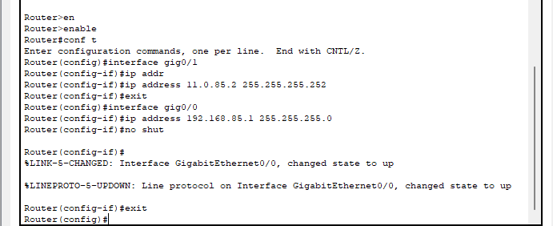

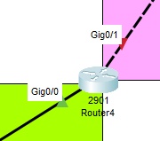

```bash

Router>enable 
Router#conf t
Enter configuration commands, one per line.  End with CNTL/Z.
Router(config)#interface gig0/1
Router(config-if)#ip addr
Router(config-if)#ip address 11.0.85.2 255.255.255.252
Router(config-if)#exit
Router(config)#interface gig0/0
Router(config-if)#ip address 192.168.85.1 255.255.255.0
Router(config-if)#no shut

Router(config-if)#
%LINK-5-CHANGED: Interface GigabitEthernet0/0, changed state to up

Router(config-if)#exit
Router(config)#
```

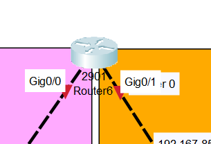
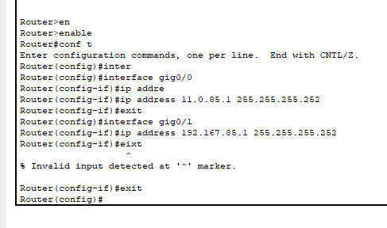

```bash
Router>enable 
Router#conf t
Router(config)#interface gig0/0
Router(config-if)#ip addre
Router(config-if)#ip address 11.0.85.1 255.255.255.252
Router(config-if)#exit
Router(config)#interface gig0/1
Router(config-if)#ip address 192.167.85.1 255.255.255.252
	
Router(config-if)#exit
Router(config)#
```

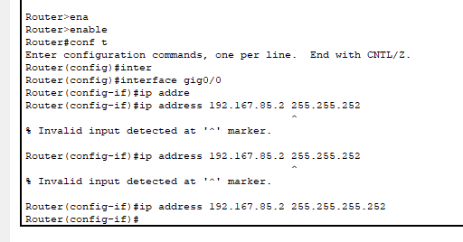
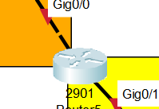

```bash
Router>enable 
Router#conf t
Router(config)#interface gig0/0
Router(config-if)#ip address 192.167.85.2 255.255.255.252
```


## Configuración de IP en PCs

Las computadoras deben configurarse con:

- Dirección IP

- Máscara de subred

- Puerta de enlace (Gateway)

La puerta de enlace es la dirección IP del router al que está conectada la red local.

### Router 1

**PC1**

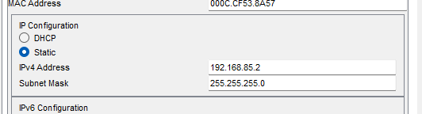

**PC2**

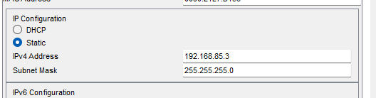

### Router 2

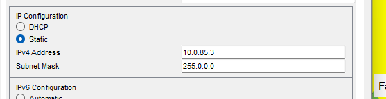

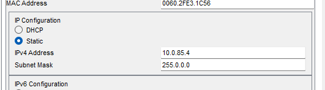


## Enrutamiento Estático


El enrutamiento permite que los routers sepan a qué red enviar los paquetes cuando el destino no está conectado directamente.

En este laboratorio se utiliza enrutamiento estático, el cual consiste en agregar manualmente rutas hacia otras redes.

La sintaxis es:
```bash
ip route [RED DESTINO] [MASCARA] [NEXT HOP]
```

Donde:

- Red destino: red a la que se desea llegar.

- Máscara: máscara de la red destino.

- Next hop: dirección IP del siguiente router al que se enviará el paquete.

### Router 0


```bash
ip route 192.168.85.0 255.255.255.0 11.0.85.2
ip route 10.0.85.0 255.255.255.252 192.167.85.2
```

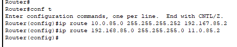

### Router 1

```bash
ip route 192.167.85.0 255.255.255.252 11.0.85.1
ip route 10.0.85.0 255.255.255.252 11.0.85.1
```

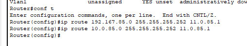

### Router 2

```bash
ip route 192.168.85.0 255.255.255.0 192.167.85.1
ip route 11.0.85.0 255.255.255.252 192.167.85.1
```

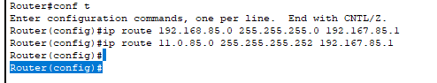

## PING

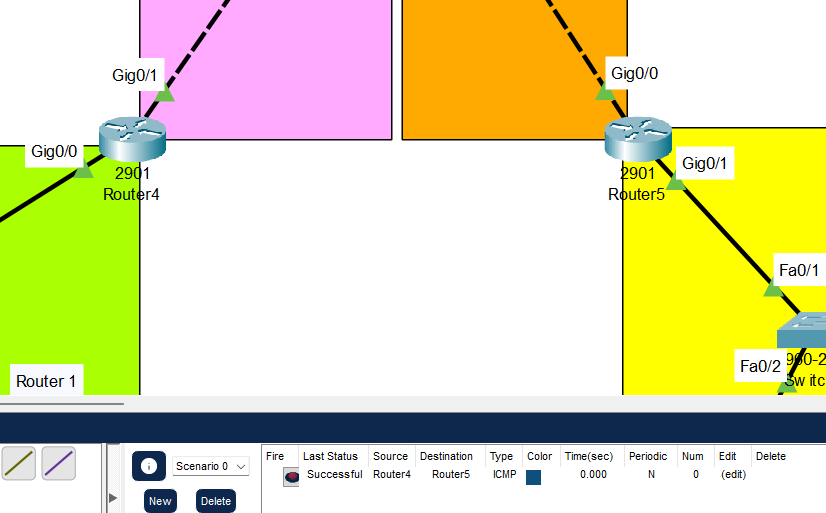

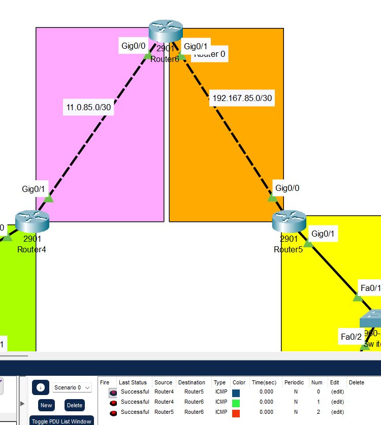

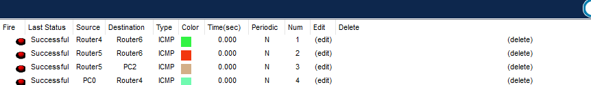

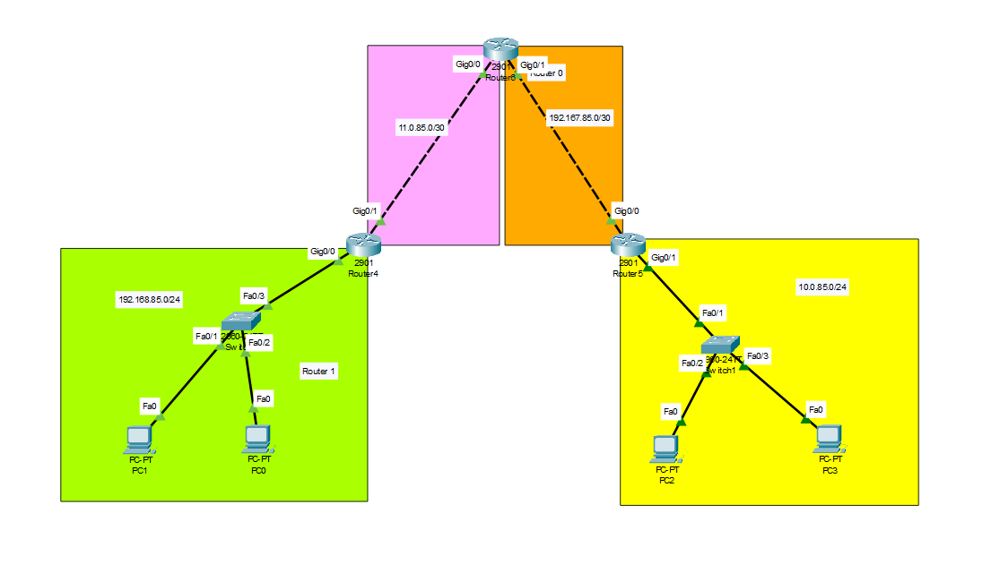