# UNIVERSIDAD DE SAN CARLOS DE GUATEMALA
## FACULTAD DE INGENIERÍA
### REDES DE COMPUTADORAS 1

**TUTOR ACADÉMICO:** César Fernando Sazo Quisquinay

---

**Diego Alexander Pablo Subuyuj**  
**CARNÉ:** 202300485  
**SECCIÓN:** N

**Guatemala, 27 de febrero del 2026**


## ACTIVIDAD 3

### Diseño e implementación de redes VLAN


### Configuracion de Switch servidor


### **Comandos**

```bash

## Configurar VTP

enable
configure terminal

vtp version 2
vtp mode server
vtp domain USAC
vtp password 123

## Crear VLANs
vlan 10
name Ventas
exit

vlan 20
name Compras
exit

# Puerto TRUNK
interface fa0/1
 switchport mode trunk
exit

interface fa0/2
 switchport mode trunk
exit

## Puertos PC

## PC VENTAS

interface fa0/3
switchport mode access
switchport access vlan 10
exit

## PC Compras

interface fa0/4
switchport mode access
switchport access vlan 20
exit

## Forzar ROOT BRIDGE

spanning-tree vlan 10 root primary
spanning-tree vlan 20 root primary

## Activar Rapid PVST

spanning-tree mode rapid-pvst
end
write


# Verificar 

show vtp status
show vlan brief
```

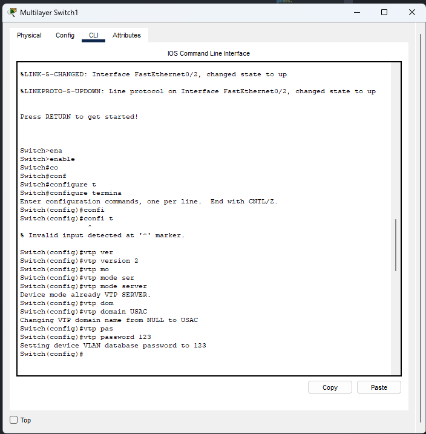

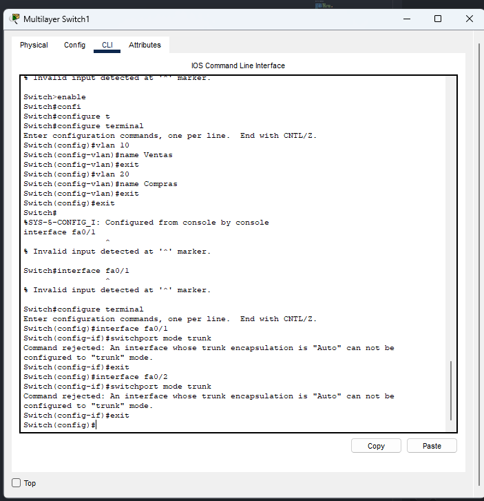

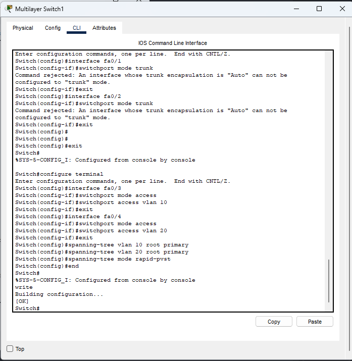

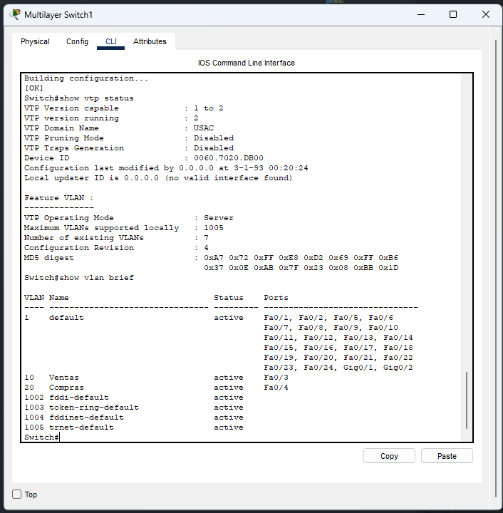

### Configuracion de Switch Cliente (switch 0)

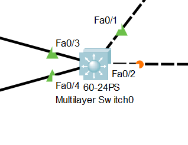

```bash

## Configurar VTP

enable
configure terminal


vtp version 2
vtp mode client
vtp domain USAC
vtp password 123


# Puerto TRUNK

interface fa0/1
switchport mode trunk
exit

interface fa0/2
switchport mode trunk
exit

## PC VLAN 10

interface fa0/3
switchport mode access
switchport access vlan 10
exit

## Rapid PVST

spanning-tree mode rapid-pvst
end
write

```

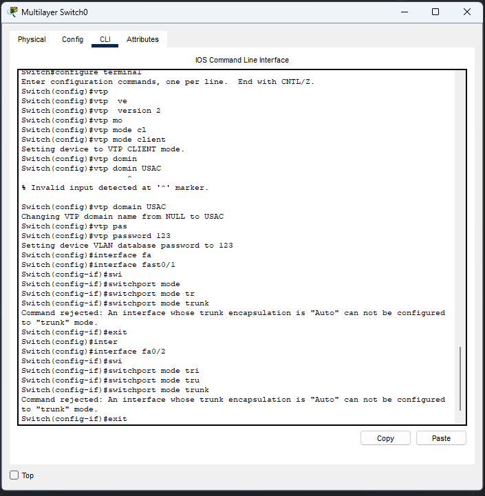

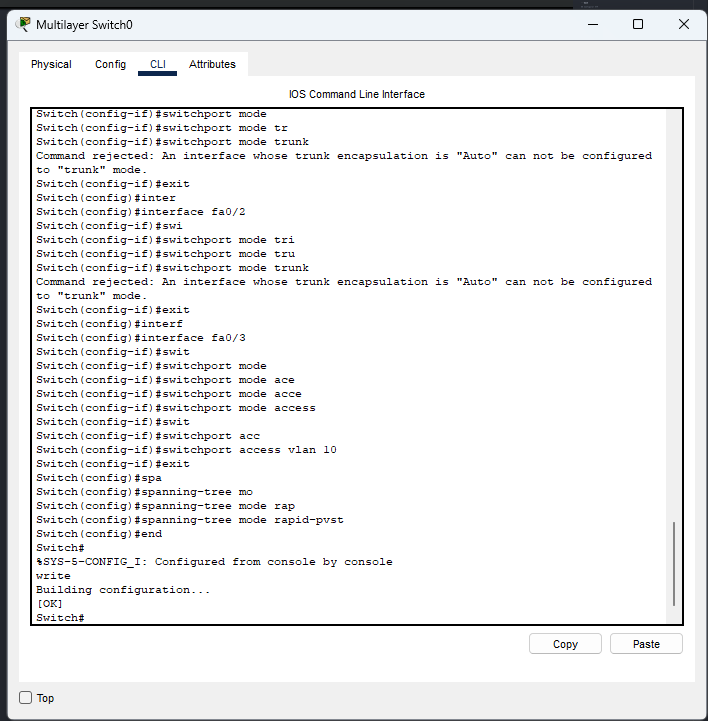


### Configuracion de Switch Cliente (switch 2)

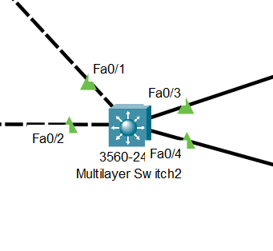

```bash

## Configurar VTP

enable
configure terminal


vtp version 2
vtp mode client
vtp domain USAC
vtp password 123


# Puerto TRUNK

interface fa0/1
switchport mode trunk
exit

interface fa0/2
switchport mode trunk
exit

## PC VLAN 10

interface fa0/3
switchport mode access
switchport access vlan 20
exit

## Rapid PVST

spanning-tree mode rapid-pvst
end
write

```

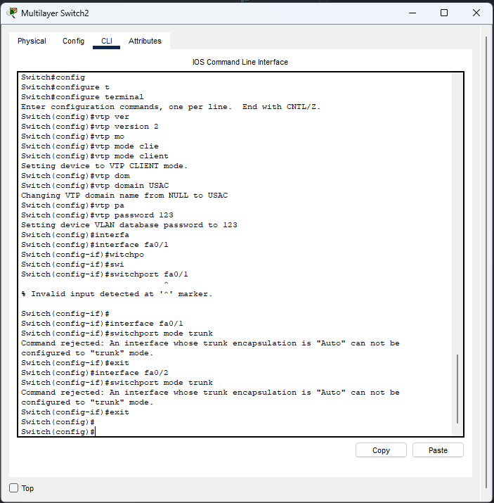

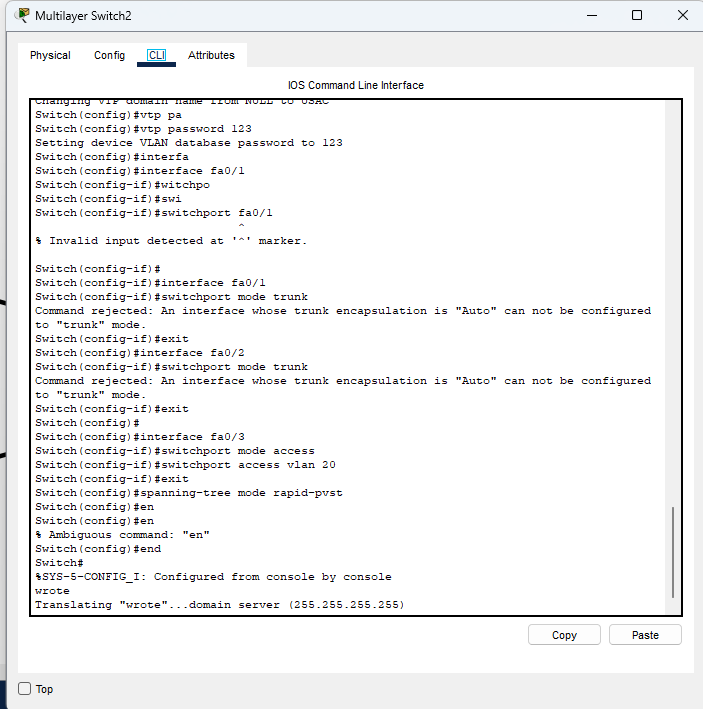


### **CAPTURAS**

**Switch raíz**

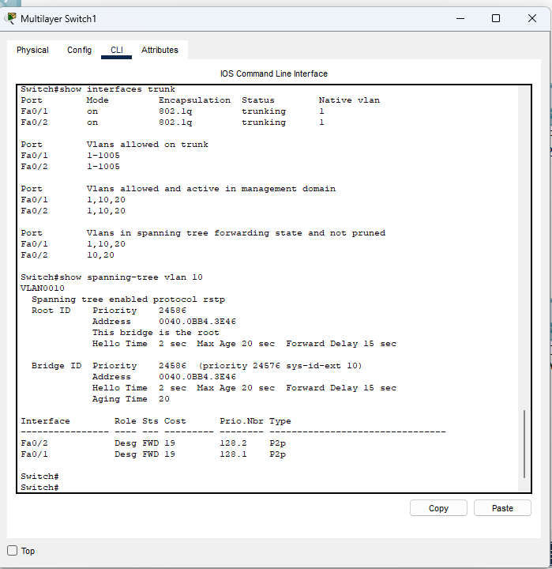

**Puerto bloqueado**

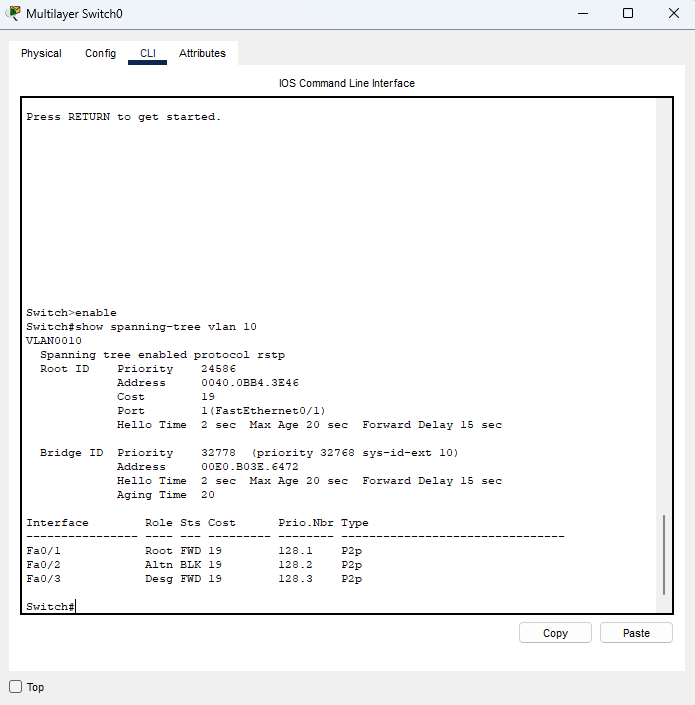

**VLAN configuradas**

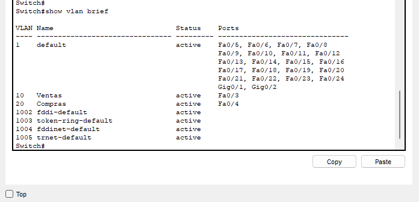

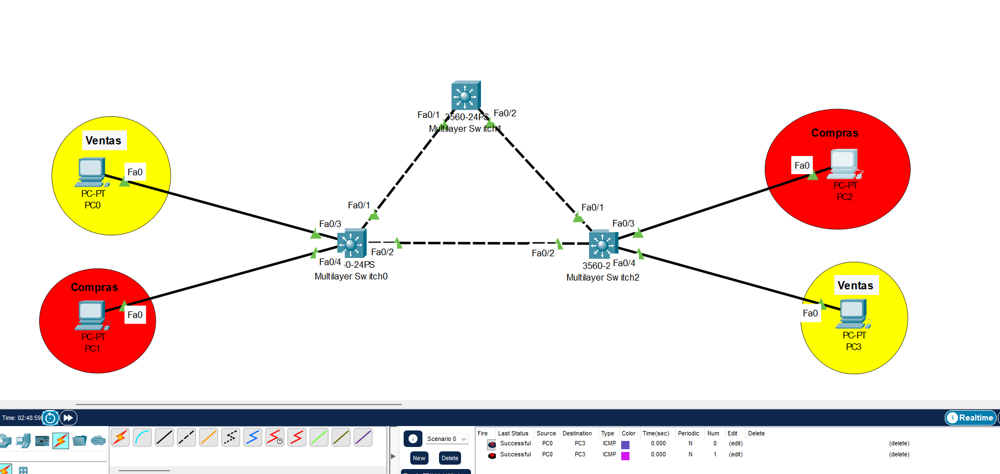