# UNIVERSIDAD DE SAN CARLOS DE GUATEMALA
## FACULTAD DE INGENIERÍA
### REDES DE COMPUTADORAS 1

**TUTOR ACADÉMICO:** César Fernando Sazo Quisquinay

---

**Diego Alexander Pablo Subuyuj**  
**CARNÉ:** 202300485  
**SECCIÓN:** N

**Guatemala, 12 de abril del 2026**


## Actividad 6


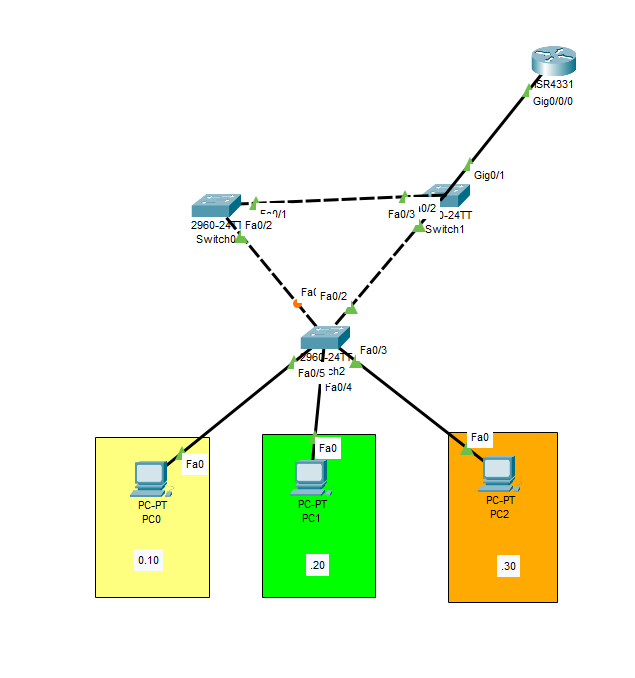

### Configuracion Switches

**server**


```bash
enable
configure terminal

vtp mode server
vtp domain redes
vtp password 123
vpt version 2

vlan 10
name ADMON

vlan 20
name RRHH

vlan 30
name IT
```

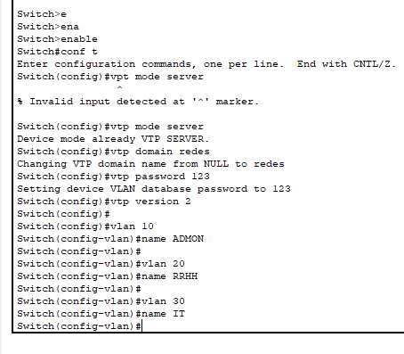

**client**

```bash
enable
configure terminal

vtp mode client
vtp domain redes
vtp password 123
vpt version 2

```

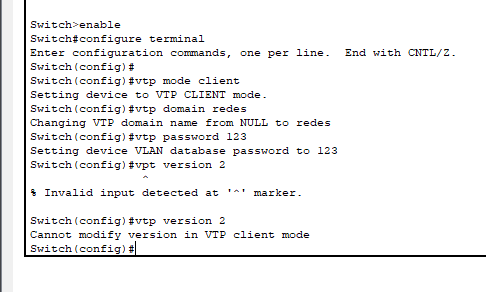

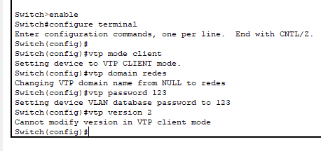

**modo access**

*PC01*
```bash
interface fa0/5
switchport mode access
switchport access vlan 10
```

*PC02*
```bash
interface fa0/4
switchport mode access
switchport access vlan 20
```

*PC03*
```bash
interface fa0/3
switchport mode access
switchport access vlan 30
```

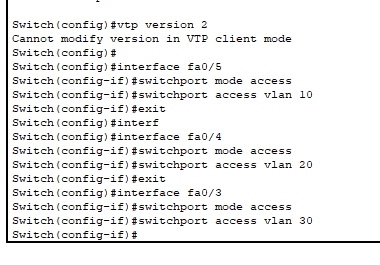

**modo trunk**

```bash
interface range fa0/2-3
switchport mode trunk
```
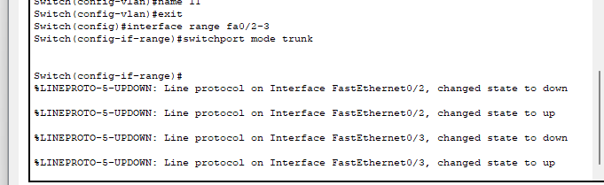

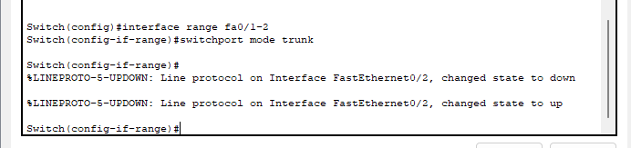


**SUBINTERFACES**

```bash
interface g0/0/0.10
encapsulation dot1Q 10
ip address 172.15.05.1 255.255.255.192

interface g0/0/0.20
encapsulation dot1Q 20
ip address 172.15.05.97 255.255.255.240

interface g0/0/0.30
encapsulation dot1Q 30
ip address 172.15.05.65 255.255.255.224
```


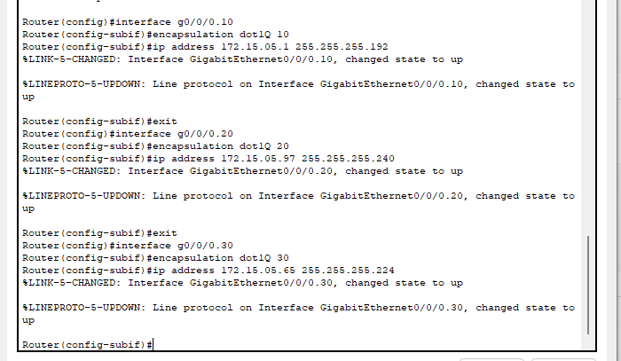

**Computadoras**

*PC01*
```bash
IP: 172.15.05.10
MASK: 255.255.255.192
GATEWAY: 172.15.05.1
```

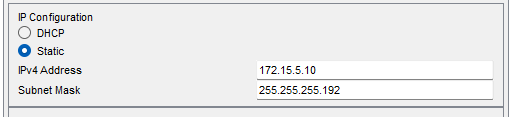


*PC02*
```bash
IP: 172.15.05.100
MASK: 255.255.255.240
GATEWAY: 172.15.05.97
```

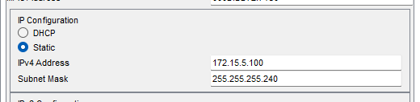

*PC03*
```bash
IP: 172.15.05.80
MASK: 255.255.255.224
GATEWAY: 172.15.05.65
```

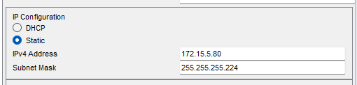


**ping**

*PC01 a PC02*

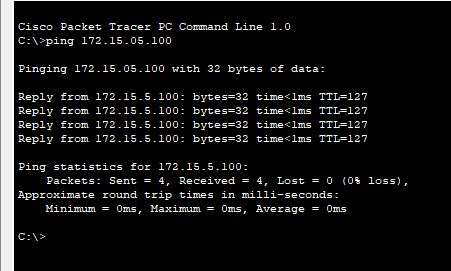

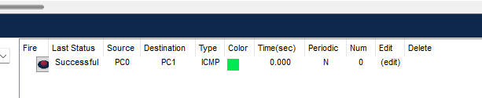

*PC02 a PC03*

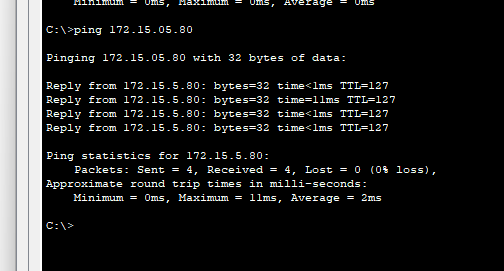


