# UNIVERSIDAD DE SAN CARLOS DE GUATEMALA
## FACULTAD DE INGENIERÍA
### ESTRUCTURAS DE DATOS

**TUTOR ACADÉMICO:** César Fernando Sazo Quisquinay

---

**Diego Alexander Pablo Subuyuj**  
**CARNÉ:** 202300485  
**SECCIÓN:** N

**Guatemala, 19 de enero del 2026**


## PRÁCTICA 1
### Diseño e implementación de red LAN


## OBJETIVOS DEL SISTEMA

### GENERAL
Poner en práctica los conocimientos adquiridos en las clases de laboratorio utilizando la herramienta Cisco Packet Tracer para simular la implementacion de una red LAN.

### ESPECÍFICOS
- Utilizar la nueva herramienta para crear la practica establecida.
- Demostrar los pasos necesarios para el uso del la simualcion.

## INTRODUCCIÓN

Esta practica se realiza una simulacion con el software Cisco Packet Tracer, el cual nos ayudara a diseñar e implementar una red LAN de un edificion de 3 niveles con almenos 50 dispositivos.

## ALCANCE DE LA PRÁCTICA

* Diseño completo de la topología LAN en Cisco Packet Tracer.
* Configuración de todos los switches según las reglas establecidas.
* Asignación correcta de direcciones IP estáticas sin repetición.
* Representación visual clara de los tres niveles del edificio.

## RECURSOS Y HERRAMIENTAS UTILIZADAS

* Cisco Packet Tracer
* Switches Cisco 2960
* VPCs (para equipos finales)
* GitHub (repositorio del curso)
* Editor Markdown


### CONFIGURACIÓN DE SWITCHES (CLI)
## Hostnames utilizados

### Nivel 1

Switch principal: SW_L1

Recepción: Recep

Contabilidad: Conta

Legal: Legal

Reuniones: Reuniones

### Nivel 2

Switch principal: SW_L2

Arquitectura: Arqui

Urbanismo: Urba

Planos: Planos

### Nivel 3

Switch principal: SW_L3

Dirección: Direccion

Ingeniería: Ingenieria

Servidores: Servidores

### Contraseña configurada

La contraseña de acceso configurada en todos los switches fue el número de carné: *202300485*

## Comandos utilizados

```bash

enable
configure terminal
hostname SW_L1
enable secret 202300485
banner motd #Personal
exit

```

# TABLA DE DIRECCIONES IP

## Piso 1 — Recepción y Administración General
### Departamento de Recepción (11 equipos + 1 servidor)

| Dispositivo  | Tipo      | IP            | Máscara       |
| ------------ | --------- | ------------- | ------------- |
| PC_Recep1    | PC        | 192.178.85.2  | 255.255.255.0 |
| PC_Recep2    | PC        | 192.178.85.3  | 255.255.255.0 |
| PC_Recep3    | PC        | 192.178.85.4  | 255.255.255.0 |
| PC_Recep4    | PC        | 192.178.85.5  | 255.255.255.0 |
| PC_Recep5    | PC        | 192.178.85.6  | 255.255.255.0 |
| PC_Recep6    | PC        | 192.178.85.7  | 255.255.255.0 |
| PC_Recep7    | PC        | 192.178.85.8  | 255.255.255.0 |
| PC_Recep8    | PC        | 192.178.85.9  | 255.255.255.0 |
| Lap_Recep1   | Laptop    | 192.178.85.10  | 255.255.255.0 |
| Lap_Recep2   | Laptop    | 192.178.85.11 | 255.255.255.0 |
| Lap_Recep3   | Laptop    | 192.178.85.12 | 255.255.255.0 |
| Server_Recep | Server-PT | 192.178.85.14 | 255.255.255.0 |

### Departamento de Contabilidad (8 PCs)

| Dispositivo | Tipo | IP            | Máscara       |
| ----------- | ---- | ------------- | ------------- |
| PC_Conta1   | PC   | 192.178.85.15 | 255.255.255.0 |
| PC_Conta2   | PC   | 192.178.85.16 | 255.255.255.0 |
| PC_Conta3   | PC   | 192.178.85.17 | 255.255.255.0 |
| PC_Conta4   | PC   | 192.178.85.18 | 255.255.255.0 |
| PC_Conta5   | PC   | 192.178.85.19 | 255.255.255.0 |
| PC_Conta6   | PC   | 192.178.85.20 | 255.255.255.0 |
| PC_Conta7   | PC   | 192.178.85.21 | 255.255.255.0 |
| PC_Conta8   | PC   | 192.178.85.22 | 255.255.255.0 |

### Departamento Legal (3 PCs + 2 Laptops)

| Dispositivo | Tipo   | IP            | Máscara       |
| ----------- | ------ | ------------- | ------------- |
| PC_Legal1   | PC     | 192.178.85.23 | 255.255.255.0 |
| PC_Legal2   | PC     | 192.178.85.24 | 255.255.255.0 |
| PC_Legal3   | PC     | 192.178.85.25 | 255.255.255.0 |
| Lap_Legal1  | Laptop | 192.178.85.26 | 255.255.255.0 |
| Lap_Legal2  | Laptop | 192.178.85.27 | 255.255.255.0 |

### Sala de Reuniones (5 Laptops)

| Dispositivo | Tipo   | IP            | Máscara       |
| ----------- | ------ | ------------- | ------------- |
| Lap_Reu1    | Laptop | 192.178.85.28 | 255.255.255.0 |
| Lap_Reu2    | Laptop | 192.178.85.29 | 255.255.255.0 |
| Lap_Reu3    | Laptop | 192.178.85.30 | 255.255.255.0 |
| Lap_Reu4    | Laptop | 192.178.85.31 | 255.255.255.0 |
| Lap_Reu5    | Laptop | 192.178.85.32 | 255.255.255.0 |


## Piso 2 — Diseño Arquitectónico y Urbanismo

### Departamento de Arquitectura (2 PCs + 4 Laptops)

| Dispositivo | Tipo   | IP            | Máscara       |
| ----------- | ------ | ------------- | ------------- |
| PC_Arqui1   | PC     | 192.178.85.33 | 255.255.255.0 |
| PC_Arqui2   | PC     | 192.178.85.34 | 255.255.255.0 |
| Lap_Arqui1  | Laptop | 192.178.85.35 | 255.255.255.0 |
| Lap_Arqui2  | Laptop | 192.178.85.36 | 255.255.255.0 |
| Lap_Arqui3  | Laptop | 192.178.85.37 | 255.255.255.0 |
| Lap_Arqui4  | Laptop | 192.178.85.38 | 255.255.255.0 |


### Departamento de Urbanismo (2 PCs + 3 Laptops + 1 servidor)

| Dispositivo | Tipo      | IP            | Máscara       |
| ----------- | --------- | ------------- | ------------- |
| PC_Urba1    | PC        | 192.178.85.39 | 255.255.255.0 |
| PC_Urba2    | PC        | 192.178.85.40 | 255.255.255.0 |
| Lap_Urba1   | Laptop    | 192.178.85.41 | 255.255.255.0 |
| Lap_Urba2   | Laptop    | 192.178.85.42 | 255.255.255.0 |
| Lap_Urba3   | Laptop    | 192.178.85.43 | 255.255.255.0 |
| Server_Urba | Server-PT | 192.178.85.44 | 255.255.255.0 |

### Sala de Revisión de Planos (1 PC + 4 Laptops)

| Dispositivo | Tipo   | IP            | Máscara       |
| ----------- | ------ | ------------- | ------------- |
| PC_Planos1  | PC     | 192.178.85.45 | 255.255.255.0 |
| Lap_Planos1 | Laptop | 192.178.85.46 | 255.255.255.0 |
| Lap_Planos2 | Laptop | 192.178.85.47 | 255.255.255.0 |
| Lap_Planos3 | Laptop | 192.178.85.48 | 255.255.255.0 |
| Lap_Planos4 | Laptop | 192.178.85.49 | 255.255.255.0 |

## Piso 3 — Ingeniería y Dirección de Proyectos

### Departamento de Dirección General (1 PC + 3 Laptops)

| Dispositivo | Tipo   | IP            | Máscara       |
| ----------- | ------ | ------------- | ------------- |
| PC_Dir1     | PC     | 192.178.85.50 | 255.255.255.0 |
| Lap_Dir1    | Laptop | 192.178.85.51 | 255.255.255.0 |
| Lap_Dir2    | Laptop | 192.178.85.52 | 255.255.255.0 |
| Lap_Dir3    | Laptop | 192.178.85.53 | 255.255.255.0 |

### Departamento de Ingeniería Civil (4 PCs + 1 Laptop + 1 servidor)

| Dispositivo | Tipo      | IP            | Máscara       |
| ----------- | --------- | ------------- | ------------- |
| PC_Ing1     | PC        | 192.178.85.54 | 255.255.255.0 |
| PC_Ing2     | PC        | 192.178.85.55 | 255.255.255.0 |
| PC_Ing3     | PC        | 192.178.85.56 | 255.255.255.0 |
| PC_Ing4     | PC        | 192.178.85.57 | 255.255.255.0 |
| Lap_Ing1    | Laptop    | 192.178.85.58 | 255.255.255.0 |
| Server_Ing  | Server-PT | 192.178.85.59 | 255.255.255.0 |


### Departamento de Servidores Principales (3 servidores)


| Dispositivo       | Tipo      | IP            | Máscara       |
| ----------------- | --------- | ------------- | ------------- |
| Server_Principal1 | Server-PT | 192.178.85.60 | 255.255.255.0 |
| Server_Principal2 | Server-PT | 192.178.85.61 | 255.255.255.0 |
| Server_Principal3 | Server-PT | 192.178.85.62 | 255.255.255.0 |


# Verificacion

## PING de 192.178.85.2 a 192.178.85.10

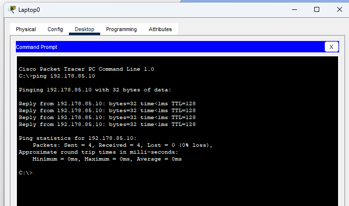

## PING de 192.178.85.10 a 192.178.85.15

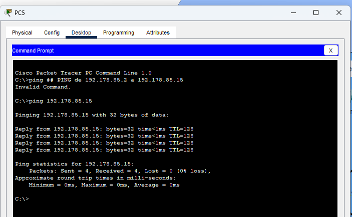


## PING de 192.178.85.15 a 192.178.85.20

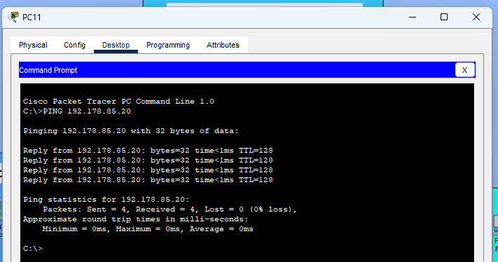

## PING de 192.178.85.20 a 192.178.85.25

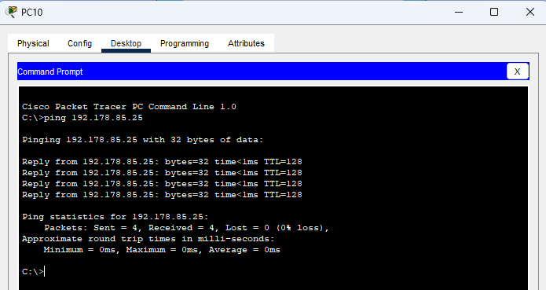

## PING de 192.178.85.25 a 192.178.85.30

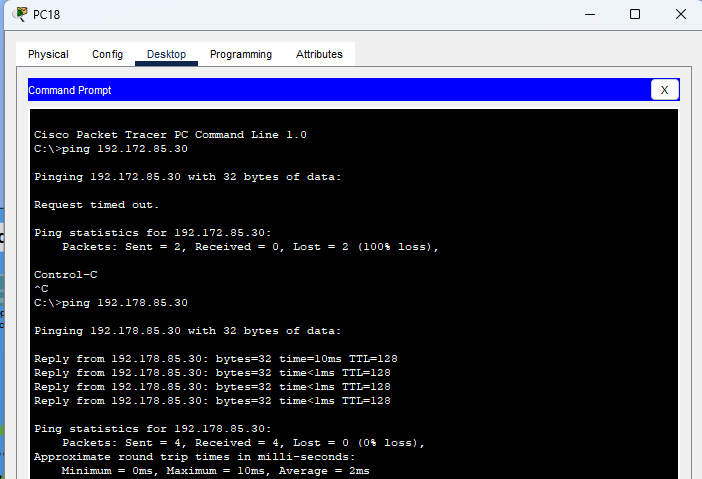

## PING de 192.178.85.30 a 192.178.85.35

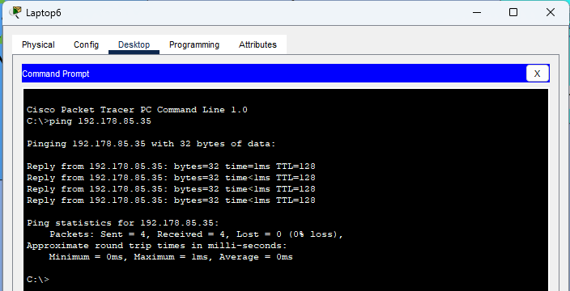

## PING de 192.178.85.35 a 192.178.85.40

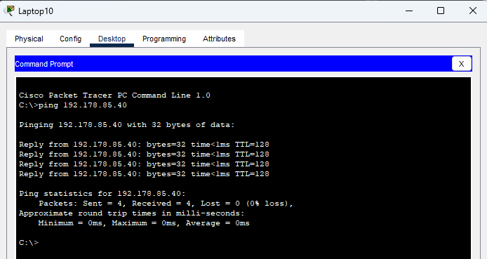

## PING de 192.178.85.40 a 192.178.85.45

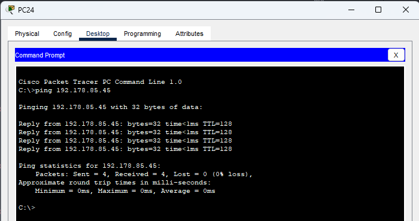

## PING de 192.178.85.45 a 192.178.85.50

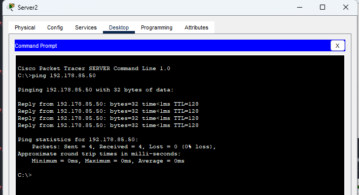

## PING de 192.178.85.50 a 192.178.85.55

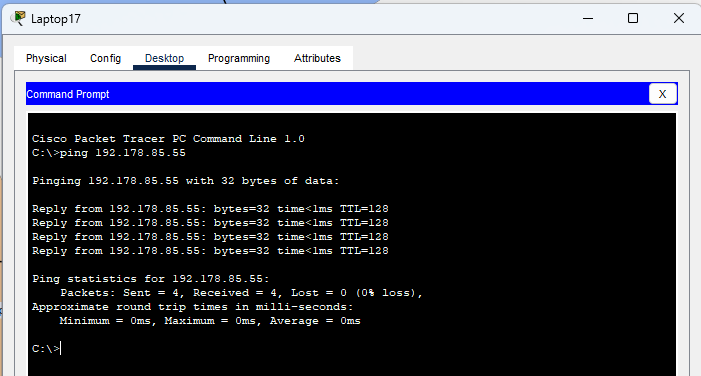


### SIMULACION

## Nivel 1

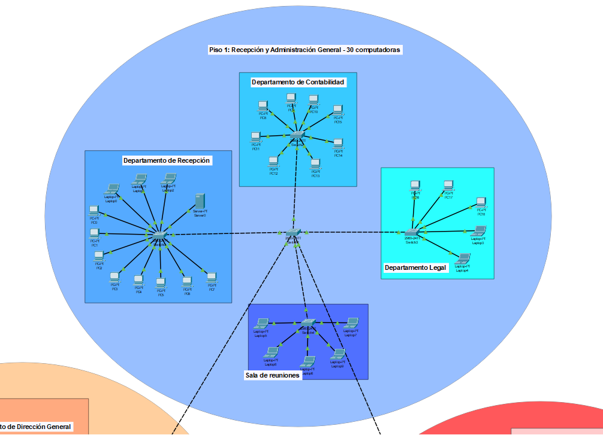

## Nivel 2

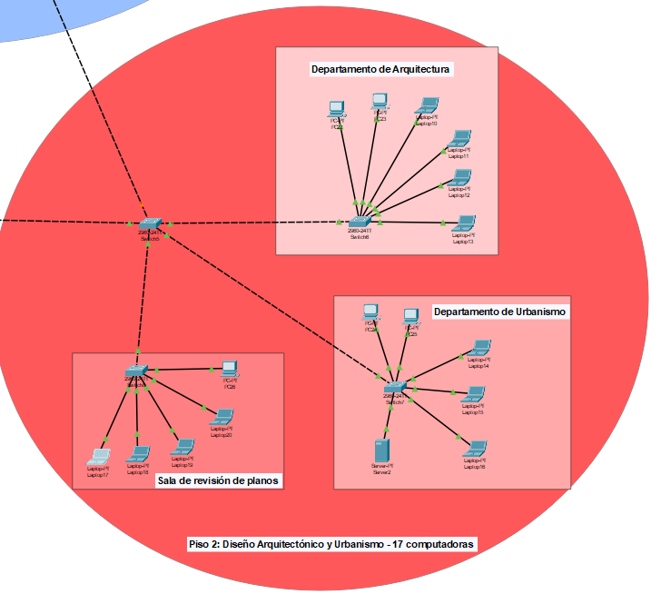

## Nivel 3

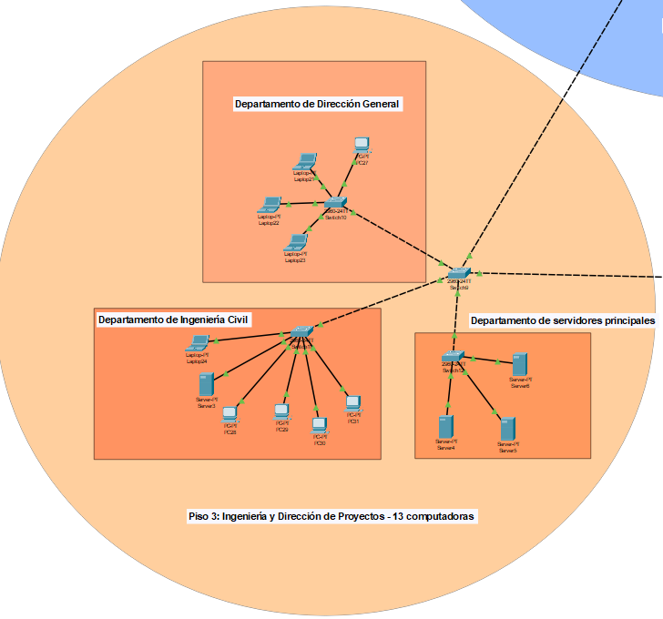

## Completa

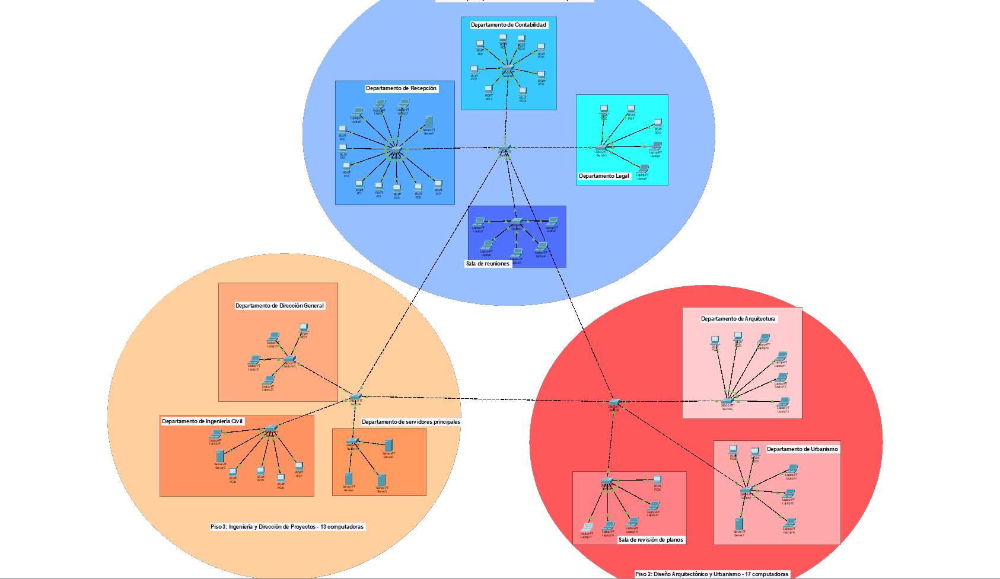

### PAQUETES Y TABLA ARP

## Paquetes de 192.178.85.52 a 192.178.85.60

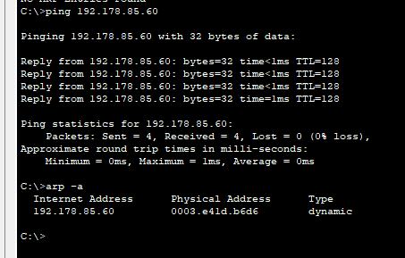

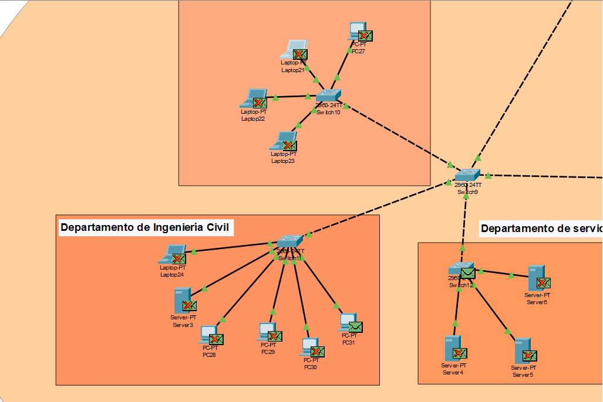

## Paquetes de 192.178.85.33 a 192.178.85.47

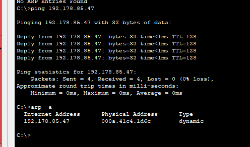

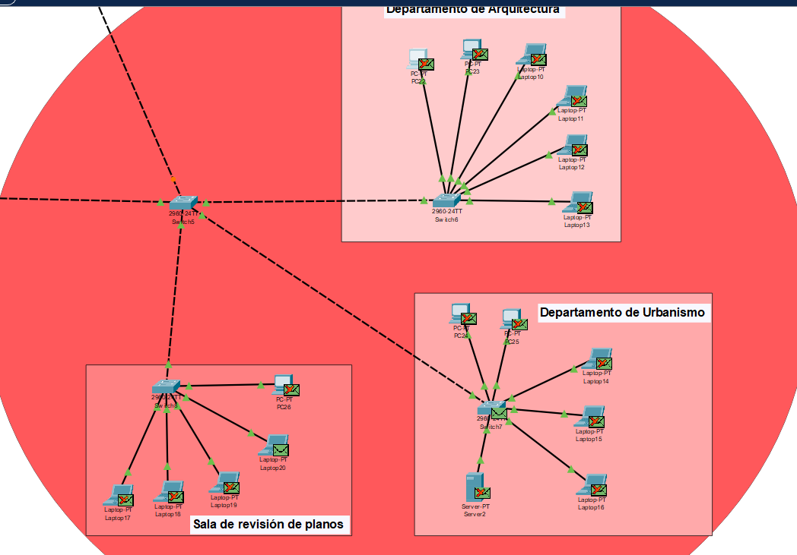

## Paquetes de 192.178.85.3 a 192.178.85.26

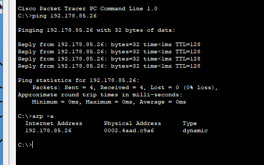

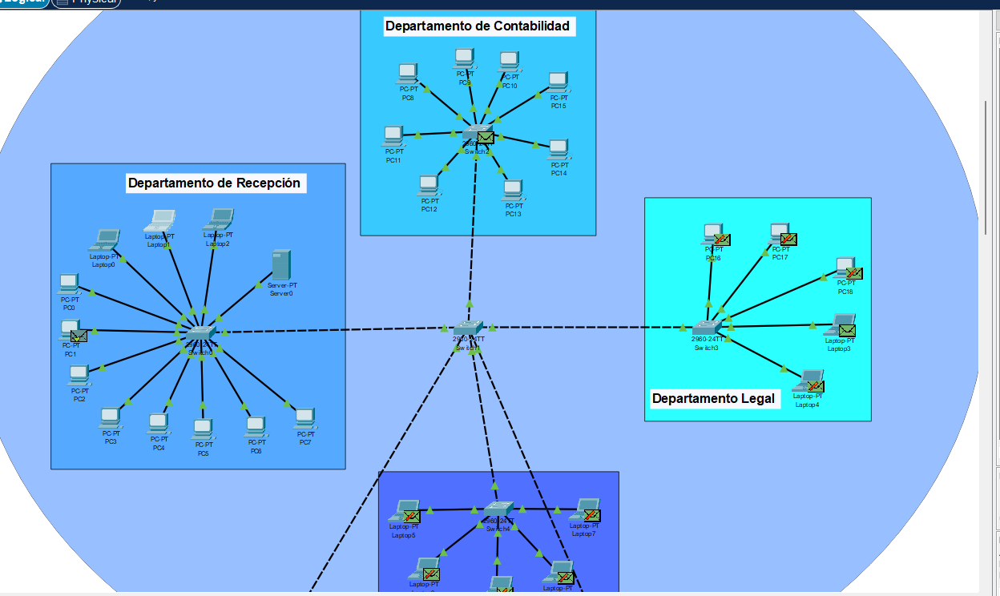

## Paquetes de 192.178.85.29 a 192.178.85.54

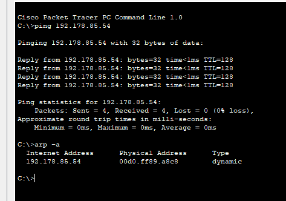

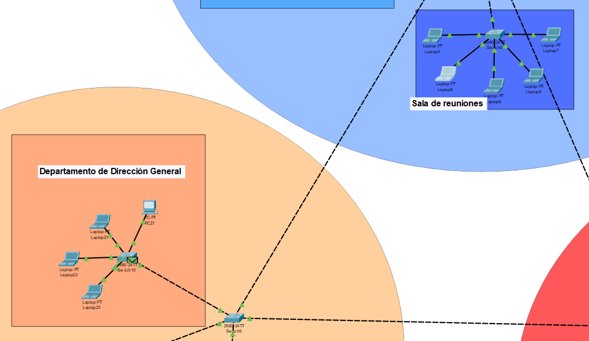

## Paquetes de 192.178.85.32 a 192.178.85.39

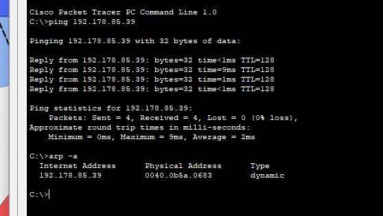

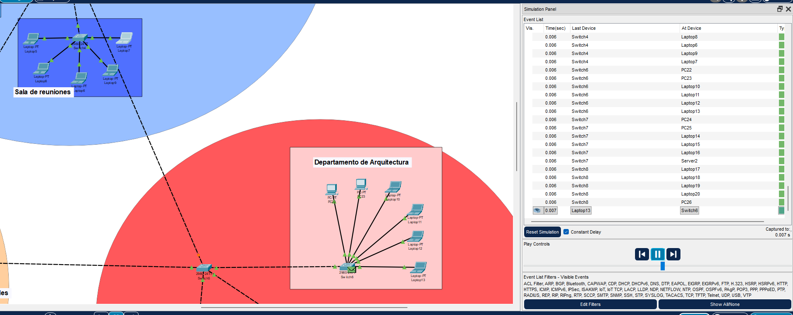