# UNIVERSIDAD DE SAN CARLOS DE GUATEMALA
## FACULTAD DE INGENIERÍA
### REDES DE COMPUTADORAS 1

**TUTOR ACADÉMICO:** César Fernando Sazo Quisquinay

---

**Diego Alexander Pablo Subuyuj**  
**CARNÉ:** 202300485  
**SECCIÓN:** N

**Guatemala, 09 de abril del 2026**


## PRÁCTICA 2
### Red del Aeropuerto Internacional La Aurora


## OBJETIVOS DEL SISTEMA

### GENERAL
Disenar y simular una red VLAN de edificios en Cisco Packet Tracer con VLANs, VTP, Rapid-PVST y EtherChannel.

### ESPECÍFICOS
- Configurar VLANs para segmentar trafico por áreas.
- Implementar VTP para distribuir información de VLANs.
- Establecer enlaces troncales 802.1Q entre switches.
- Aplicar Rapid-PVST para prevenir bucles de capa 2.
- Utilizar EtherChannel para redundancia en enlaces.
- Verificar conectividad mediante pruebas básicas.

## INTRODUCCIÓN

Este proyecto aplica los fundamentos de conmutación a un escenario práctico con VLANs, VTP, enlaces troncales, Rapid-PVST y EtherChannel. La simulación en Cisco Packet Tracer permite validar el diseño, comprender el comportamiento de dispositivos de capa 2 y desarrollar competencias técnicas en configuración de redes segmentadas.

## JUSTIFICACION

Esta práctica integra teoría y práctica en configuración de redes segmentadas. Permite comprender el comportamiento de dispositivos de capa 2, desarrollar habilidades en diseño de topologías, estandarización de configuraciones y documentación técnica reproducible, competencias esenciales en entornos profesionales.

## ALCANCE DE LA PRÁCTICA

* Diseño e implementación de red VLAN segmentada en Cisco Packet Tracer.
* Configuración de VTP, trunks, Rapid-PVST y EtherChannel.
* Asignación de direccionamiento IP estático con VLSM.
* Verificación de conectividad entre segmentos permitidos.

### LIMITACIONES

* Entorno de simulación sin factores físicos reales.
* Sin implementación de enrutamiento dinámico ni ACLs complejas.
* Validación académica, no auditoria de seguridad empresarial.

## RECURSOS Y HERRAMIENTAS UTILIZADAS

* Cisco Packet Tracer
* Switches Cisco 2960
* VPCs (para equipos finales)
* GitHub (repositorio del curso)
* Editor Markdown

## MARCO TEORICO RESUMIDO

### VLAN
Una VLAN permite dividir una red fisica en varias redes logicas independientes. Esto reduce dominios de broadcast, mejora el orden del trafico y facilita aplicar politicas administrativas por area funcional.

### VTP
VTP (VLAN Trunking Protocol) simplifica la administracion de VLANs al propagar cambios dentro de un mismo dominio. En este proyecto se usa un switch en modo servidor y switches en modo cliente para mantener consistencia.

### Trunk
Un enlace trunk transporta multiples VLANs sobre un mismo enlace fisico entre switches. Esto permite interconectar segmentos de red sin requerir un enlace dedicado por cada VLAN.

### STP / Rapid-PVST
Spanning Tree evita bucles de capa 2 al bloquear caminos redundantes cuando es necesario. Rapid-PVST mejora los tiempos de convergencia y mantiene estabilidad ante cambios de topologia.

### EtherChannel
EtherChannel agrupa varios enlaces fisicos en un unico enlace logico. Sus ventajas principales son mayor ancho de banda agregado y redundancia frente a la falla de un enlace individual.

### Subredes y Subnetting
Subnetting es el proceso de dividir una red en subredes más pequeñas usando máscaras de red. Permite optimizar el uso de direcciones IP, mejorar la eficiencia de enrutamiento y aplicar políticas de seguridad por subred. En esta práctica se aplica subnetting para asignar rangos IP específicos a cada VLAN.

### VLSM (Variable Length Subnet Mask)
VLSM permite asignar máscaras de red de longitud variable, adaptando el tamaño de subred a los requerimientos reales de cada área. Esto optimiza el uso de direcciones IP al usar máscaras más largas para áreas pequeñas y máscaras más cortas para áreas con más dispositivos, reduciendo desperdicios de direcciones.

### VLANS

| No 	| Nombre              	| VLAN 	|
|:--:	|---------------------	|------	|
| 1  	| ADMINISTRACIÓN      	| 15   	|
| 2  	| SEGURIDAD           	| 25   	|
| 3  	| SERVIDORES          	| 35   	|
| 4  	| CHECK-IN            	| 45   	|
| 5  	| MIGRACIÓN           	| 55   	|
| 6  	| PUERTAS             	| 65   	|
| 7  	| TIENDAS             	| 75   	|
| 8  	| SALA DE ESPERA      	| 85   	|
| 9  	| NATIVE              	| 99   	|
| 10 	| BLACKHOLE           	| 999  	|


## TOPOLOGIA

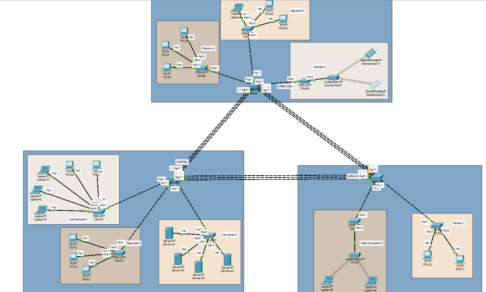


## VTP


**Configuracion switch SW-A1 B1 y C1 modo server**


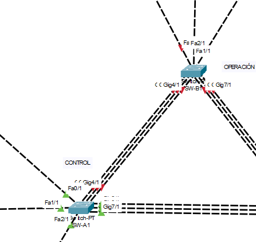

```bash
enable
configure terminal 
hostname SW-A1
vtp version 2
vtp domain 202300485
vtp mode server
vtp password areaA

vlan 15
name AREA1

vlan 25
name AREA2

vlan 35
name AREA3

vlan 45
name AREA4
exit
vlan 55
name AREA5
exit
vlan 65
name AREA6
exit
vlan 75
name AREA7
exit
vlan 85
name AREA8
vlan 99
name NATIVE

vlan 999
name BLACKHOLE


```
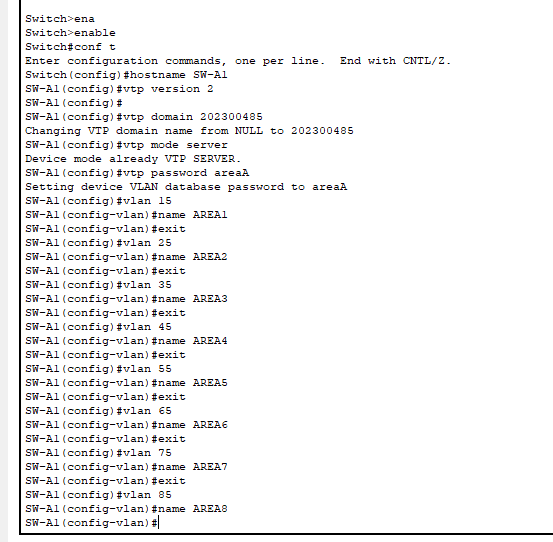

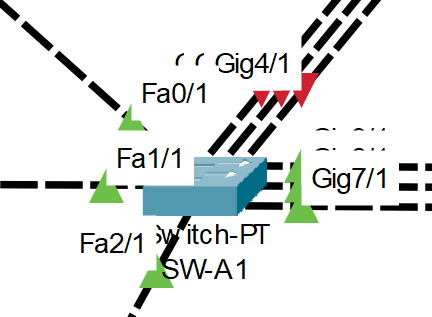

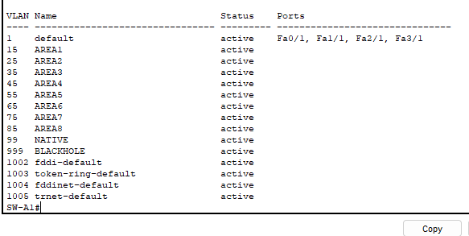


**Configuracion switch SW-B1 Y C1 modo cliente**

```bash
enable
conf t

hostname SW-A2 

vtp domain 202300485
vtp password areaB
vtp mode client
vtp version 2
```

## STP


```bash
enable
conf t
spanning-tree mode rapid-pvst
```
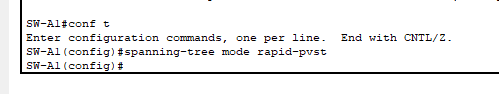


## Etherchannels

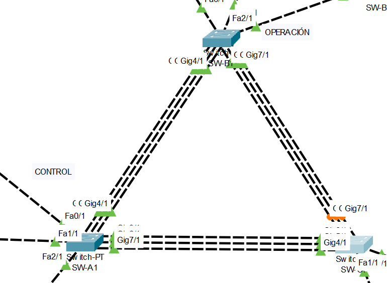

**Operacion <-> Control**


```bash
enable
conf t

interface range g4/1, g5/1, g6/1
channel-protocol LACP
channel-group 1 mode active
no shutdown
exit

interface port-channel 1
switchport mode trunk
switchport trunk allowed vlan 15,25,35,45,55,65,75,85
no shutdown
end
wr
```
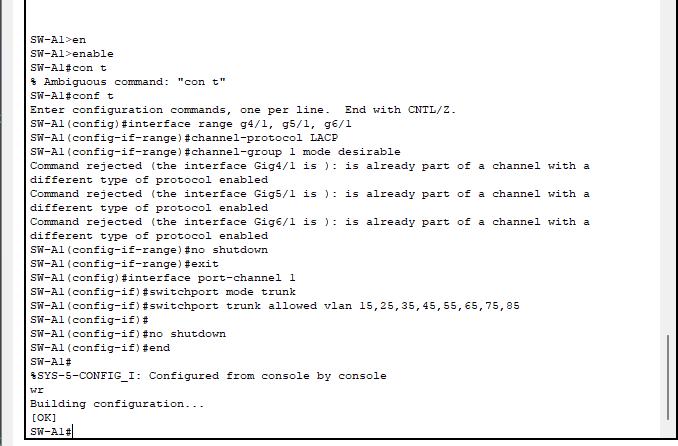


```bash
conf t
interface range g4/1, g5/1, g6/1
channel-group 1 mode active
exit

interface port-channel 1
switchport mode trunk
switchport trunk allowed vlan 15,25,35,45,55,65,75,85
no shutdown
end
wr
```

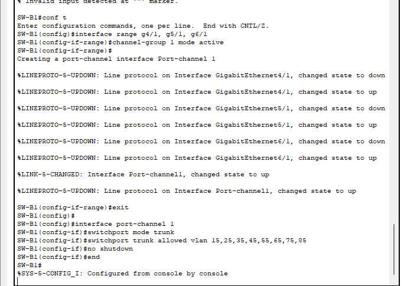

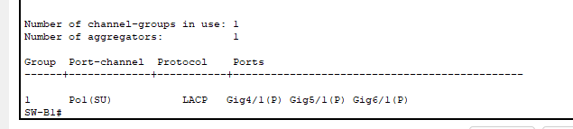


**Operacion <-> Servicios**


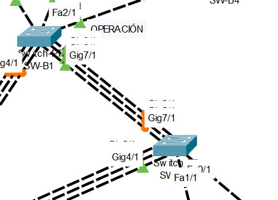

```bash
enable
conf t

interface range g7/1, g8/1, g9/1
channel-protocol LACP
channel-group 2 mode active
no shutdown
exit

interface port-channel 2
switchport mode trunk
switchport trunk allowed vlan 15,25,35,45,55,65,75,85
no shutdown
end
wr
```
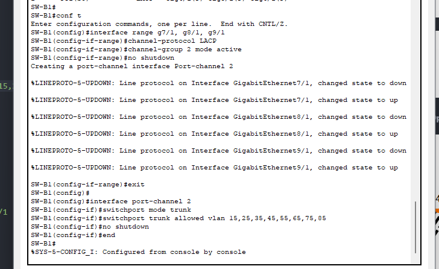


```bash
conf t
interface range g7/1, g8/1, g9/1
channel-group 1 mode active
exit

interface port-channel 1
switchport mode trunk
switchport trunk allowed vlan 15,25,35,45,55,65,75,85
no shutdown
end
wr
```

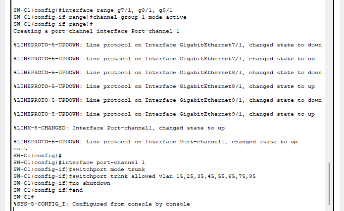

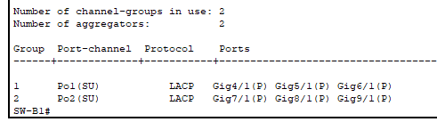

**Control <-> Servicios**


```bash
enable
conf t

interface range g4/1, g5/1, g6/1
channel-protocol LACP
channel-group 2 mode active
no shutdown
exit

interface port-channel 2
switchport mode trunk
switchport trunk allowed vlan 15,25,35,45,55,65,75,85
no shutdown
end
wr
```
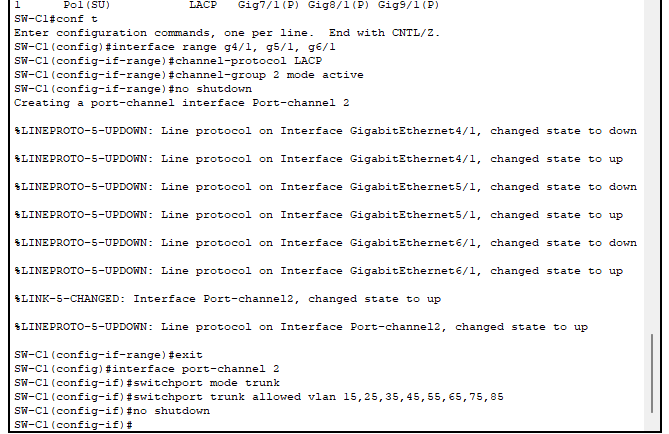


```bash
conf t
interface range g7/1, g8/1, g9/1
channel-group 2 mode active
exit

interface port-channel 2
switchport mode trunk
switchport trunk allowed vlan 15,25,35,45,55,65,75,85
no shutdown
end
wr
```

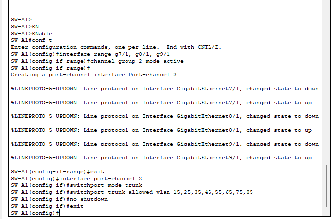

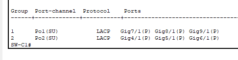


## VTP Edificios

**Control**

*SW-A2*

```bash
enable
conf t

hostname SW-A2 

vtp domain 202300485
vtp version 2
vtp mode client
vtp password area1
```
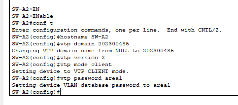

*SW-A3*

```bash
enable
conf t

hostname SW-A3

vtp domain 202300485
vtp version 2
vtp mode client
vtp password area2
```
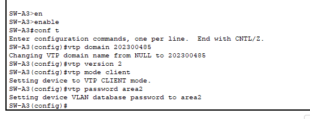

*SW-A4*

```bash
enable
conf t

hostname SW-A4

vtp domain 202300485
vtp version 2
vtp mode client
vtp password area3
```
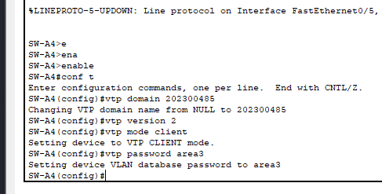

**Operacion**


*SW-B2*

```bash
enable
conf t

hostname SW-B2 

vtp domain 202300485
vtp version 2
vtp mode client
vtp password area4
```
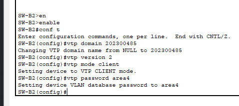


*SW-B3*

```bash
enable
conf t

hostname SW-B3 

vtp domain 202300485
vtp version 2
vtp mode client
vtp password area5
```
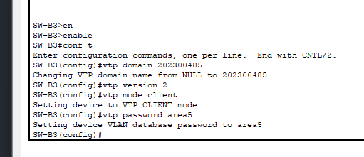

*SW-B4*

```bash
enable
conf t

hostname SW-B4 

vtp domain 202300485
vtp version 2
vtp mode client
vtp password area6
```
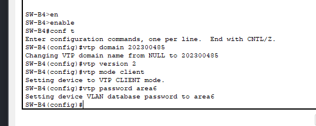


**Servicios**

*SW-C2*

```bash
enable
conf t

hostname SW-C2

vtp domain 202300485
vtp version 2
vtp mode client
vtp password area7
```
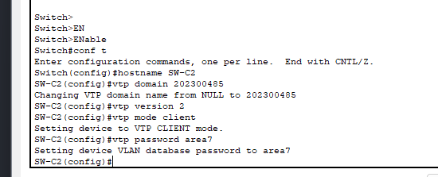


*SW-C3*

```bash
enable
conf t

hostname SW-C3

vtp domain 202300485
vtp version 2
vtp mode client
vtp password area8
```
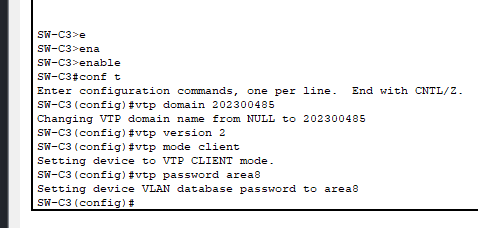


## Trunk Edificios

**SW-A2**
```bash
interface fa0/1
switchport mode trunk
switchport trunk native vlan 99
switchport trunk allowed vlan 15,99,999
```
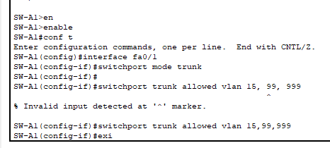
**SW-A3**
```bash
interface fa1/1
switchport mode trunk
switchport trunk native vlan 99
switchport trunk allowed vlan 25,99,999
```

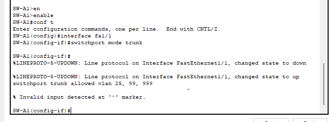

**SW-A4**
```bash
interface fa2/1
switchport mode trunk
switchport trunk native vlan 99
switchport trunk allowed vlan 35,99,999
```
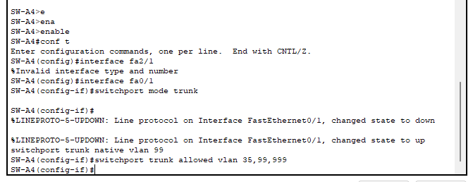

**SW-B2**
```bash
interface fa0/1
switchport mode trunk
switchport trunk native vlan 99
switchport trunk allowed vlan 45,99,999
```
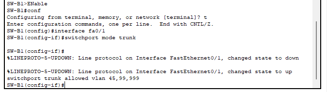

**SW-B3**
```bash
interface fa1/1
switchport mode trunk
switchport trunk native vlan 99
switchport trunk allowed vlan 55,99,999
```
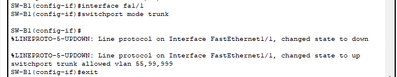

**SW-B4**
```bash
interface fa2/1
switchport mode trunk
switchport trunk native vlan 99
switchport trunk allowed vlan 65,99,999
```
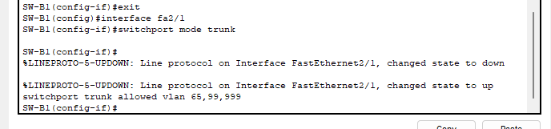


**SW-C2**
```bash
interface fa0/1
switchport mode trunk
switchport trunk native vlan 99
switchport trunk allowed vlan 85,99,999
```
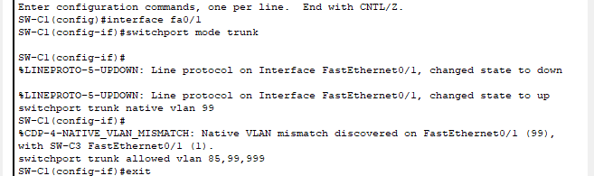

**SW-C3**
```bash
interface fa1/1
switchport mode trunk
switchport trunk native vlan 99
switchport trunk allowed vlan 75,99,999
```
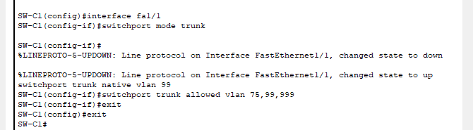

## Subnetting (VLSM)

**SUBREDES VLSM**

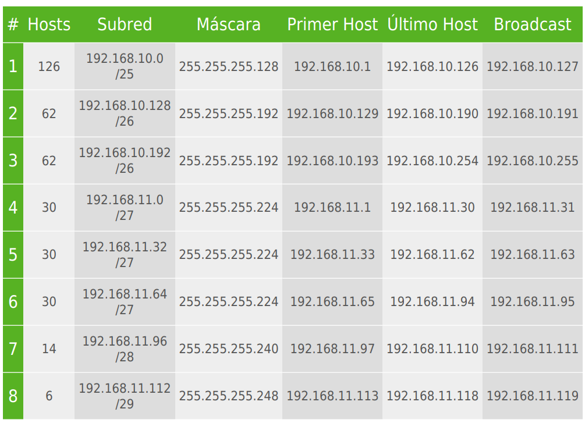

- Número direcciones proporcionadas pora la IP 254
- Número de Hosts solicitados 237
- Número direcciones proporcionadas pora la IP 254
- Número de Hosts solicitados 237
- Número de Hosts encontrados 360
- Porcentaje de direcciones utilizadas 93%
- Porcentaje de direcciones encontradas 142%
- Número de Hosts encontrados 360
- Porcentaje de direcciones utilizadas 93%
- Porcentaje de direcciones encontradas 142%

Se aplicó VLSM para dividir la red principal en subredes adaptadas a cada área, asignando tamaños según la cantidad de hosts requeridos y optimizando el uso de direcciones IP.

Tenemos la red principal **192.168.10.0/24** con mascara **255.255.255.0** lo que nos brinda 256 host utiles.


## Asignación de Direcciones IP 

| Área   | VLAN | Subred            | Máscara         | Gateway        | Dispositivo 1  | Dispositivo 2  | Dispositivo 3  | Dispositivo 4  | Dispositivo 5 |
| ------ | ---- | ----------------- | --------------- | -------------- | -------------- | -------------- | -------------- | -------------- | ------------- |
| Área 1 | 15   | 192.168.10.0/25   | 255.255.255.128 | 192.168.10.1   | 192.168.10.2   | 192.168.10.3   | 192.168.10.4   | 192.168.10.5   | 192.168.10.6  |
| Área 2 | 25   | 192.168.11.32/27  | 255.255.255.224 | 192.168.11.33  | 192.168.11.34  | 192.168.11.35  | 192.168.11.36  | —              | —             |
| Área 3 | 35   | 192.168.10.192/26 | 255.255.255.192 | 192.168.10.193 | 192.168.10.194 | 192.168.10.195 | 192.168.10.196 | 192.168.10.197 | —             |
| Área 4 | 45   | 192.168.11.112/29 | 255.255.255.248 | 192.168.11.113 | 192.168.11.114 | 192.168.11.115 | 192.168.11.116 | —              | —             |
| Área 5 | 55   | 192.168.11.0/27   | 255.255.255.224 | 192.168.11.1   | 192.168.11.2   | 192.168.11.3   | 192.168.11.4   | —              | —             |
| Área 6 | 65   | 192.168.10.128/26 | 255.255.255.192 | 192.168.10.129 | 192.168.10.130 | 192.168.10.131 | —              | —              | —             |
| Área 7 | 75   | 192.168.11.96/28  | 255.255.255.240 | 192.168.11.97  | 192.168.11.98  | 192.168.11.99  | —              | —              | —             |
| Área 8 | 85   | 192.168.11.64/27  | 255.255.255.224 | 192.168.11.65  | 192.168.11.66  | 192.168.11.67  | —              | —              | —             |


## Access VLANS

### CONTROL

**Administracion - SW-A2**

```bash
# VLAN 15
interface range fa0/2-6
switchport mode access
switchport access vlan 15
```
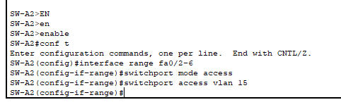

**Seguridad - SW-A3**

```bash
# VLAN 25
interface range fa0/2-4
switchport mode access
switchport access vlan 25
```
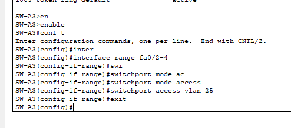

**Servidores - SW-A4**

```bash
# VLAN 15
interface range fa0/2-5
switchport mode access
switchport access vlan 35
```

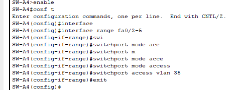


### OPERACION


**Check-in - SW-B2**

```bash
# VLAN 45
interface range fa0/2-4
switchport mode access
switchport access vlan 45
```
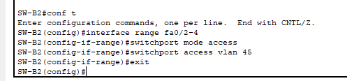

**Migración - SW-B3**

```bash
# VLAN 55
interface range fa0/2-4
switchport mode access
switchport access vlan 55
```

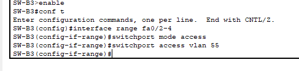


**Puertas - SW-B4**


```bash
# VLAN 65
interface fa0/2
switchport mode access
switchport access vlan 65
```
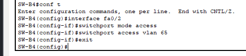

### SERVICIOS

**Tiendas - SW-C2**

```bash
# VLAN 75
interface range fa0/2-3
switchport mode access
switchport access vlan 75
```

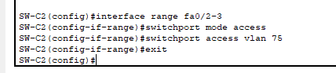


**Sala de Espera - SW-C3**

```bash
# VLAN 85
interface fa0/2
switchport mode access
switchport access vlan 85
```

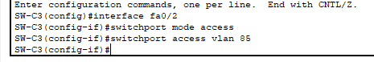


##  VLAN Blackhole (999)

### CONTROL

**Administracion - SW-A2**


```bash
# VLAN 999
interface range fa0/7-24
switchport mode access
switchport access vlan 999
```
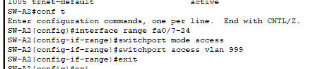


**Seguridad - SW-A3**


```bash
# VLAN 999
interface range fa0/5-24
switchport mode access
switchport access vlan 999
```

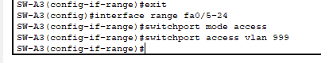

**Servidores - SW-A4**

```bash
# VLAN 999
interface range fa0/6-24
switchport mode access
switchport access vlan 999
```
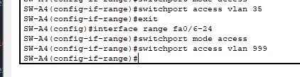


### OPERACION

**Check-in - SW-B2**

```bash
# VLAN 999
interface range fa0/5-24
switchport mode access
switchport access vlan 999
```
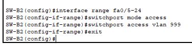


**Migración - SW-B3**

```bash
# VLAN 999
interface range fa0/5-24
switchport mode access
switchport access vlan 999
```

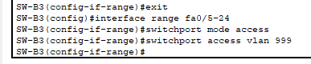

**Puertas - SW-B4**

```bash
# VLAN 999
interface range fa0/3-24
switchport mode access
switchport access vlan 999
```
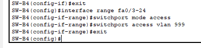


### SERVICIOS

**Tiendas - SW-C2**

```bash
# VLAN 999
interface range fa0/4-24
switchport mode access
switchport access vlan 999
```
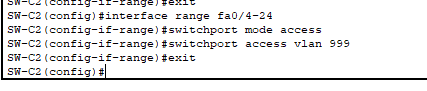

**Sala de Espera - SW-C3**

```bash
# VLAN 999
interface range fa0/3-24
switchport mode access
switchport access vlan 999
```

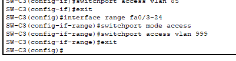

## Comprobacion VLANS

### CONTROL

**Administracion - SW-A2**


**Seguridad - SW-A3**


**Servidores - SW-A4**


### OPERACION


**Check-in - SW-B2**


**Migración - SW-B3**


**Puertas - SW-B4**


### SERVICIOS

**Tiendas - SW-C2**


**Sala de Espera - SW-C3**


## VERIFICACIONES

**VTP**


**Rapid PVST+**


**Trunks**


**Ethernetchannel**

