## Edificio A

### Dispositivos:

- 3 computadoras (PC-PT)
- 2 Switches (2960-24TT)
- Switch (Switch-PT)
- Acces Point (AC-PT)
- Smartphone (Smartphone-PT)
- 2 Laptops (Laptop-PT)

**VLANs para este edificio**

1. Administracion
2. Laboratorio
3. Docencia

**Asignacion IP**

* Administracion ```192.168.15.0/24```
* Laboratorio ```192.168.45.0/24```
* Docencia ```192.168.25.0/24```


**Configuracion switch SW-A1 modo server**


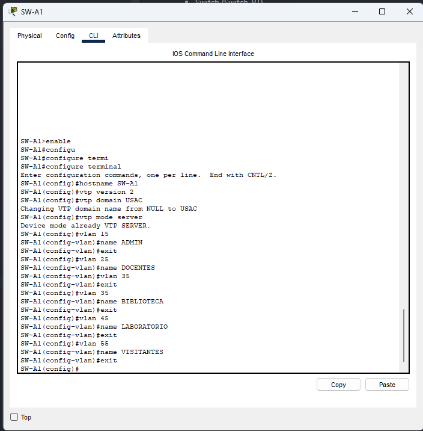

```bash
enable
configure terminal 
hostname SW-A1
vtp version 2
vtp domain C8_NetCore
vtp mode server
vtp password proyecto12026

vlan 15
name ADMIN

vlan 25
name DOCENTES

vlan 35
name BIBLIOTECA

vlan 45
name LABORATORIO

vlan 55
name VISITANTES
```

**Configuracion switch SW-A2 y A3 modo cliente**

Misma configuracion para ambos switches


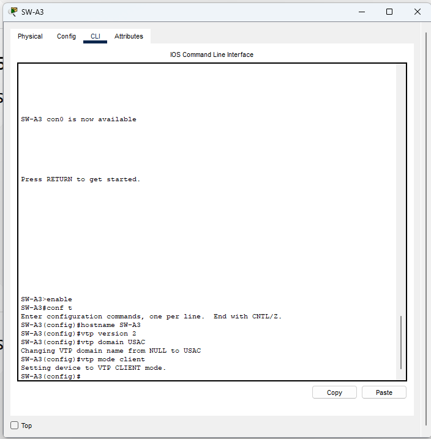

```bash
enable
conf t

hostname SW-A2 

vtp domain C8_NetCore
vtp password proyecto12026
vtp mode client
vtp version 2
```

**Configuración de TRUNK**

*SW-A1 → SW-A2*

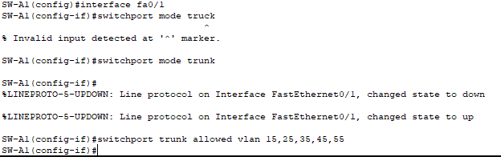

```bash
interface fa0/1
switchport mode trunk
switchport trunk allowed vlan 15,25,35,45,55
```


*SW-A1 → SW-A3*

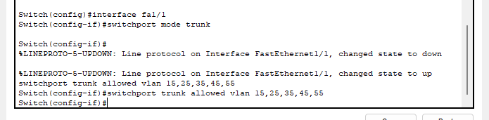

```bash
interface fa1/1
switchport mode trunk
switchport trunk allowed vlan 15,25,35,45,55
```

**Configuración de puertos ACCESS**

*SW-A2*

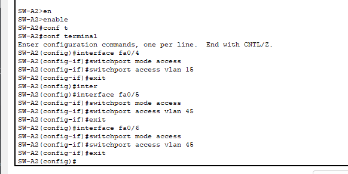
```bash
# VLAN 15
interface fa0/4
switchport mode access
switchport access vlan 15

# VLAN 45

interface fa0/6
switchport mode access
switchport access vlan 45

interface fa0/5
switchport mode access
switchport access vlan 45


```

*SW-A3*

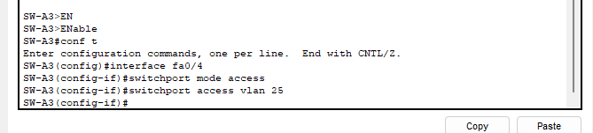

```bash
# VLAN 25
interface fa0/4
switchport mode access
switchport access vlan 25


```

**Configurar Spanning Tree Rapid-PVST**

**SW-A1 - SW-A2 - SW-A3**

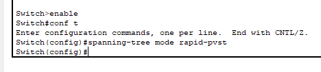


```bash
enable
conf t
spanning-tree mode rapid-pvst

```

**Configurar PortChannel con PAgP**

**Configuración SW-A2 (PAgP DESIRABLE)**
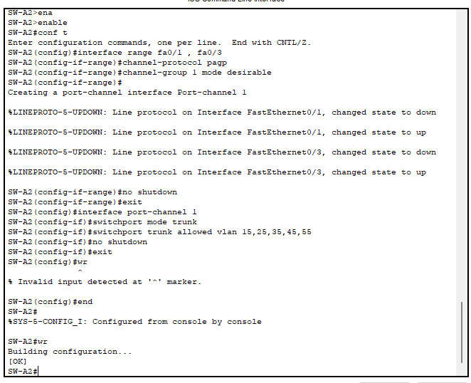
```bash
enable
conf t

interface range fa0/1 , fa0/3
 channel-protocol pagp
 channel-group 1 mode desirable
 no shutdown
exit

interface port-channel 1
 switchport mode trunk
 switchport trunk allowed vlan 11,21,31,41,51
 no shutdown
exit

wr
```

**Configuración SW-A3 (PAgP AUTO)**

```bash
enable
conf t

interface range fa0/1 , fa0/2
 channel-protocol pagp
 channel-group 1 mode auto
 no shutdown
exit

interface port-channel 1
 switchport mode trunk
 switchport trunk allowed vlan 11,21,31,41,51
 no shutdown
exit

wr

```

**Comprobaciones**

**Ver las VLANs configuradas**

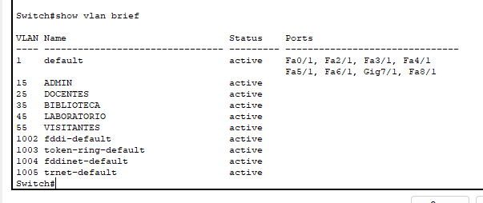

```bash
show vlan brief
```

**Ver los TRUNKS entre switches**

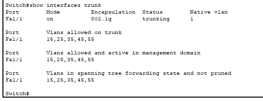

**SW-A1**
```bash
show interfaces trunk
```

**Ver VTP**

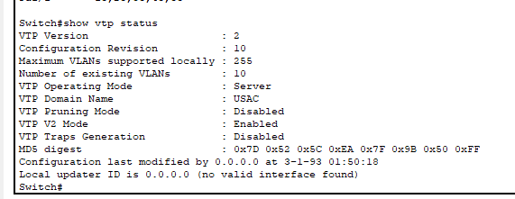

```bash
show vtp status
```

**Ver EtherChanne**
**SW-A2 Y SW-A3**

```bash
show etherchannel summary
```


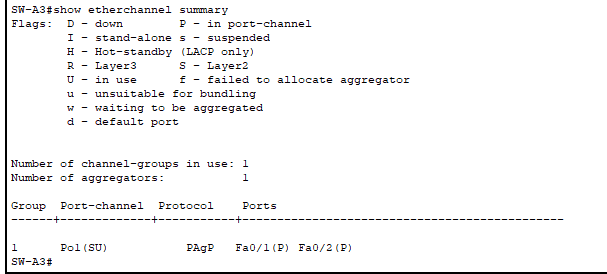

**Ver Spanning Tree**

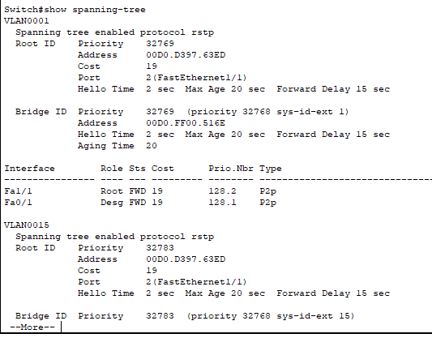

```bash
show spanning-tree
```

**Configuración en SW-A1**

Para fibra optica entre edificios

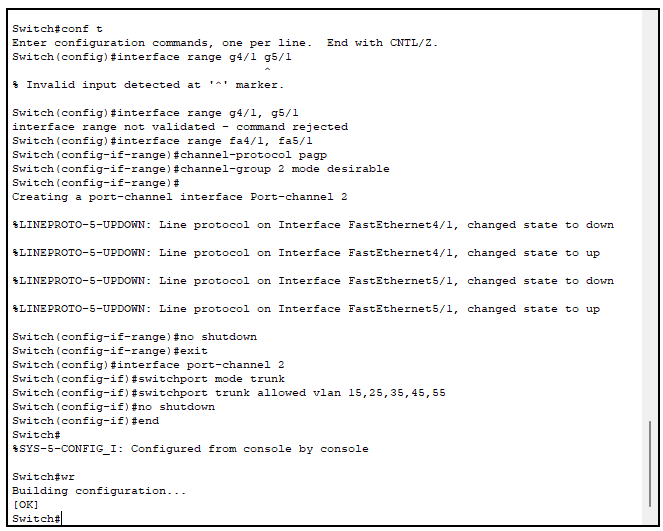

```bash
enable
conf t

interface range fa4/1, fa5/1
channel-protocol pagp
channel-group 2 mode desirable
no shutdown
exit

interface port-channel 2
switchport mode trunk
switchport trunk allowed vlan 15,25,35,45,55
no shutdown
end
wr
```

## Edificio B

### Dispositivos:


- 4 computadoras (PC-PT)
- 2 Switches (2960-24TT)
- 2 Switch (Switch-PT)
- Hub (HUB.PT)
- 3 Laptops (Laptop-PT)

**VLANs para este edificio**

1. Administracion
2. Biblioteca
3. Docencia

**Asignacion IP**

* Administracion ```192.168.15.0/24```
* Biblioteca ```192.168.35.0/24```
* Docencia ```192.168.25.0/24```


**Configuracion switch SW-B1 modo cliente**

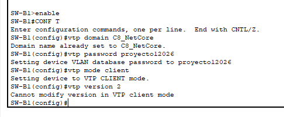

```bash
enable
conf t

hostname SW-A2 

vtp domain C8_NetCore
vtp password proyecto12026
vtp mode client
vtp version 2

```


**Configuración de TRUNK**

*SW-B1 → SW-B3*

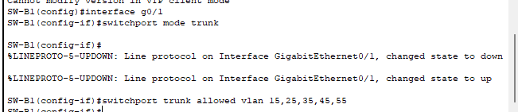


```bash
interface g0/1
switchport mode trunk
switchport trunk allowed vlan 15,25,35,45,55
```


*SW-B1 → SW-B4*

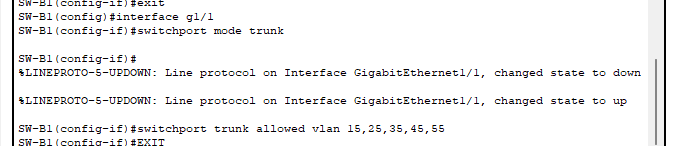

```bash
interface g1/1
switchport mode trunk
switchport trunk allowed vlan 15,25,35,45,55
```

*SW-B3 → SW-B4*

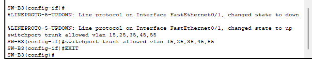

```bash
interface fa0/1
switchport mode trunk
switchport trunk allowed vlan 15,25,35,45,55
```


**Configuración de puertos ACCESS**

*SW-B3*

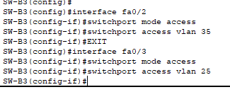
```bash
# VLAN 35
interface fa0/2
switchport mode access
switchport access vlan 35

# VLAN 25

interface fa0/3
switchport mode access
switchport access vlan 25


```

*SW-B4*


```bash
# VLAN 15
interface fa0/2
switchport mode access
switchport access vlan 15

# VLAN 35
interface fa0/3
switchport mode access
switchport access vlan 35


```


**Configurar Spanning Tree Rapid-PVST**

**SW-A1 - SW-A2 - SW-A3**

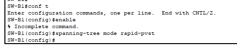

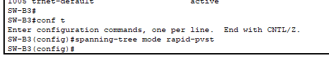


```bash
enable
conf t
spanning-tree mode rapid-pvst

```

**Configuracion SW-B2**

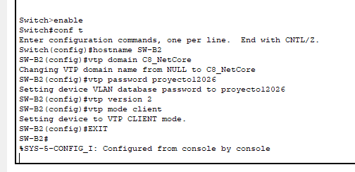

```bash
enable
conf t

hostname SW-B2 

vtp domain C8_NetCore
vtp password proyecto12026
vtp mode client
vtp version 2

```

**Configuración en SW-B2**

Para fibra optica entre edificios

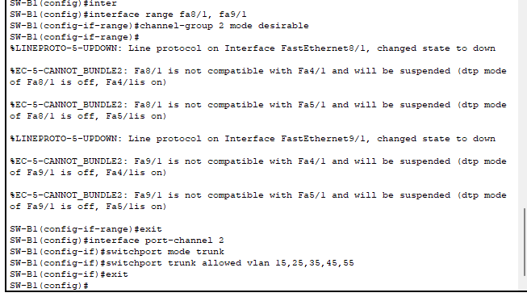

```bash
enable
conf t

interface range fa9/1, fa8/1
channel-protocol pagp
channel-group 2 mode desirable
no shutdown
exit

interface port-channel 2
switchport mode trunk
switchport trunk allowed vlan 15,25,35,45,55
no shutdown
end
wr
```


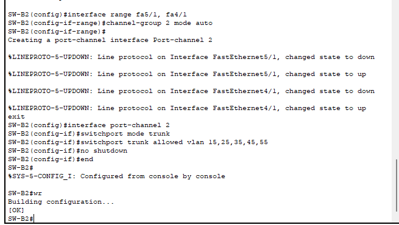

```bash
conf t
interface range fa5/1, fa4/1
channel-group 2 mode desirable
exit

interface port-channel 2
switchport mode trunk
switchport trunk allowed vlan 15,25,35,45,55
no shutdown
end
wr

```

**Configuración de puertos ACCESS**

**SW-B2**

```bash
# VLAN 35
interface fa0/3
switchport mode access
switchport access vlan 35
```


**Comprobaciones**

**Ver las VLANs configuradas**


```bash
show vlan brief
```

**Ver los TRUNKS entre switches**

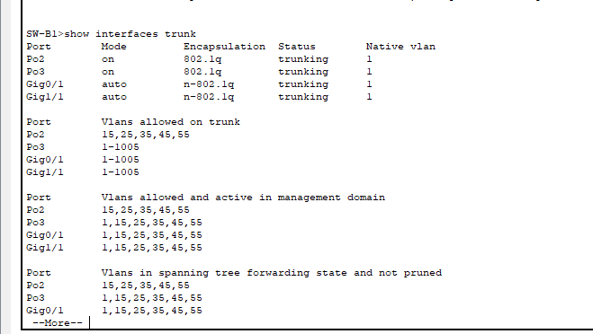

**SW-B1**
```bash
show interfaces trunk
```

**Ver VTP**

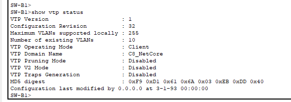

```bash
show vtp status
```

**Ver EtherChanne**
**SW-A2 Y SW-A3**

```bash
show etherchannel summary
```


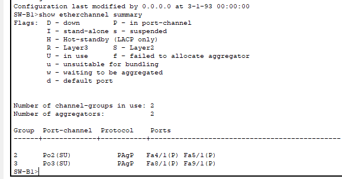

**Ver Spanning Tree**

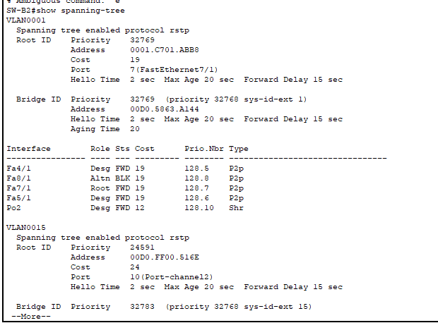

```bash
show spanning-tree
```

## Edificio C

### Dispositivos:

- 5 computadoras (PC-PT)
- 2 Switches (2960-24TT)
- 2 Switches (Switch-PT)
- Hub (Hub-PT)

**VLANs para este edificio**

1. Administracion
2. Biblioteca
3. Docencia

**Asignacion IP**

* Administracion ```192.168.15.0/24```
* Biblioteca ```192.168.35.0/24```
* Docencia ```192.168.25.0/24```


**Configuracion switch SW-C1, C2, C3 Y C4 modo cliente**


Misma configuracion para los 3 switches


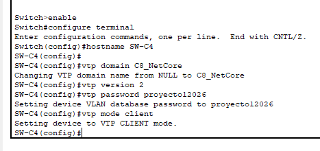

```bash
enable
conf t

hostname SW-A2 

vtp domain C8_NetCore
vtp password proyecto12026
vtp mode client
vtp version 2
```

**Configuración de TRUNK**

*SW-C4 → HUB*

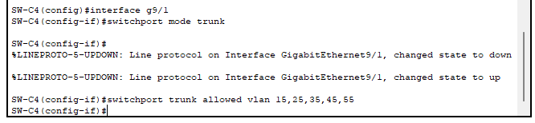

```bash
interface g9/1
switchport mode trunk
switchport trunk allowed vlan 15,25,35,45,55
```


*SW-C3 → HUB*

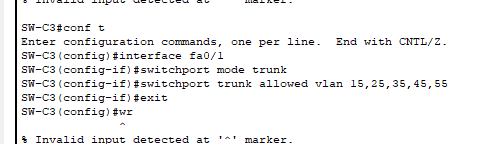

```bash
interface fa0/1
switchport mode trunk
switchport trunk allowed vlan 15,25,35,45,55
```

*SW-C1 → HUB*

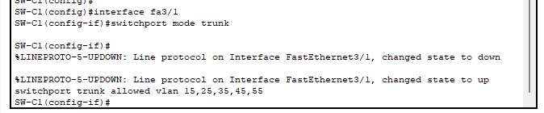

```bash
interface fa3/1
switchport mode trunk
switchport trunk allowed vlan 15,25,35,45,55
```


*SW-C2 → HUB*

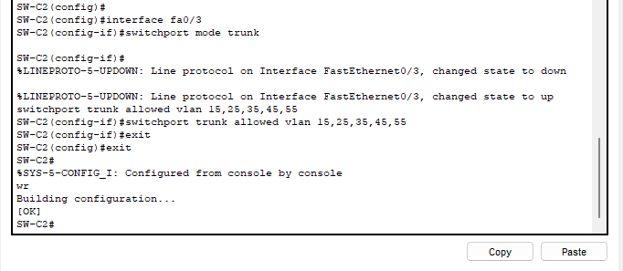

```bash
interface fa0/3
switchport mode trunk
switchport trunk allowed vlan 15,25,35,45,55
```


**Configuración de puertos ACCESS**

*SW-C3*

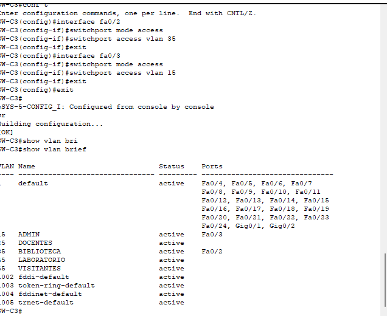
```bash

# VLAN 35
interface fa0/2
switchport mode access
switchport access vlan 35

# VLAN 15

interface fa0/3
switchport mode access
switchport access vlan 15

```

*SW-C1*

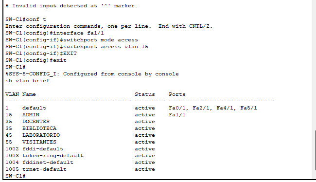

```bash
# VLAN 15
interface fa1/1
switchport mode access
switchport access vlan 15


```

*SW-C2*

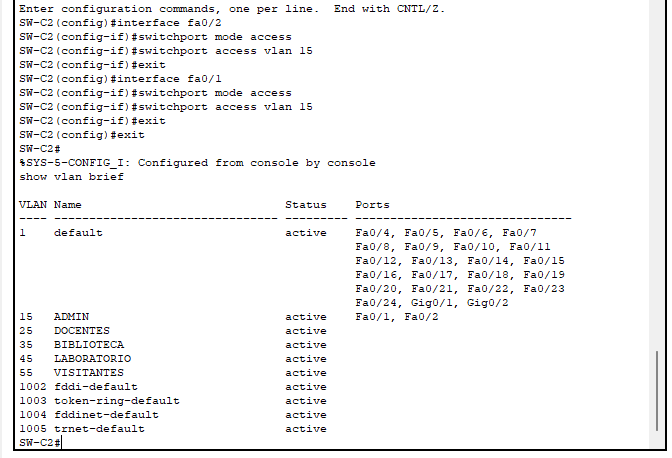

```bash
# VLAN 15
interface fa0/2
switchport mode access
switchport access vlan 15

# VLAN 15
interface fa0/1
switchport mode access
switchport access vlan 15


```

**Configurar Spanning Tree Rapid-PVST**

**SW-C1 - SW-C2 - SW-C3**

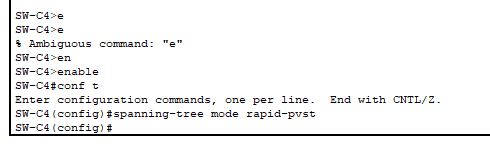


```bash
enable
conf t
spanning-tree mode rapid-pvst

```


**Configurar PortChannel con PAgP**

**Configuración SW-B4 (PAgP DESIRABLE)**
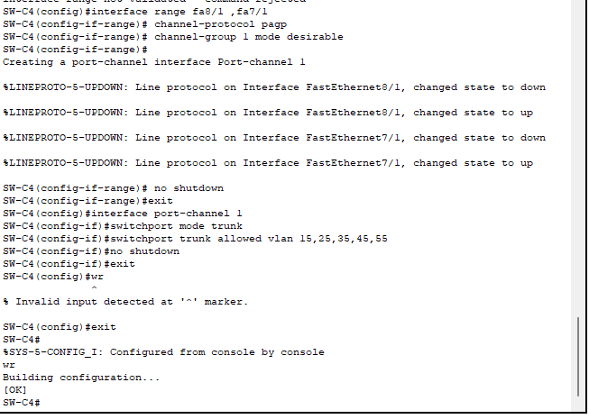
```bash
enable
conf t

interface range fa8/1 , fa7/1
 channel-protocol pagp
 channel-group 1 mode desirable
 no shutdown
exit

interface port-channel 1
 switchport mode trunk
 switchport trunk allowed vlan 15,25,35,45,55
 no shutdown
exit

wr
```

**Configuración SW-A3 (PAgP DESIRABLE)**

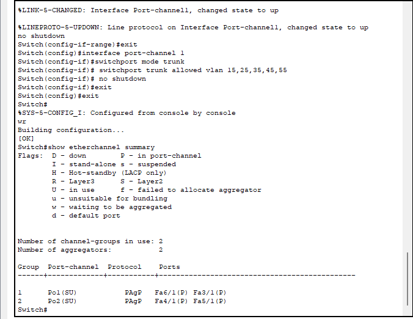

```bash
enable
conf t

interface range fa6/1 , fa3/1
 channel-protocol pagp
 channel-group 1 mode desirable
 no shutdown
exit

interface port-channel 1
 switchport mode trunk
 switchport trunk allowed vlan 15,25,35,45,55
 no shutdown
exit

wr

```


**Comprobaciones**

**Ver las VLANs configuradas**

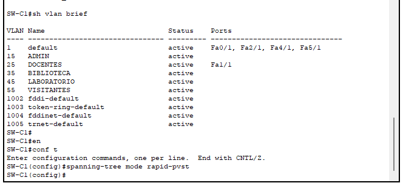

```bash
show vlan brief
```

**Ver los TRUNKS entre switches**

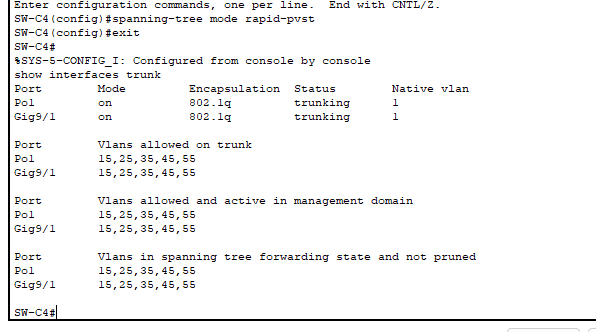

**SW-B1**
```bash
show interfaces trunk
```

**Ver VTP**

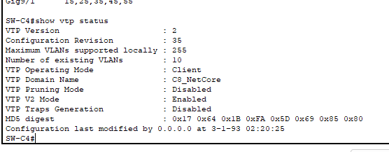

```bash
show vtp status
```

**Ver EtherChanne**
**SW-A2 Y SW-A3**

```bash
show etherchannel summary
```


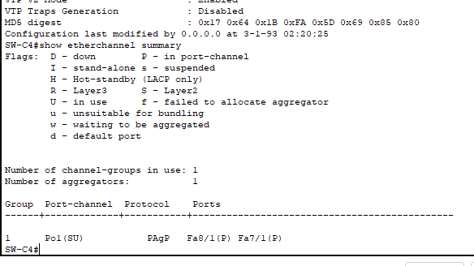

**Ver Spanning Tree**

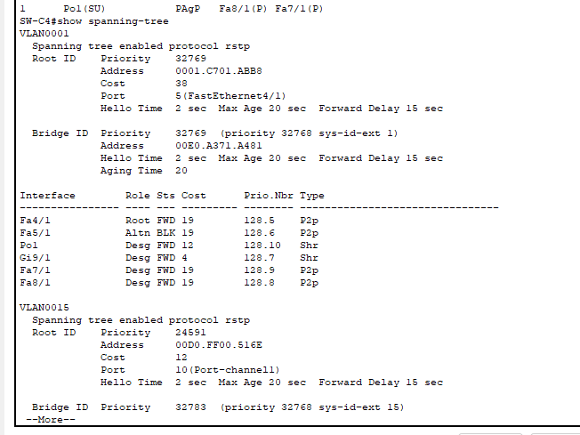

```bash
show spanning-tree
```


## Edificio D

### Dispositivos:

- 7 computadoras (PC-PT)
- 3 Switches (2960-24TT)
- 3 Switches (Switch-PT)
- Acces Point (AC-PT)
- Repetidor (Repeater-PT)
- Server (Server-PT)

**VLANs para este edificio**

1. Administracion
2. Laboratorio
3. Biblioteca
4. Visitantes

**Asignacion IP**

* Administracion ```192.168.15.0/24```
* Laboratorio ```192.168.45.0/24```
* Biblioteca ```192.168.35.0/24```
* Visitantes ```192.168.55.0/24```


**Configuracion switch SW-D1, D2, D3, D4 Y D5 modo cliente**


Misma configuracion para los 5 switches excepto 1.

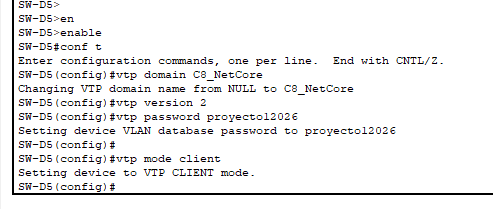

```bash
enable
conf t

hostname SW-A2 

vtp domain C8_NetCore
vtp password proyecto12026
vtp mode client
vtp version 2
```

**Configuracion switch SW-E1 modo Transparente**

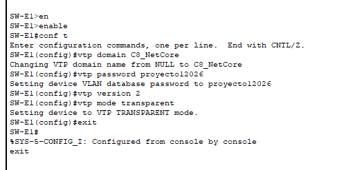

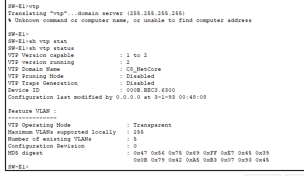

```bash
enable
conf t

hostname SW-E1
vtp domain C8_NetCore
vtp password proyecto12026
vtp mode transparent
vtp version 2

```

**Ethernet Channel**
**Configuración en SW-D5**

Para fibra optica entre edificios

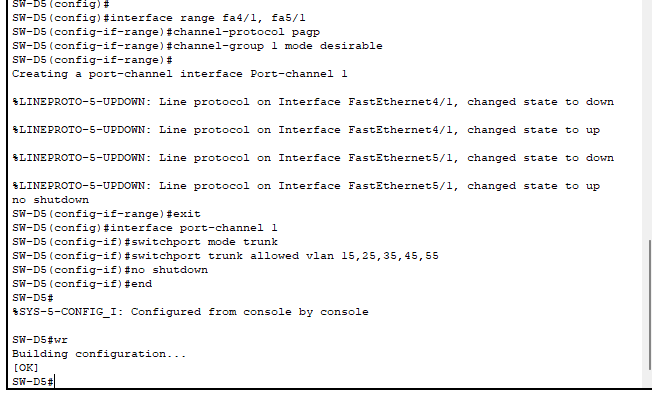

```bash
enable
conf t

interface range fa4/1, fa5/1
channel-protocol pagp
channel-group 1 mode desirable
no shutdown
exit

interface port-channel 1
switchport mode trunk
switchport trunk allowed vlan 15,25,35,45,55
no shutdown
end
wr
```

SW 2

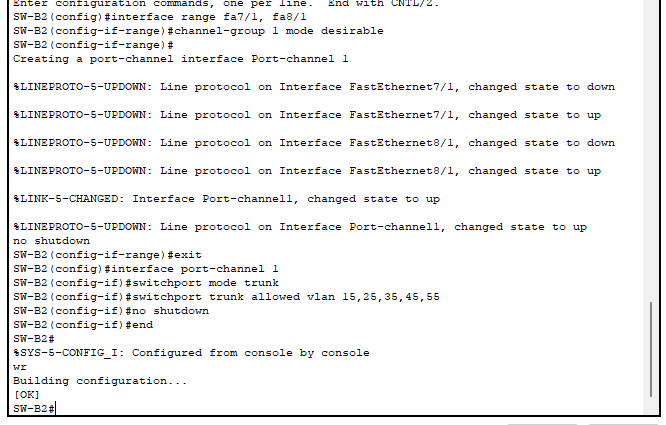

```bash
conf t
interface range fa7/1, fa8/1
channel-group 1 mode desirable
exit

interface port-channel 1
switchport mode trunk
switchport trunk allowed vlan 15,25,35,45,55
no shutdown
end
wr

```


**Configuración en SW-D1**

Para fibra optica entre edificios

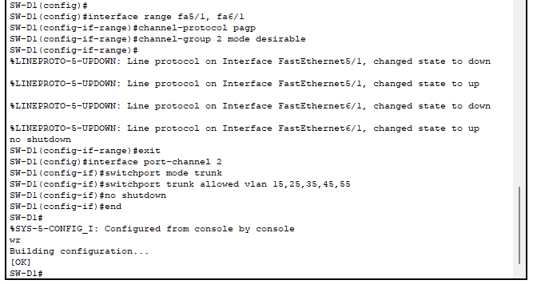

```bash
enable
conf t

interface range fa5/1, fa6/1
channel-protocol pagp
channel-group 2 mode desirable
no shutdown
exit

interface port-channel 2
switchport mode trunk
switchport trunk allowed vlan 15,25,35,45,55
no shutdown
end
wr
```

SW 2


```bash
conf t
interface range fa4/1, fa5/1
channel-protocol pagp
channel-group 2 mode desirable
no shutdown
exit

interface port-channel 2
switchport mode trunk
switchport trunk allowed vlan 15,25,35,45,55
no shutdown
end
wr

```


**Configuración de TRUNK**

*SW-C4 → HUB*


```bash
interface g9/1
switchport mode trunk
switchport trunk allowed vlan 15,25,35,45,55
```


*SW-D1 → SW-D5*


```bash
interface fa4/1
switchport mode trunk
switchport trunk allowed vlan 15,25,35,45,55
```

*SW-D5 → SW-D2*


```bash
interface gig7/1
switchport mode trunk
switchport trunk allowed vlan 15,25,35,45,55
```


*SW-D2 → SW-D5*


```bash
interface gig6/1
switchport mode trunk
switchport trunk allowed vlan 15,25,35,45,55
```
*SW-D2 → SW-D4*

```bash
interface fa1/1
switchport mode trunk
switchport trunk allowed vlan 15,25,35,45,55
```

*SW-D4 → SW-D2*


```bash
interface fa0/3
switchport mode trunk
switchport trunk allowed vlan 15,25,35,45,55
```

*SW-D2 → Repeater*


```bash
interface fa0/1
switchport mode trunk
switchport trunk allowed vlan 15,25,35,45,55
```
*SW-D3 → Repeater*


```bash
interface fa0/4
switchport mode trunk
switchport trunk allowed vlan 15,25,35,45,55
```


*SW-D2 → SW-E1*


```bash
interface fa2/1
switchport mode trunk
switchport trunk allowed vlan 15,25,35,45,55
```

*SW-D1 → SW-E1*


```bash
interface fa0/1
switchport mode trunk
switchport trunk allowed vlan 15,25,35,45,55
```


**Configurar Spanning Tree Rapid-PVST**

**SW-D1 - SW-D2 - SW-D3 - SW-D4 - SW-D5**


```bash
enable
conf t
spanning-tree mode rapid-pvst

```


**Configuración de puertos ACCESS**

*SW-D4*


```bash

# VLAN 35
interface fa0/1
switchport mode access
switchport access vlan 35

# VLAN 45

interface fa0/2
switchport mode access
switchport access vlan 45

```

*SW-D3*


```bash
# VLAN 15
interface range fa0/1, fa0/3
switchport mode access
switchport access vlan 15

# VLAN 25
interface fa0/2
switchport mode access
switchport access vlan 25


```

*SW-C2*


```bash
# VLAN 15
interface fa0/2
switchport mode access
switchport access vlan 15

# VLAN 15
interface fa0/1
switchport mode access
switchport access vlan 15


```


**Comprobaciones**

**Ver las VLANs configuradas**


```bash
show vlan brief
```

**Ver los TRUNKS entre switches**


**SW-B1**
```bash
show interfaces trunk
```

**Ver VTP**


```bash
show vtp status
```

**Ver EtherChanne**
**SW-B2 Y SW-D5**


```bash
show etherchannel summary
```


**Ver Spanning Tree**


```bash
show spanning-tree
```