# UNIVERSIDAD DE SAN CARLOS DE GUATEMALA
## FACULTAD DE INGENIERÍA
### REDES DE COMPUTADORAS 1

**TUTOR ACADÉMICO:** César Fernando Sazo Quisquinay

---

**Diego Alexander Pablo Subuyuj**  
**CARNÉ:** 202300485  
**SECCIÓN:** N

**Guatemala, 19 de enero del 2026**


## PROYECTO 1
### NetCore Academy


## OBJETIVOS DEL SISTEMA

### GENERAL
Disenar, simular y documentar una red VLAN de cuatro edificios por medio de Cisco Packet Tracer, aplicando buenas practicas de segmentacion logica, administracion de switches y validacion de conectividad en un entorno controlado.

### ESPECÍFICOS
- Modelar una topologia funcional para un edificio de 4 edificios con al menos 50 dispositivos finales.
- Configurar VLANs para separar trafico por areas o funciones, mejorando orden, seguridad y administracion.
- Implementar VTP para centralizar la distribucion de informacion de VLAN entre switches del mismo dominio.
- Establecer enlaces troncales 802.1Q para transportar multiples VLANs entre equipos de conmutacion.
- Configurar puertos de acceso segun la necesidad de cada dispositivo final y su respectiva VLAN.
- Aplicar Spanning Tree (Rapid-PVST) para prevenir bucles de capa 2 y acelerar la convergencia.
- Utilizar EtherChannel para aumentar capacidad y redundancia en enlaces entre switches.
- Verificar conectividad y consistencia de configuracion mediante pruebas basicas de comunicacion y revision de tablas.

## INTRODUCCIÓN

El presente proyecto integra los fundamentos de conmutacion vistos en el curso de Redes de Computadoras 1, trasladandolos a un escenario practico de simulacion.

Desde una perspectiva tecnica, la propuesta se centra en separar dominios de broadcast por medio de VLANs, estandarizar la propagacion de dichas VLANs con VTP y asegurar una interconexion confiable con enlaces troncales. Adicionalmente, se incorporan mecanismos de resiliencia y eficiencia como Rapid-PVST y EtherChannel, que son esenciales para evitar fallas por bucles y para optimizar el aprovechamiento de los enlaces. La simulacion permite validar decisiones de diseno antes de una implementacion real, reduciendo riesgos y facilitando la comprension del comportamiento de la red. De esta forma, el proyecto no solo evidencia el dominio de comandos de configuracion, sino tambien la capacidad de planificar, justificar y documentar una solucion de red alineada con requerimientos academicos.

## JUSTIFICACION

La realizacion de esta practica fortalece la relacion entre teoria y aplicacion real en el area de redes. Implementar un escenario completo en Packet Tracer permite comprender con mayor claridad como se comportan los dispositivos de capa 2 ante diferentes politicas de segmentacion y transporte de trafico.

Asimismo, el proyecto aporta competencias clave para entornos profesionales: analisis de requerimientos, diseno de topologias, estandarizacion de configuraciones, deteccion temprana de errores y documentacion tecnica reproducible.

## ALCANCE DE LA PRÁCTICA

* Diseno logico y fisico de la topologia LAN para los tres niveles del edificio en Cisco Packet Tracer.
* Configuracion de switches con funciones de acceso, distribucion de VLANs y enlaces troncales.
* Aplicacion de practicas de redundancia y control de lazo de capa 2 con Rapid-PVST y EtherChannel.
* Asignacion de direccionamiento IP estatico sin duplicidad para los hosts definidos.
* Verificacion funcional de comunicacion entre equipos permitidos por la segmentacion implementada.
* Elaboracion de evidencia tecnica de configuraciones y resultados de la simulacion.

### LIMITACIONES

* El entorno es de simulacion, por lo que no se contemplan factores fisicos reales como interferencia, fallos electricos o limitaciones de cableado.
* No se incluye implementacion de servicios avanzados de capa 3 (enrutamiento dinamico, ACLs complejas o alta disponibilidad de gateway).
* Las pruebas se orientan al cumplimiento de la practica academica y no a una auditoria de seguridad de nivel empresarial.

## RECURSOS Y HERRAMIENTAS UTILIZADAS

* Cisco Packet Tracer
* Switches Cisco 2960
* VPCs (para equipos finales)
* GitHub (repositorio del curso)
* Editor Markdown

## MARCO TEORICO RESUMIDO

### VLAN
Una VLAN permite dividir una red fisica en varias redes logicas independientes. Esto reduce dominios de broadcast, mejora el orden del trafico y facilita aplicar politicas administrativas por area funcional.

### VTP
VTP (VLAN Trunking Protocol) simplifica la administracion de VLANs al propagar cambios dentro de un mismo dominio. En este proyecto se usa un switch en modo servidor y switches en modo cliente para mantener consistencia.

### Trunk
Un enlace trunk transporta multiples VLANs sobre un mismo enlace fisico entre switches. Esto permite interconectar segmentos de red sin requerir un enlace dedicado por cada VLAN.

### STP / Rapid-PVST
Spanning Tree evita bucles de capa 2 al bloquear caminos redundantes cuando es necesario. Rapid-PVST mejora los tiempos de convergencia y mantiene estabilidad ante cambios de topologia.

### EtherChannel
EtherChannel agrupa varios enlaces fisicos en un unico enlace logico. Sus ventajas principales son mayor ancho de banda agregado y redundancia frente a la falla de un enlace individual.

### VLANS

| No 	| Nombre      	| VLAN 	|
|:--:	|-------------	|------	|
| 1  	| ADMIN       	| 15   	|
| 2  	| DOCENTES    	| 25   	|
| 3  	| BIBLIOTECA  	| 35   	|
| 4  	| LABORATORIO 	| 45   	|
| 5  	| VISITANTES  	| 55   	|

## Edificio A

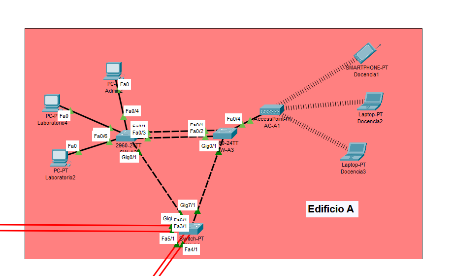

### Dispositivos:

- 3 computadoras (PC-PT)
- 2 Switches (2960-24TT)
- Switch (Switch-PT)
- Acces Point (AC-PT)
- Smartphone (Smartphone-PT)
- 2 Laptops (Laptop-PT)

**VLANs para este edificio**

1. Administracion
2. Laboratorio
3. Docencia

**Asignacion IP**

* Administracion ```192.168.15.0/24```
* Laboratorio ```192.168.45.0/24```
* Docencia ```192.168.25.0/24```

**IPs ASIGNADAS**

| Área / Dispositivo | Tipo de Equipo | Dirección IP     |
|--------------------|---------------|------------------|
| Docencia1          | Celular       | 192.168.25.2     |
| Docencia2          | Celular       | 192.168.25.3     |
| Docencia3          | Celular       | 192.168.25.4     |
| Admin2             | Computadora   | 192.168.15.3     |
| Laboratorio4       | Computadora   | 192.168.45.5     |
| Laboratorio2       | Computadora   | 192.168.45.3     |


**Configuracion switch SW-A1 modo server**


```bash
enable
configure terminal 
hostname SW-A1
vtp version 2
vtp domain C8_NetCore
vtp mode server
vtp password proyecto12026

vlan 15
name ADMIN

vlan 25
name DOCENTES

vlan 35
name BIBLIOTECA

vlan 45
name LABORATORIO

vlan 55
name VISITANTES
```

**Configuracion switch SW-A2 y A3 modo cliente**

Misma configuracion para ambos switches


```bash
enable
conf t

hostname SW-A2 

vtp domain C8_NetCore
vtp password proyecto12026
vtp mode client
vtp version 2
```

**Configuración de TRUNK**

*SW-A1 → SW-A2*


```bash
interface fa0/1
switchport mode trunk
switchport trunk allowed vlan 15,25,35,45,55
```


*SW-A1 → SW-A3*


```bash
interface fa1/1
switchport mode trunk
switchport trunk allowed vlan 15,25,35,45,55
```

**Configuración de puertos ACCESS**

*SW-A2*


```bash
# VLAN 15
interface fa0/4
switchport mode access
switchport access vlan 15

# VLAN 45

interface fa0/6
switchport mode access
switchport access vlan 45

interface fa0/5
switchport mode access
switchport access vlan 45


```

*SW-A3*


```bash
# VLAN 25
interface fa0/4
switchport mode access
switchport access vlan 25


```

**Configurar Spanning Tree Rapid-PVST**

**SW-A1 - SW-A2 - SW-A3**


```bash
enable
conf t
spanning-tree mode rapid-pvst

```

**Configurar PortChannel con PAgP**

**Configuración SW-A2 (PAgP DESIRABLE)**

```bash
enable
conf t

interface range fa0/1 , fa0/3
 channel-protocol LACP
 channel-group 1 mode activate
 no shutdown
exit

interface port-channel 1
 switchport mode trunk
 switchport trunk allowed vlan 15,25,35,45,55
 no shutdown
exit

wr
```

**Configuración SW-A3 (PAgP AUTO)**

```bash
enable
conf t

interface range fa0/1 , fa0/2
 channel-protocol LACP
 channel-group 1 mode activate
 no shutdown
exit

interface port-channel 1
 switchport mode trunk
 switchport trunk allowed vlan 15,25,35,45,55
 no shutdown
exit

wr

```

**Comprobaciones**

**Ver las VLANs configuradas**


```bash
show vlan brief
```

**Ver los TRUNKS entre switches**


**SW-A1**
```bash
show interfaces trunk
```

**Ver VTP**


```bash
show vtp status
```

**Ver EtherChanne**
**SW-A2 Y SW-A3**

```bash
show etherchannel summary
```


**Ver Spanning Tree**


```bash
show spanning-tree
```

**Configuración en SW-A1**

Para fibra optica entre edificios


```bash
enable
conf t

interface range fa4/1, fa5/1
channel-protocol pagp
channel-group 2 mode desirable
no shutdown
exit

interface port-channel 2
switchport mode trunk
switchport trunk allowed vlan 15,25,35,45,55
no shutdown
end
wr
```

## Edificio B


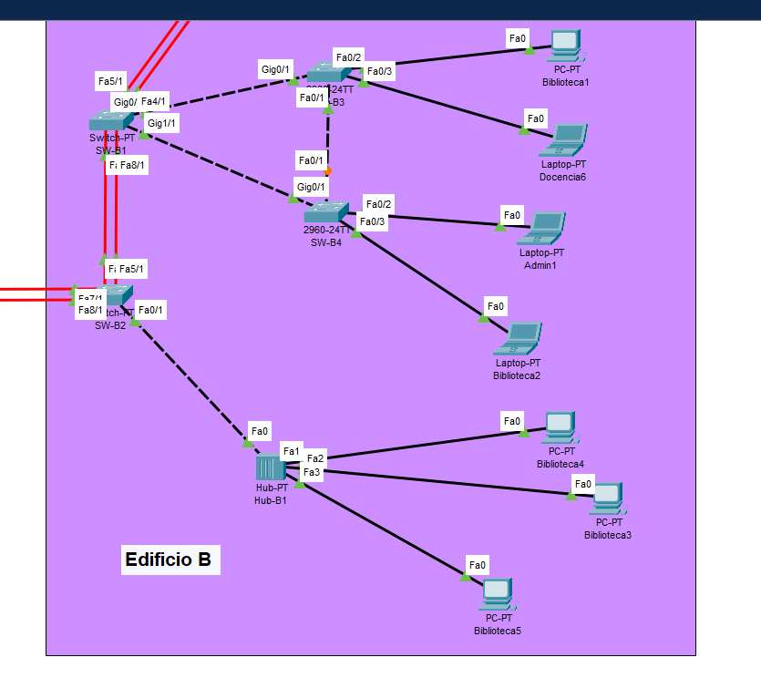

### Dispositivos:


- 4 computadoras (PC-PT)
- 2 Switches (2960-24TT)
- 2 Switch (Switch-PT)
- Hub (HUB.PT)
- 3 Laptops (Laptop-PT)

**VLANs para este edificio**

1. Administracion
2. Biblioteca
3. Docencia

**Asignacion IP**

* Administracion ```192.168.15.0/24```
* Biblioteca ```192.168.35.0/24```
* Docencia ```192.168.25.0/24```


**IPs Asignadas**

| Área / Dispositivo | Tipo de Equipo | Dirección IP     |
|--------------------|---------------|------------------|
| Biblioteca1        | Computadora   | 192.168.35.2     |
| Docencia6          | Laptop        | 192.168.25.7     |
| Admin1             | Laptop        | 192.168.15.2     |
| Biblioteca2        | Laptop        | 192.168.35.3     |
| Biblioteca4        | Computadora   | 192.168.35.5     |
| Biblioteca3        | Computadora   | 192.168.35.4     |
| Biblioteca5        | Computadora   | 192.168.35.6     |


**Configuracion switch SW-B1 modo cliente**


```bash
enable
conf t

hostname SW-A2 

vtp domain C8_NetCore
vtp password proyecto12026
vtp mode client
vtp version 2

```


**Configuración de TRUNK**

*SW-B1 → SW-B3*


```bash
interface g0/1
switchport mode trunk
switchport trunk allowed vlan 15,25,35,45,55
```


*SW-B1 → SW-B4*


```bash
interface g1/1
switchport mode trunk
switchport trunk allowed vlan 15,25,35,45,55
```

*SW-B3 → SW-B4*


```bash
interface fa0/1
switchport mode trunk
switchport trunk allowed vlan 15,25,35,45,55
```


**Configuración de puertos ACCESS**

*SW-B3*


```bash
# VLAN 35
interface fa0/2
switchport mode access
switchport access vlan 35

# VLAN 25

interface fa0/3
switchport mode access
switchport access vlan 25


```

*SW-B4*


```bash
# VLAN 15
interface fa0/2
switchport mode access
switchport access vlan 15

# VLAN 35
interface fa0/3
switchport mode access
switchport access vlan 35


```


**Configurar Spanning Tree Rapid-PVST**

**SW-A1 - SW-A2 - SW-A3**


```bash
enable
conf t
spanning-tree mode rapid-pvst

```

**Configuracion SW-B2**


```bash
enable
conf t

hostname SW-B2 

vtp domain C8_NetCore
vtp password proyecto12026
vtp mode client
vtp version 2

```

**Configuración en SW-B2**

Para fibra optica entre edificios


```bash
enable
conf t

interface range fa9/1, fa8/1
channel-protocol pagp
channel-group 2 mode desirable
no shutdown
exit

interface port-channel 2
switchport mode trunk
switchport trunk allowed vlan 15,25,35,45,55
no shutdown
end
wr
```


```bash
conf t
interface range fa5/1, fa4/1
channel-group 2 mode desirable
exit

interface port-channel 2
switchport mode trunk
switchport trunk allowed vlan 15,25,35,45,55
no shutdown
end
wr

```

**Configuración de puertos ACCESS**

**SW-B2**

```bash
# VLAN 35
interface fa0/3
switchport mode access
switchport access vlan 35
```


**Comprobaciones**

**Ver las VLANs configuradas**


```bash
show vlan brief
```

**Ver los TRUNKS entre switches**


**SW-B1**
```bash
show interfaces trunk
```

**Ver VTP**


```bash
show vtp status
```

**Ver EtherChanne**
**SW-A2 Y SW-A3**

```bash
show etherchannel summary
```


**Ver Spanning Tree**


```bash
show spanning-tree
```

## Edificio C


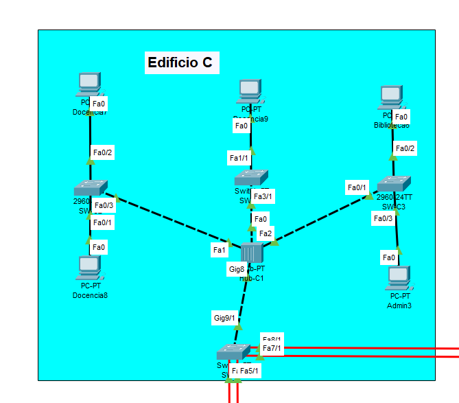


### Dispositivos:

- 5 computadoras (PC-PT)
- 2 Switches (2960-24TT)
- 2 Switches (Switch-PT)
- Hub (Hub-PT)

**VLANs para este edificio**

1. Administracion
2. Biblioteca
3. Docencia

**Asignacion IP**

* Administracion ```192.168.15.0/24```
* Biblioteca ```192.168.35.0/24```
* Docencia ```192.168.25.0/24```

**IPs Asignadas**


| Área / Dispositivo | Tipo de Equipo | Dirección IP     |
|--------------------|---------------|------------------|
| Docencia7          | Computadora   | 192.168.25.8     |
| Docencia8          | Computadora   | 192.168.25.9     |
| Docencia9          | Computadora   | 192.168.25.10    |
| Admin3             | Computadora   | 192.168.15.4     |
| Biblioteca6        | Computadora   | 192.168.35.7     |


**Configuracion switch SW-C1, C2, C3 Y C4 modo cliente**


Misma configuracion para los 3 switches


```bash
enable
conf t

hostname SW-A2 

vtp domain C8_NetCore
vtp password proyecto12026
vtp mode client
vtp version 2
```

**Configuración de TRUNK**

*SW-C4 → HUB*


```bash
interface g9/1
switchport mode trunk
switchport trunk allowed vlan 15,25,35,45,55
```


*SW-C3 → HUB*


```bash
interface fa0/1
switchport mode trunk
switchport trunk allowed vlan 15,25,35,45,55
```

*SW-C1 → HUB*


```bash
interface fa3/1
switchport mode trunk
switchport trunk allowed vlan 15,25,35,45,55
```


*SW-C2 → HUB*


```bash
interface fa0/3
switchport mode trunk
switchport trunk allowed vlan 15,25,35,45,55
```


**Configuración de puertos ACCESS**

*SW-C3*


```bash

# VLAN 35
interface fa0/2
switchport mode access
switchport access vlan 35

# VLAN 15

interface fa0/3
switchport mode access
switchport access vlan 15

```

*SW-C1*


```bash
# VLAN 15
interface fa1/1
switchport mode access
switchport access vlan 15


```

*SW-C2*


```bash
# VLAN 15
interface fa0/2
switchport mode access
switchport access vlan 15

# VLAN 15
interface fa0/1
switchport mode access
switchport access vlan 15


```

**Configurar Spanning Tree Rapid-PVST**

**SW-C1 - SW-C2 - SW-C3**


```bash
enable
conf t
spanning-tree mode rapid-pvst

```


**Configurar PortChannel con PAgP**

**Configuración SW-B4 (PAgP DESIRABLE)**

```bash
enable
conf t

interface range fa8/1 , fa7/1
 channel-protocol pagp
 channel-group 1 mode desirable
 no shutdown
exit

interface port-channel 1
 switchport mode trunk
 switchport trunk allowed vlan 15,25,35,45,55
 no shutdown
exit

wr
```

**Configuración SW-A3 (PAgP DESIRABLE)**


```bash
enable
conf t

interface range fa6/1 , fa3/1
 channel-protocol pagp
 channel-group 1 mode desirable
 no shutdown
exit

interface port-channel 1
 switchport mode trunk
 switchport trunk allowed vlan 15,25,35,45,55
 no shutdown
exit

wr

```


**Comprobaciones**

**Ver las VLANs configuradas**


```bash
show vlan brief
```

**Ver los TRUNKS entre switches**


**SW-B1**
```bash
show interfaces trunk
```

**Ver VTP**


```bash
show vtp status
```

**Ver EtherChanne**
**SW-A2 Y SW-A3**

```bash
show etherchannel summary
```


**Ver Spanning Tree**


```bash
show spanning-tree
```


## Edificio D

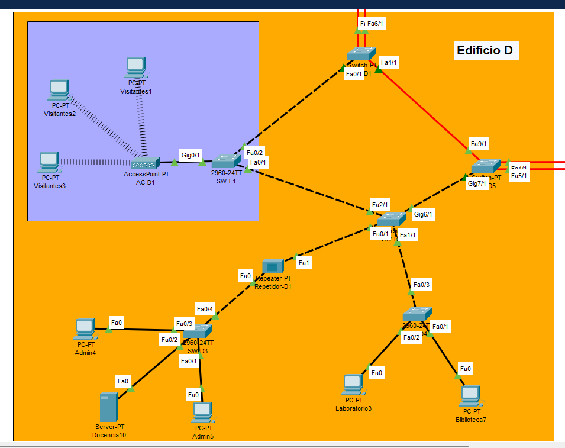

### Dispositivos:

- 7 computadoras (PC-PT)
- 3 Switches (2960-24TT)
- 3 Switches (Switch-PT)
- Acces Point (AC-PT)
- Repetidor (Repeater-PT)
- Server (Server-PT)

**VLANs para este edificio**

1. Administracion
2. Laboratorio
3. Biblioteca
4. Visitantes

**Asignacion IP**

* Administracion ```192.168.15.0/24```
* Laboratorio ```192.168.45.0/24```
* Biblioteca ```192.168.35.0/24```
* Visitantes ```192.168.55.0/24```


**IPs Asignadas**


| Área / Dispositivo | Tipo de Equipo | Dirección IP     |
|--------------------|---------------|------------------|
| Biblioteca7        | Computadora   | 192.168.35.8     |
| Laboratorio3       | Computadora   | 192.168.45.4     |
| Admin5             | Computadora   | 192.168.15.6     |
| Docencia10         | Server        | 192.168.25.11    |
| Admin4             | Computadora   | 192.168.15.5     |


| Área / Dispositivo | Tipo de Equipo | Dirección IP   |
|--------------------|---------------|----------------|
| Visitantes1        | Computadora   | 192.168.55.2   |
| Visitantes2        | Computadora   | 192.168.55.3   |
| Visitantes3        | Computadora   | 192.168.55.4   |

**Configuracion switch SW-D1, D2, D3, D4 Y D5 modo cliente**


Misma configuracion para los 5 switches excepto 1.


```bash
enable
conf t

hostname SW-A2 

vtp domain C8_NetCore
vtp password proyecto12026
vtp mode client
vtp version 2
```

**Configuracion switch SW-E1 modo Transparente**


```bash
enable
conf t

hostname SW-E1
vtp domain C8_NetCore
vtp password proyecto12026
vtp mode transparent
vtp version 2

```

**Ethernet Channel**
**Configuración en SW-D5**

Para fibra optica entre edificios


```bash
enable
conf t

interface range fa4/1, fa5/1
channel-protocol pagp
channel-group 1 mode desirable
no shutdown
exit

interface port-channel 1
switchport mode trunk
switchport trunk allowed vlan 15,25,35,45,55
no shutdown
end
wr
```

SW 2


```bash
conf t
interface range fa7/1, fa8/1
channel-group 1 mode desirable
exit

interface port-channel 1
switchport mode trunk
switchport trunk allowed vlan 15,25,35,45,55
no shutdown
end
wr

```


**Configuración en SW-D1**

Para fibra optica entre edificios


```bash
enable
conf t

interface range fa5/1, fa6/1
channel-protocol pagp
channel-group 2 mode desirable
no shutdown
exit

interface port-channel 2
switchport mode trunk
switchport trunk allowed vlan 15,25,35,45,55
no shutdown
end
wr
```

SW 2


```bash
conf t
interface range fa4/1, fa5/1
channel-protocol pagp
channel-group 2 mode desirable
no shutdown
exit

interface port-channel 2
switchport mode trunk
switchport trunk allowed vlan 15,25,35,45,55
no shutdown
end
wr

```


**Configuración de TRUNK**

*SW-C4 → HUB*


```bash
interface g9/1
switchport mode trunk
switchport trunk allowed vlan 15,25,35,45,55
```


*SW-D1 → SW-D5*


```bash
interface fa4/1
switchport mode trunk
switchport trunk allowed vlan 15,25,35,45,55
```

*SW-D5 → SW-D2*


```bash
interface gig7/1
switchport mode trunk
switchport trunk allowed vlan 15,25,35,45,55
```


*SW-D2 → SW-D5*


```bash
interface gig6/1
switchport mode trunk
switchport trunk allowed vlan 15,25,35,45,55
```
*SW-D2 → SW-D4*

```bash
interface fa1/1
switchport mode trunk
switchport trunk allowed vlan 15,25,35,45,55
```

*SW-D4 → SW-D2*


```bash
interface fa0/3
switchport mode trunk
switchport trunk allowed vlan 15,25,35,45,55
```

*SW-D2 → Repeater*


```bash
interface fa0/1
switchport mode trunk
switchport trunk allowed vlan 15,25,35,45,55
```
*SW-D3 → Repeater*


```bash
interface fa0/4
switchport mode trunk
switchport trunk allowed vlan 15,25,35,45,55
```


*SW-D2 → SW-E1*


```bash
interface fa2/1
switchport mode trunk
switchport trunk allowed vlan 15,25,35,45,55
```

*SW-D1 → SW-E1*


```bash
interface fa0/1
switchport mode trunk
switchport trunk allowed vlan 15,25,35,45,55
```


**Configurar Spanning Tree Rapid-PVST**

**SW-D1 - SW-D2 - SW-D3 - SW-D4 - SW-D5**


```bash
enable
conf t
spanning-tree mode rapid-pvst

```


**Configuración de puertos ACCESS**

*SW-D4*


```bash

# VLAN 35
interface fa0/1
switchport mode access
switchport access vlan 35

# VLAN 45

interface fa0/2
switchport mode access
switchport access vlan 45

```

*SW-D3*


```bash
# VLAN 15
interface range fa0/1, fa0/3
switchport mode access
switchport access vlan 15

# VLAN 25
interface fa0/2
switchport mode access
switchport access vlan 25


```

*SW-C2*


```bash
# VLAN 15
interface fa0/2
switchport mode access
switchport access vlan 15

# VLAN 15
interface fa0/1
switchport mode access
switchport access vlan 15


```


**Comprobaciones**

**Ver las VLANs configuradas**


```bash
show vlan brief
```

**Ver los TRUNKS entre switches**


**SW-B1**
```bash
show interfaces trunk
```

**Ver VTP**


```bash
show vtp status
```

**Ver EtherChanne**
**SW-B2 Y SW-D5**


```bash
show etherchannel summary
```


**Ver Spanning Tree**


```bash
show spanning-tree
```


### COMPROBACIONES GENERALES PINGS


**Ping Edificio A al B**


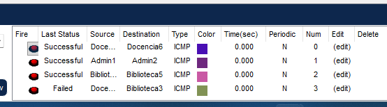


**Ping Edificio A al C**


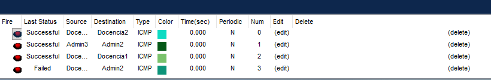

**Ping Edificio A al D**

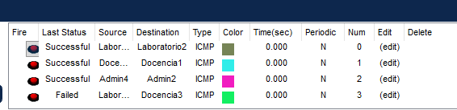

## Topologia Completa

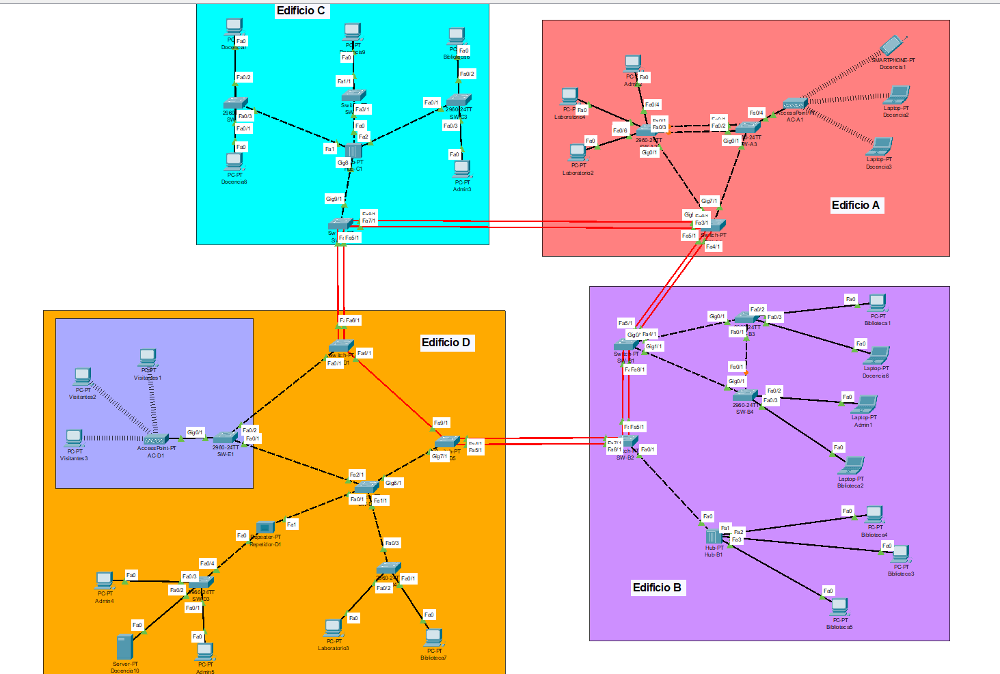

###  Identificación de Equipos (Banner MOTD) 

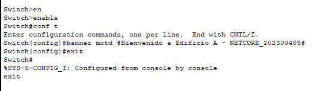


```bash
enable
conf t
banner motd #Bienvenido a Edificio A - NETCORE_202300485#
exit
wr
```

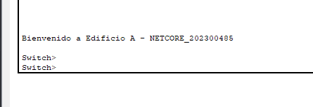


## IPs Utilizadas 

| Área / Dispositivo | Tipo de Equipo | Dirección IP     |
|--------------------|---------------|------------------|
| Admin1             | Laptop        | 192.168.15.2     |
| Admin2             | Computadora   | 192.168.15.3     |
| Admin3             | Computadora   | 192.168.15.4     |
| Admin4             | Computadora   | 192.168.15.5     |
| Admin5             | Computadora   | 192.168.15.6     |
| Biblioteca1        | Computadora   | 192.168.35.2     |
| Biblioteca2        | Laptop        | 192.168.35.3     |
| Biblioteca3        | Computadora   | 192.168.35.4     |
| Biblioteca4        | Computadora   | 192.168.35.5     |
| Biblioteca5        | Computadora   | 192.168.35.6     |
| Biblioteca6        | Computadora   | 192.168.35.7     |
| Biblioteca7        | Computadora   | 192.168.35.8     |
| Docencia1          | Celular       | 192.168.25.2     |
| Docencia2          | Celular       | 192.168.25.3     |
| Docencia3          | Celular       | 192.168.25.4     |
| Docencia6          | Laptop        | 192.168.25.7     |
| Docencia7          | Computadora   | 192.168.25.8     |
| Docencia8          | Computadora   | 192.168.25.9     |
| Docencia9          | Computadora   | 192.168.25.10    |
| Docencia10         | Server        | 192.168.25.11    |
| Laboratorio2       | Computadora   | 192.168.45.3     |
| Laboratorio3       | Computadora   | 192.168.45.4     |
| Laboratorio4       | Computadora   | 192.168.45.5     |
| Visitantes1        | Computadora   | 192.168.55.2     |
| Visitantes2        | Computadora   | 192.168.55.3     |
| Visitantes3        | Computadora   | 192.168.55.4     |


## Dominios de Colision  

| Área           | Dispositivos | Dominios de Colisión |
|----------------|-------------|----------------------|
| Administración | 5           | 5                    |
| Docencia       | 8           | 8                    |
| Biblioteca     | 7           | 7                    |
| Laboratorio    | 3           | 3                    |
| Visitantes     | 3           | 3                    |
| **Total**      | **26**      | **26**               |

## Dominios de Broadcast por VLAN

| VLAN | Área           | Red              | Dispositivos |
|-----|---------------|-----------------|--------------|
| 10  | Administración | 192.168.15.0/24 | Admin1, Admin2, Admin3, Admin4, Admin5 |
| 20  | Docencia       | 192.168.25.0/24 | Docencia1, Docencia2, Docencia3, Docencia6, Docencia7, Docencia8, Docencia9, Docencia10 |
| 30  | Biblioteca     | 192.168.35.0/24 | Biblioteca1, Biblioteca2, Biblioteca3, Biblioteca4, Biblioteca5, Biblioteca6, Biblioteca7 |
| 40  | Laboratorio    | 192.168.45.0/24 | Laboratorio2, Laboratorio3, Laboratorio4 |
| 50  | Visitantes     | 192.168.55.0/24 | Visitantes1, Visitantes2, Visitantes3 |

## PRESUPUESTO


Para la implementación física de la red mostrada en la topología se consideran los equipos principales de interconexión, módulos de expansión, cableado estructurado y conectores necesarios para la comunicación entre los distintos switches y dispositivos finales.


### Equipos de Red


| Equipo                         | Cantidad | Precio Unitario (USD) | Precio Unitario (GTQ) | Subtotal USD | Subtotal GTQ |
| ------------------------------ | -------- | --------------------- | --------------------- | ------------ | ------------ |
| Switch Cisco 2960-24TT         | 12       | $950                  | Q7,410                | $11,400      | Q88,920      |
| Switch equivalente (Switch-PT) | 3        | $300                  | Q2,340                | $900         | Q7,020       |

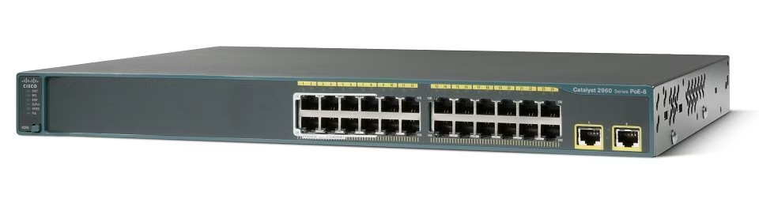


### Módulos de Fibra Óptica

| Equipo            | Cantidad | Precio Unitario (USD) | Precio Unitario (GTQ) | Subtotal USD | Subtotal GTQ |
| ----------------- | -------- | --------------------- | --------------------- | ------------ | ------------ |
| PT-SWITCH-NM-1FFE | 8        | $120                  | Q936                  | $960         | Q7,488       |

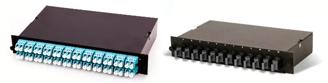


### Cableado de Red

| Material                     | Cantidad | Precio Unitario USD | Precio Unitario GTQ | Subtotal USD | Subtotal GTQ |
| ---------------------------- | -------- | ------------------- | ------------------- | ------------ | ------------ |
| Cable UTP Cat6 (rollo 305m)  | 3        | $150                | Q1,170              | $450         | Q3,510       |
| Cable fibra óptica multimodo | 120 m    | $2.50               | Q19.5               | $300         | Q2,340       |

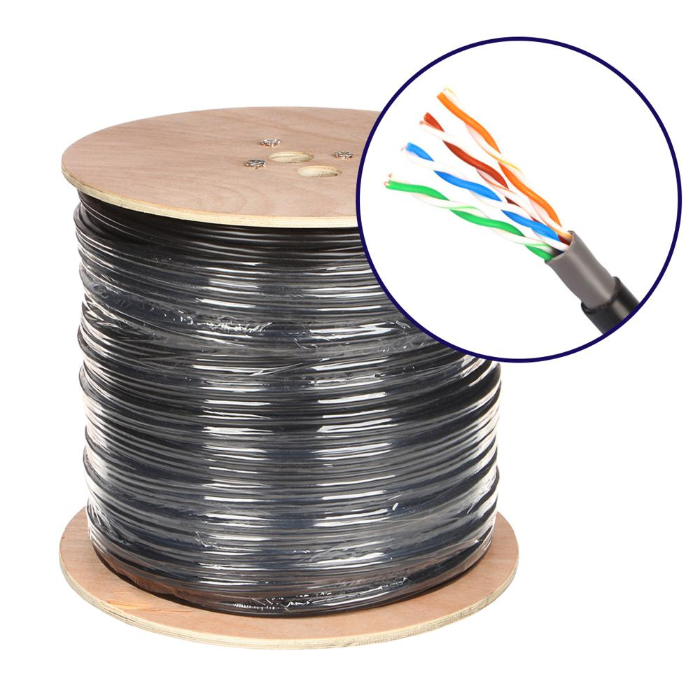

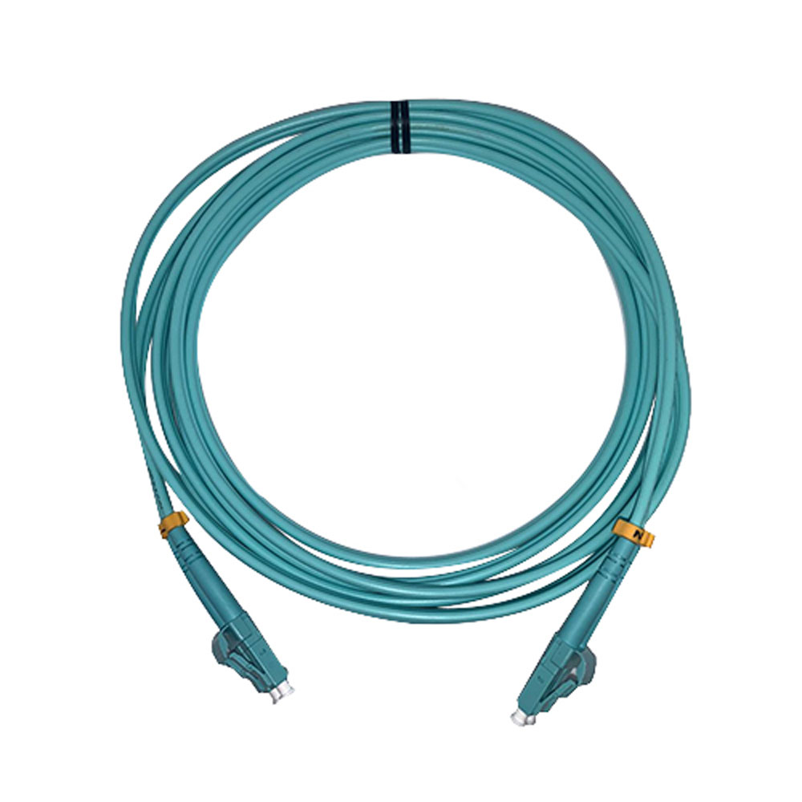


### Conectores y Accesorios

| Material                | Cantidad | Precio Unitario USD | Precio Unitario GTQ | Subtotal USD | Subtotal GTQ |
| ----------------------- | -------- | ------------------- | ------------------- | ------------ | ------------ |
| Conectores RJ45         | 100      | $0.50               | Q3.9                | $50          | Q390         |
| Patch cords Cat6        | 30       | $5                  | Q39                 | $150         | Q1,170       |
| Conectores fibra óptica | 10       | $6                  | Q46.8               | $60          | Q468         |

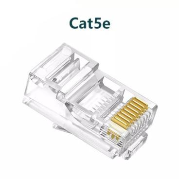

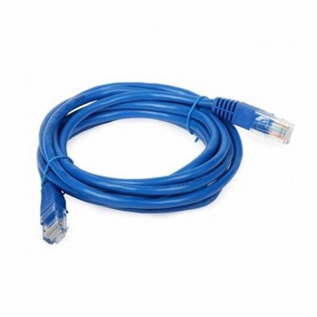

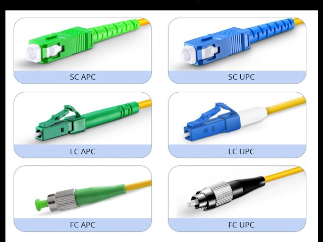


### RESUMEN

| Concepto                | Total USD | Total GTQ |
| ----------------------- | --------- | --------- |
| Equipos de red          | $12,300   | Q95,940   |
| Módulos de fibra        | $960      | Q7,488    |
| Cableado                | $750      | Q5,850    |
| Conectores y accesorios | $260      | Q2,028    |


### TOTAL

| Total USD   | Total GTQ    |
| ----------- | ------------ |
| **$14,270** | **Q111,306** |
