## 1. Sede Occidente 


### Dispositivos:

- 8 computadoras (PC-PT)
- 5 Switches (2960-24TT)
- Router (2911)

**VLANs para este edificio**

| No 	| Nombre      	| VLAN 	|
|:--:	|-------------	|------	|
| 1  	| OPERACIONES       	| 15   	|
| 2  	| ADMINISTRACION    	| 25   	|
| 3  	| SEGURIDAD  	| 35   	|
| 4  	| INVENTARIO 	| 45   	|


**Subnnetting**

| VLAN | Área           | Hosts requeridos | Red               | Máscara         | Gateway        |
| ---: | -------------- | ---------------: | ----------------- | --------------- | -------------- |
|   45 | Inventario     |               55 | 192.168.85.0/26   | 255.255.255.192 | 192.168.85.1   |
|   15 | Operaciones    |               40 | 192.168.85.64/26  | 255.255.255.192 | 192.168.85.65  |
|   25 | Administración |               18 | 192.168.85.128/27 | 255.255.255.224 | 192.168.85.129 |
|   35 | Seguridad      |                8 | 192.168.85.160/28 | 255.255.255.240 | 192.168.85.161 |


**IPs de los disposivos**

| PC          | IP             | Máscara         | Gateway        |
| ----------- | -------------- | --------------- | -------------- |
| PC-OCC-OP1  | 192.168.85.66  | 255.255.255.192 | 192.168.85.65  |
| PC-OCC-OP2  | 192.168.85.67  | 255.255.255.192 | 192.168.85.65  |
| PC-OCC-ADM1 | 192.168.85.130 | 255.255.255.224 | 192.168.85.129 |
| PC-OCC-ADM2 | 192.168.85.131 | 255.255.255.224 | 192.168.85.129 |
| PC-OCC-SEG1 | 192.168.85.162 | 255.255.255.240 | 192.168.85.161 |
| PC-OCC-SEG2 | 192.168.85.163 | 255.255.255.240 | 192.168.85.161 |
| PC-OCC-INV1 | 192.168.85.2   | 255.255.255.192 | 192.168.85.1   |
| PC-OCC-INV2 | 192.168.85.3   | 255.255.255.192 | 192.168.85.1   |


**Configuracion router R-Occidente modo server**
```bash
enable
conf t
hostname R-Occidente

interface g0/0
 no shutdown

interface g0/0.15
 encapsulation dot1Q 15
 ip address 192.168.85.65 255.255.255.192

interface g0/0.25
 encapsulation dot1Q 25
 ip address 192.168.85.129 255.255.255.224

interface g0/0.35
 encapsulation dot1Q 35
 ip address 192.168.85.161 255.255.255.240

interface g0/0.45
 encapsulation dot1Q 45
 ip address 192.168.85.1 255.255.255.192

end
wr
```


**Configuracion switch SW-OCC-MAIN modo server**

```bash
enable
conf t
hostname SW-OCC-MAIN

vtp domain CONRED
vtp mode server
vtp password redes123

vlan 15
 name OPERACIONES
vlan 25
 name ADMINISTRACION
vlan 35
 name SEGURIDAD
vlan 45
 name INVENTARIO

interface g0/1
 switchport mode trunk
 switchport trunk allowed vlan 15,25,35,45

interface range fa0/1 - 4
 switchport mode trunk
 switchport trunk allowed vlan 15,25,35,45

end
wr
```


**Configuracion switch SW-OCC-1 modo client**
```bash
enable
conf t
hostname SW-OCC-1 

vtp domain CONRED
vtp mode client
vtp password redes123

spanning-tree mode rapid-pvst

interface fa0/1
 switchport mode trunk
 switchport trunk allowed vlan 15,25,35,45

interface range fa0/2 - 3
 switchport mode access
 switchport access vlan 15

end
wr
```


**Configuracion switch SW-OCC-2 modo client**
```bash
enable
conf t
hostname SW-OCC-2

vtp domain CONRED
vtp mode client
vtp password redes123

spanning-tree mode rapid-pvst

interface fa0/1
 switchport mode trunk
 switchport trunk allowed vlan 15,25,35,45

interface range fa0/2 - 3
 switchport mode access
 switchport access vlan 25

end
wr
```


**Configuracion switch SW-OCC-3 modo client**

```bash
enable
conf t
hostname SW-OCC-3

vtp domain CONRED
vtp mode client
vtp password redes123

spanning-tree mode rapid-pvst

interface fa0/1
 switchport mode trunk
 switchport trunk allowed vlan 15,25,35,45

interface range fa0/2 - 3
 switchport mode access
 switchport access vlan 35


end
wr
```


**Configuracion switch SW-OCC-4 modo client**
```bash
enable
conf t
hostname SW-OCC-4

vtp domain CONRED
vtp mode client
vtp password redes123

spanning-tree mode rapid-pvst

interface fa0/1
 switchport mode trunk
 switchport trunk allowed vlan 15,25,35,45

interface range fa0/2 - 3
 switchport mode access
 switchport access vlan 45


end
wr

```


**Comprobaciones**

*show vlan brief*


*show interfaces trunk*


*show vtp status*


*show ip interface brief*


*PING*


## 2. Sede Norte 


### Dispositivos:

- 8 computadoras (PC-PT)
- 4 Switches (2960-24TT)
- Router (2911)

**VLANs para este edificio**

| No 	| Nombre      	| VLAN 	|
|:--:	|-------------	|------	|
| 1  	| OPERACIONES       	| 15   	|
| 2  	| ADMINISTRACION    	| 25   	|
| 3  	| SEGURIDAD  	| 35   	|
| 4  	| INVENTARIO 	| 45   	|


**Subnnetting**

| VLAN | Área           | Hosts | Red              | Máscara         | Gateway       |
| ---: | -------------- | ----: | ---------------- | --------------- | ------------- |
|   15 | Operaciones    |    30 | 192.168.86.0/27  | 255.255.255.224 | 192.168.86.1  |
|   45 | Inventario     |    15 | 192.168.86.32/27 | 255.255.255.224 | 192.168.86.33 |
|   25 | Administración |    12 | 192.168.86.64/28 | 255.255.255.240 | 192.168.86.65 |
|   35 | Seguridad      |    10 | 192.168.86.80/28 | 255.255.255.240 | 192.168.86.81 |


**IPs de los disposivos**

| PC          | IP            | Máscara         | Gateway       |
| ----------- | ------------- | --------------- | ------------- |
| PC-NOR-OP1  | 192.168.86.2  | 255.255.255.224 | 192.168.86.1  |
| PC-NOR-OP2  | 192.168.86.3  | 255.255.255.224 | 192.168.86.1  |
| PC-NOR-ADM1 | 192.168.86.66 | 255.255.255.240 | 192.168.86.65 |
| PC-NOR-ADM2 | 192.168.86.67 | 255.255.255.240 | 192.168.86.65 |
| PC-NOR-SEG1 | 192.168.86.82 | 255.255.255.240 | 192.168.86.81 |
| PC-NOR-SEG2 | 192.168.86.83 | 255.255.255.240 | 192.168.86.81 |
| PC-NOR-INV1 | 192.168.86.34 | 255.255.255.224 | 192.168.86.33 |
| PC-NOR-INV2 | 192.168.86.35 | 255.255.255.224 | 192.168.86.33 |


**Configuracion router R-Occidente**

```bash
enable
conf t
hostname R-Norte

interface g0/0
 no shutdown

interface g0/0.15
 encapsulation dot1Q 15
 ip address 192.168.86.1 255.255.255.224

interface g0/0.25
 encapsulation dot1Q 25
 ip address 192.168.85.65 255.255.255.240

interface g0/0.35
 encapsulation dot1Q 35
 ip address 192.168.85.81 255.255.255.240

interface g0/0.45
 encapsulation dot1Q 45
 ip address 192.168.85.33 255.255.255.224

end
wr
```


**Configuracion switch SW-NOR-1 modo server**

```bash
enable
conf t
hostname SW-NOR-1

vtp domain CONRED
vtp mode server
vtp password redes123

spanning-tree mode rapid-pvst

spanning-tree vlan 15,25,35,45 root primary

vlan 15
 name OPERACIONES
vlan 25
 name ADMINISTRACION
vlan 35
 name SEGURIDAD
vlan 45
 name INVENTARIO

interface g0/1
 switchport mode trunk
 switchport trunk allowed vlan 15,25,35,45

interface range fa0/1 - 3
 switchport mode trunk
 switchport trunk allowed vlan 15,25,35,45

end
wr
```


**Configuracion switch SW-NOR-2 modo client**

```bash
enable
conf t
hostname SW-NOR-2

vtp domain CONRED
vtp mode server
vtp password redes123

spanning-tree mode rapid-pvst

interface range fa0/1 - 3
 switchport mode trunk
 switchport trunk allowed vlan 15,25,35,45

end
wr
```


**Configuracion switch SW-NOR-3 modo client**

```bash
enable
conf t
hostname SW-NOR-3

vtp domain CONRED
vtp mode server
vtp password redes123

spanning-tree mode rapid-pvst

interface range fa0/1 - 3
 switchport mode trunk
 switchport trunk allowed vlan 15,25,35,45

interface range fa0/4 - 5
 switchport mode Acces
 switchport trunk allowed vlan 15

interface range fa0/6 - 7
 switchport mode Acces
 switchport trunk allowed vlan 25

end
wr
```


**Configuracion switch SW-NOR-4 modo client**

```bash
enable
conf t
hostname SW-NOR-3

vtp domain CONRED
vtp mode server
vtp password redes123

spanning-tree mode rapid-pvst

interface range fa0/1 - 3
 switchport mode trunk
 switchport trunk allowed vlan 15,25,35,45

interface range fa0/4 - 5
 switchport mode Acces
 switchport trunk allowed vlan 35

interface range fa0/6 - 7
 switchport mode Acces
 switchport trunk allowed vlan 45

end
wr
```


**Comprobaciones**

*show vlan brief*


*show interfaces trunk*


*show vtp status*


*show ip interface brief*


*PING*


## 3. Sede Oriente 


### Dispositivos:

- 8 computadoras (PC-PT)
- 3 Switches (2960-24TT)
- 2 Routers (2911)

**VLANs para este edificio**

| No 	| Nombre      	| VLAN 	|
|:--:	|-------------	|------	|
| 1  	| ATENCION REGIONAL       	| 55   	|
| 2  	| ADMINISTRACION    	| 25   	|
| 3  	| SEGURIDAD  	| 35   	|
| 4  	| INVENTARIO 	| 45   	|


**Subnnetting**

| VLAN | Área              | Red              | Máscara         | Gateway HSRP  |
| ---: | ----------------- | ---------------- | --------------- | ------------- |
|   55 | Atención Regional | 192.168.87.0/27  | 255.255.255.224 | 192.168.87.1  |
|   45 | Inventario        | 192.168.87.32/27 | 255.255.255.224 | 192.168.87.33 |
|   25 | Administración    | 192.168.87.64/27 | 255.255.255.224 | 192.168.87.65 |
|   35 | Seguridad         | 192.168.87.96/28 | 255.255.255.240 | 192.168.87.97 |


**IPs de los disposivos**


| PC          | IP             | Máscara         | Gateway       |
| ----------- | -------------- | --------------- | ------------- |
| PC-ORI-AT1  | 192.168.87.4   | 255.255.255.224 | 192.168.87.1  |
| PC-ORI-AT2  | 192.168.87.5   | 255.255.255.224 | 192.168.87.1  |
| PC-ORI-ADM1 | 192.168.87.68  | 255.255.255.224 | 192.168.87.65 |
| PC-ORI-ADM2 | 192.168.87.69  | 255.255.255.224 | 192.168.87.65 |
| PC-ORI-SEG1 | 192.168.87.100 | 255.255.255.240 | 192.168.87.97 |
| PC-ORI-SEG2 | 192.168.87.101 | 255.255.255.240 | 192.168.87.97 |
| PC-ORI-INV1 | 192.168.87.36  | 255.255.255.224 | 192.168.87.33 |
| PC-ORI-INV2 | 192.168.87.37  | 255.255.255.224 | 192.168.87.33 |


**Configuracion router R-Occidente1**
```bash
enable
conf t
hostname R-Oriente1

interface g0/0
 no shutdown

interface g0/0.55
 encapsulation dot1Q 55
 ip address 192.168.87.2 255.255.255.224
 standby 55 ip 192.168.87.1
 standby 55 priority 110
 standby 55 preempt

interface g0/0.25
 encapsulation dot1Q 25
 ip address 192.168.87.66 255.255.255.224
 standby 25 ip 192.168.87.65
 standby 25 priority 110
 standby 25 preempt

interface g0/0.35
 encapsulation dot1Q 35
 ip address 192.168.87.98 255.255.255.240
 standby 35 ip 192.168.87.97
 standby 35 priority 90
 standby 35 preempt

interface g0/0.45
 encapsulation dot1Q 45
 ip address 192.168.87.34 255.255.255.224
 standby 45 ip 192.168.87.33
 standby 45 priority 90
 standby 45 preempt

end
wr
```


**Configuracion router R-Occidente2**
```bash
enable
conf t
hostname R-Oriente2

interface g0/0
 no shutdown

interface g0/0.55
 encapsulation dot1Q 55
 ip address 192.168.87.3 255.255.255.224
 standby 55 ip 192.168.87.1
 standby 55 priority 90
 standby 55 preempt

interface g0/0.25
 encapsulation dot1Q 25
 ip address 192.168.87.67 255.255.255.224
 standby 25 ip 192.168.87.65
 standby 25 priority 90
 standby 25 preempt

interface g0/0.35
 encapsulation dot1Q 35
 ip address 192.168.87.99 255.255.255.240
 standby 35 ip 192.168.87.97
 standby 35 priority 110
 standby 35 preempt

interface g0/0.45
 encapsulation dot1Q 45
 ip address 192.168.87.35 255.255.255.224
 standby 45 ip 192.168.87.33
 standby 45 priority 110
 standby 45 preempt

end
wr
```


**Configuracion switch SW-ORI-MAIN modo Server**

```bash
enable
conf t
hostname SW-ORI-MAIN

vtp domain CONRED
vtp mode server
vtp password redes123

spanning-tree mode rapid-pvst

vlan 55
 name ATENCION_REGIONAL
vlan 25
 name ADMINISTRACION
vlan 35
 name SEGURIDAD
vlan 45
 name INVENTARIO

interface range g0/1 - 2
 switchport mode trunk
 switchport trunk allowed vlan 25,35,45,55

interface range fa0/1 - 2
 switchport mode trunk
 switchport trunk allowed vlan 25,35,45,55

end
wr

```


**Configuracion switch SW-ORI-1 modo cliente**

```bash
enable
conf t
hostname SW-ORI-1

vtp domain CONRED
vtp mode client
vtp password redes123

spanning-tree mode rapid-pvst

interface range f0/1
 switchport mode trunk
 switchport trunk allowed vlan 25,35,45,55

interface range fa0/2 - 3
 switchport mode access
 switchport access vlan 55

interface range fa0/4 - 5
 switchport mode access
 switchport access vlan 25

end
wr

```


**Configuracion switch SW-ORI-2 modo cliente**

```bash
enable
conf t
hostname SW-ORI-2

vtp domain CONRED
vtp mode client
vtp password redes123

spanning-tree mode rapid-pvst

interface range f0/1
 switchport mode trunk
 switchport trunk allowed vlan 25,35,45,55

interface range fa0/2 - 3
 switchport mode access
 switchport access vlan 35

interface range fa0/4 - 5
 switchport mode access
 switchport access vlan 45

end
wr

```


**Comprobaciones**

*show vlan brief*


*show interfaces trunk*


*show vtp status*


*show ip interface brief*


*PING*


## 4. Sede Central 


### Dispositivos:

- 10 computadoras (PC-PT)
- 5 Switches (2960-24TT)
- 1 Routers (2911)

**VLANs para este edificio**

| No 	| Nombre      	| VLAN 	|
|:--:	|-------------	|------	|
| 1  	| ATENCION REGIONAL       	| 55   	|
| 2  	| ADMINISTRACION    	| 25   	|
| 3  	| MONITOREO Y CONTROL  	| 65  	|
| 4  	| SOPORTE 	| 75   	|
| 5  	| SERVICIOS CRITICOS 	| 85   	|


**Subnnetting**

| VLAN | Área                | Hosts | Red               | Máscara         | Gateway        |
| ---: | ------------------- | ----: | ----------------- | --------------- | -------------- |
|   65 | Monitoreo y Control |    45 | 192.168.88.0/26   | 255.255.255.192 | 192.168.88.1   |
|   25 | Administración      |    20 | 192.168.88.64/27  | 255.255.255.224 | 192.168.88.65  |
|   85 | Servicios Críticos  |    16 | 192.168.88.96/27  | 255.255.255.224 | 192.168.88.97  |
|   75 | Soporte             |    10 | 192.168.88.128/28 | 255.255.255.240 | 192.168.88.129 |
|   35 | Seguridad           |     9 | 192.168.88.144/28 | 255.255.255.240 | 192.168.88.145 |


**IPs de los disposivos**

| PC            | IP             | Máscara         | Gateway        |
| ------------- | -------------- | --------------- | -------------- |
| PC-CEN-MON1   | 192.168.88.2   | 255.255.255.192 | 192.168.88.1   |
| PC-CEN-MON2   | 192.168.88.3   | 255.255.255.192 | 192.168.88.1   |
| PC-CEN-ADM1   | 192.168.88.66  | 255.255.255.224 | 192.168.88.65  |
| PC-CEN-ADM2   | 192.168.88.67  | 255.255.255.224 | 192.168.88.65  |
| PC-CEN-SEG1   | 192.168.88.146 | 255.255.255.240 | 192.168.88.145 |
| PC-CEN-SEG2   | 192.168.88.147 | 255.255.255.240 | 192.168.88.145 |
| PC-CEN-SOP1   | 192.168.88.130 | 255.255.255.240 | 192.168.88.129 |
| PC-CEN-SOP2   | 192.168.88.131 | 255.255.255.240 | 192.168.88.129 |
| PC-CEN-SCRIT1 | 192.168.88.98  | 255.255.255.224 | 192.168.88.97  |
| PC-CEN-SCRIT2 | 192.168.88.99  | 255.255.255.224 | 192.168.88.97  |


**Configuracion router R-Central**


```bash

enable
conf t
hostname R-Central

interface g0/0
 no shutdown

interface g0/0.25
 encapsulation dot1Q 25
 ip address 192.168.88.65 255.255.255.224

interface g0/0.35
 encapsulation dot1Q 35
 ip address 192.168.88.145 255.255.255.240

interface g0/0.65
 encapsulation dot1Q 65
 ip address 192.168.88.1 255.255.255.192

interface g0/0.75
 encapsulation dot1Q 75
 ip address 192.168.88.129 255.255.255.240

interface g0/0.85
 encapsulation dot1Q 85
 ip address 192.168.88.97 255.255.255.224

end
wr

```


**Configuracion switch SW-CEN-1 modo server**

```bash
enable
conf t
hostname SW-CEN-1

vtp domain CONRED
vtp mode server
vtp password redes123

vlan 25
 name ADMINISTRACION
vlan 35
 name SEGURIDAD
vlan 65
 name MONITOREO_CONTROL
vlan 75
 name SOPORTE
vlan 85
 name SERVICIOS_CRITICOS


spanning-tree mode rapid-pvst
spanning-tree vlan 25,35,65,75,85 root primary


interface g0/1
 switchport mode trunk
 switchport trunk allowed vlan 25,35,65,75,85


interface range fa0/3 - 4 
 switchport mode trunk
 switchport trunk allowed vlan 25,35,65,75,85


interface range fa0/1 - 2
channel-protocol pagp
channel-group 2 mode desirable
no shutdown
exit

interface port-channel 2
 switchport mode trunk
 switchport trunk allowed vlan 25,35,65,75,85
no shutdown

end
wr


```


**Configuracion switch SW-CEN-2 modo cliente**

```bash
enable
conf t
hostname SW-CEN-2

vtp domain CONRED
vtp mode client
vtp password redes123

spanning-tree mode rapid-pvst
spanning-tree vlan 25,35,65,75,85 root secondary

interface range fa0/3 - 4 
 switchport mode trunk
 switchport trunk allowed vlan 25,35,65,75,85


interface range fa0/1 - 2
channel-protocol pagp
channel-group 2 mode desirable
no shutdown
exit

interface port-channel 2
switchport mode trunk
switchport trunk allowed vlan 25,35,65,75,85
no shutdown

end
wr


```


**Configuracion switch SW-CEN-3 modo cliente**

```bash
enable
conf t
hostname SW-CEN-3

vtp domain CONRED
vtp mode client
vtp password redes123

spanning-tree mode rapid-pvst

interface range fa0/1 
 switchport mode trunk
 switchport trunk allowed vlan 25,35,65,75,85

interface range fa0/2 - 3
 switchport mode access
 switchport access vlan 25
 spanning-tree portfast

end
wr


```


**Configuracion switch SW-CEN-4 modo cliente**

```bash
enable
conf t
hostname SW-CEN-4

vtp domain CONRED
vtp mode client
vtp password redes123

spanning-tree mode rapid-pvst

interface range fa0/1 - 2 
 switchport mode trunk
 switchport trunk allowed vlan 25,35,65,75,85

interface range fa0/3 - 4
 switchport mode access
 switchport access vlan 35
 spanning-tree portfast

interface range fa0/5 - 6
 switchport mode access
 switchport access vlan 65
 spanning-tree portfast

end
wr


```


**Configuracion switch SW-CEN-5 modo cliente**

```bash
enable
conf t
hostname SW-CEN-5

vtp domain CONRED
vtp mode client
vtp password redes123

spanning-tree mode rapid-pvst

interface range fa0/1 
 switchport mode trunk
 switchport trunk allowed vlan 25,35,65,75,85

interface range fa0/2 - 3
 switchport mode access
 switchport access vlan 75
 spanning-tree portfast

interface range fa0/4 - 5
 switchport mode access
 switchport access vlan 85
 spanning-tree portfast

end
wr


```


**Comprobaciones**

*show vlan brief*


*show interfaces trunk*


*show vtp status*


*show etherchannel summary*


*show ip interface brief*


*PING*


## Configuracion OSPF

**Configuracion Router R-Occidente**

```bash
enable
conf t

interface s0/0/0
 ip address 10.85.0.1 255.255.255.252
 no shutdown

interface s0/0/1
 ip address 10.85.0.5 255.255.255.252
 no shutdown

router ospf 1
 router-id 1.1.1.1
 network 10.85.0.0 0.0.0.3 area 0
 network 10.85.0.4 0.0.0.3 area 0

 network 192.168.85.0 0.0.0.63 area 0
 network 192.168.85.64 0.0.0.63 area 0
 network 192.168.85.128 0.0.0.31 area 0
 network 192.168.85.160 0.0.0.15 area 0

end
wr
```


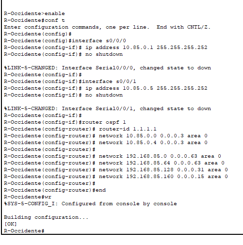


**Configuracion Router R-OSPF-CORE**

```bash
enable
conf t
hostname R-OSPF-CORE

interface s0/0/0
 ip address 10.85.0.2 255.255.255.252
 clock rate 64000
 no shutdown

interface s0/0/1
 ip address 10.85.0.9 255.255.255.252
 clock rate 64000
 no shutdown

router ospf 1
 router-id 2.2.2.2
 network 10.85.0.0 0.0.0.3 area 0
 network 10.85.0.8 0.0.0.3 area 0

end
wr
```

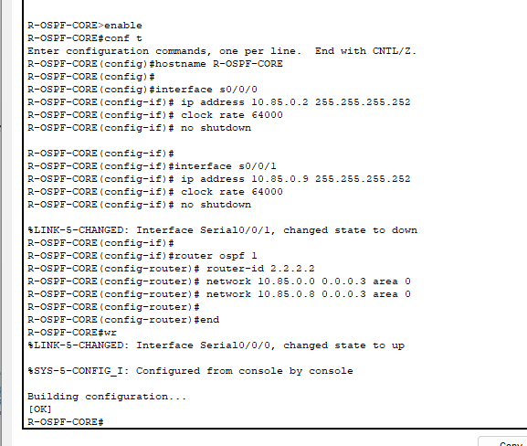

**Configuracion Router R-OSPF-BORDER**

```bash
enable
conf t
hostname R-OSPF-BORDER

interface s0/0/1
 ip address 10.85.0.6 255.255.255.252
 no shutdown

interface s0/0/0
 ip address 10.85.0.10 255.255.255.252
 no shutdown

router ospf 1
 router-id 3.3.3.3
 network 10.85.0.4 0.0.0.3 area 0
 network 10.85.0.8 0.0.0.3 area 0

end
wr

```

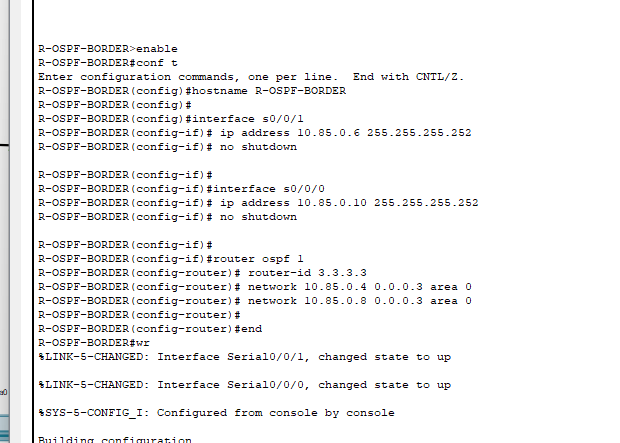


**Comprobaciones**

*show ip ospf neighbor*


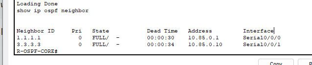

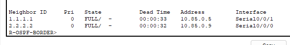

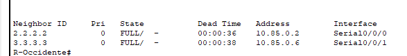

*show ip ospf interface brief*

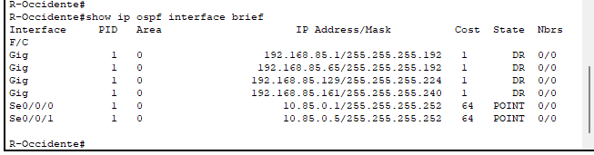

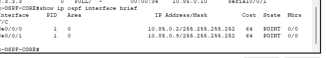

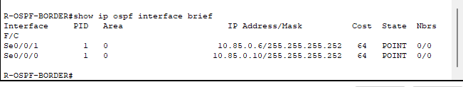


## RIP

**Configuracion Router R-RIP-CORE**

```bash
enable
conf t
interface s0/0/0
 ip address 10.90.0.1 255.255.255.252
 no shutdown


router rip
 version 2
 no auto-summary

 network 10.0.0.0
end

wr

```
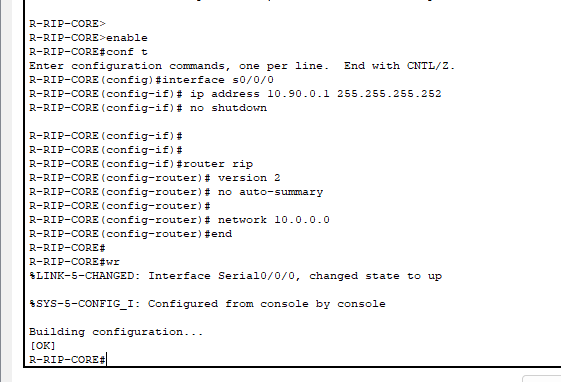

**Configuracion Router R-Central**

```bash
conf t
interface s0/0/0
 ip address 10.90.0.2 255.255.255.252
 no shutdown

router rip
 version 2
 no auto-summary

 network 10.0.0.0
 network 192.168.0.0
end

```
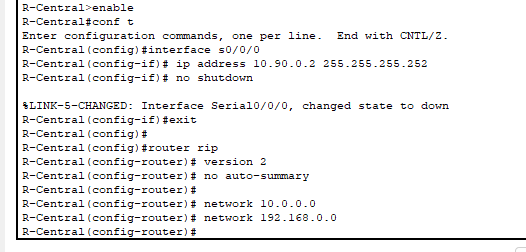

**Comprobaciones**

*show ip route rip*

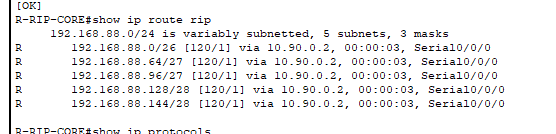

*show ip protocols*

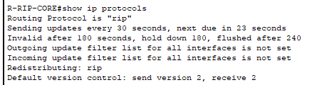


## STATIC

**Configuracion R-STATIC-CORE**

```bash
enable
conf t


ip routing

interface g0/1
 no switchport
 ip address 10.91.0.1 255.255.255.252
 no shutdown

ip route 192.168.86.0 255.255.255.224 10.91.0.2
ip route 192.168.86.32 255.255.255.224 10.91.0.2
ip route 192.168.86.64 255.255.255.240 10.91.0.2
ip route 192.168.86.80 255.255.255.240 10.91.0.2

end
wr
```
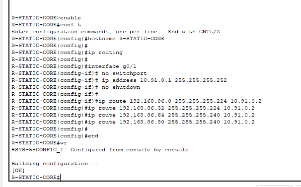

**Configuracion R-Norte**

```bash
enable
conf t

interface g0/1
 ip address 10.91.0.2 255.255.255.252
 no shutdown

ip route 0.0.0.0 0.0.0.0 10.91.0.1

end
wr
```
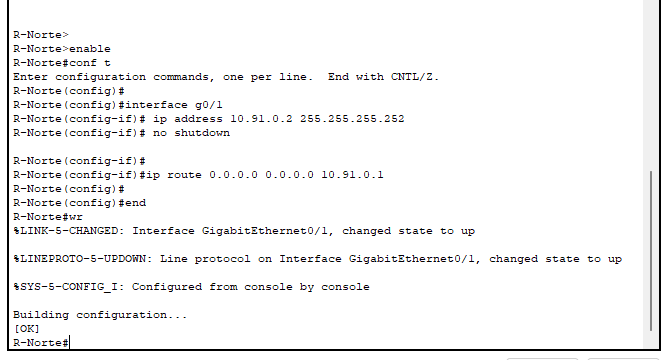

**Comprobaciones**

*show ip route*

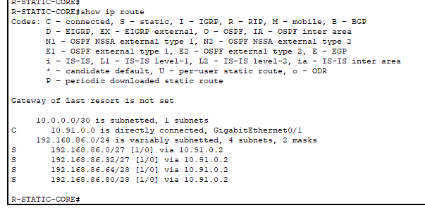


## EIGRP

**Configuracion MLS-EIGRP-CORE1**

```bash

enable
conf t
hostname MLS-EIGRP-CORE1

ip routing

interface range g1/1/1 - 2
 no switchport
 channel-group 12 mode active
 no shutdown

interface port-channel 12
 no switchport
 ip address 10.100.0.1 255.255.255.252
 no shutdown

interface range g1/0/2 - 3
 no switchport
 channel-group 13 mode active
 no shutdown

interface port-channel 13
 no switchport
 ip address 10.100.0.5 255.255.255.252
 no shutdown

router eigrp 100
 no auto-summary
 network 10.100.0.0 0.0.0.15

end
wr
```

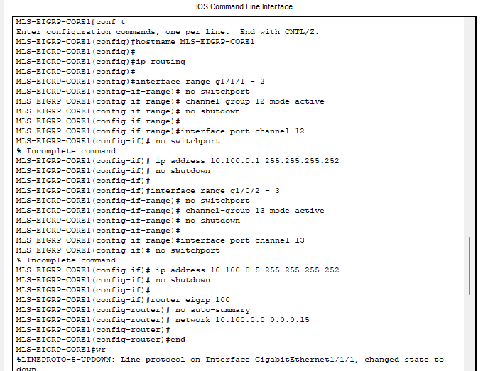

**Configuracion MLS-EIGRP-CORE2**

```bash

enable
conf t
hostname MLS-EIGRP-CORE2

ip routing

interface range g1/1/1 - 2
 no switchport
 channel-group 12 mode active
 no shutdown

interface port-channel 12
 no switchport
 ip address 10.100.0.2 255.255.255.252
 no shutdown

interface range g1/0/1 - 2
 no switchport
 channel-group 23 mode active
 no shutdown

interface port-channel 23
 no switchport
 ip address 10.100.0.9 255.255.255.252
 no shutdown

router eigrp 100
 no auto-summary
 network 10.100.0.0 0.0.0.15

end
wr
```

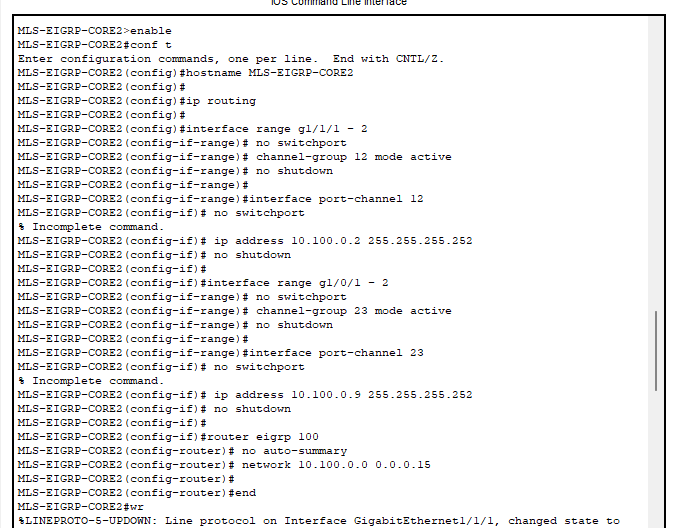


**Configuracion MLS-EIGRP-DIST**

```bash
enable
conf t
hostname MLS-EIGRP-DIST

ip routing

interface range fa0/1 , fa0/3
 no switchport
 channel-group 13 mode active
 no shutdown

interface port-channel 13
 no switchport
 ip address 10.100.0.6 255.255.255.252
 no shutdown

interface range fa0/2 , fa0/4
 no switchport
 channel-group 23 mode active
 no shutdown

interface port-channel 23
 no switchport
 ip address 10.100.0.10 255.255.255.252
 no shutdown

router eigrp 100
 no auto-summary
 network 10.100.0.0 0.0.0.15

end
wr
```

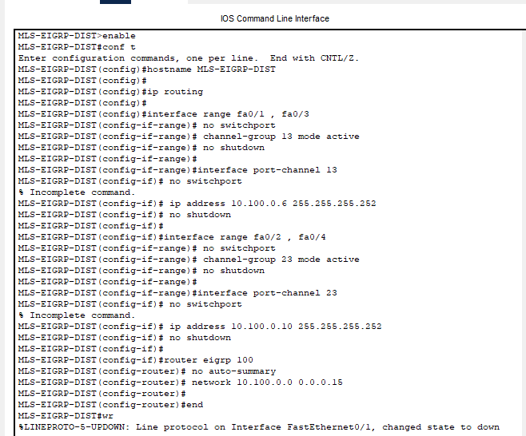

**Comprobaciones**

*show etherchannel summary*

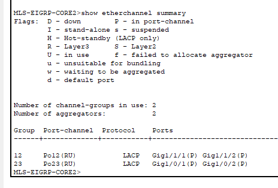

*show ip interface brief*

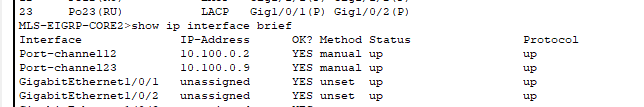

*show ip eigrp neighbors*

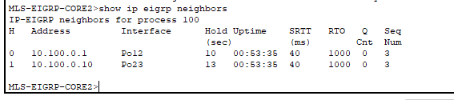

*show ip route eigrp*

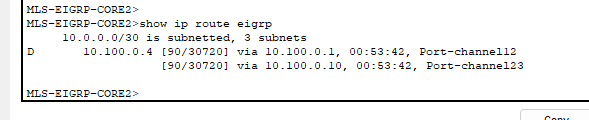


