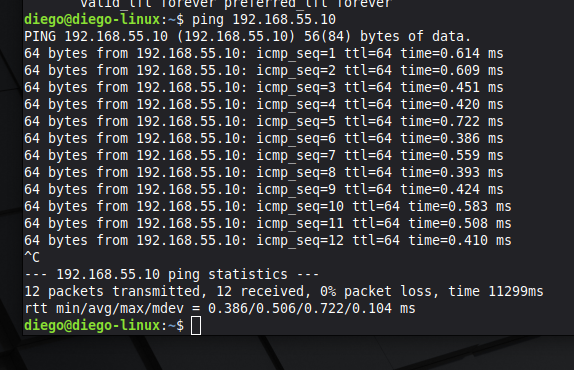
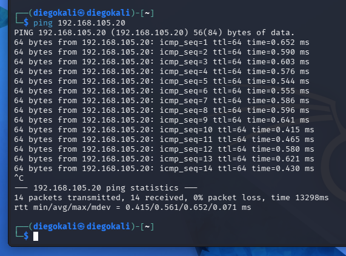
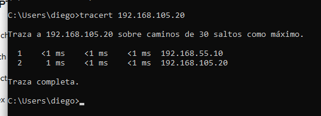
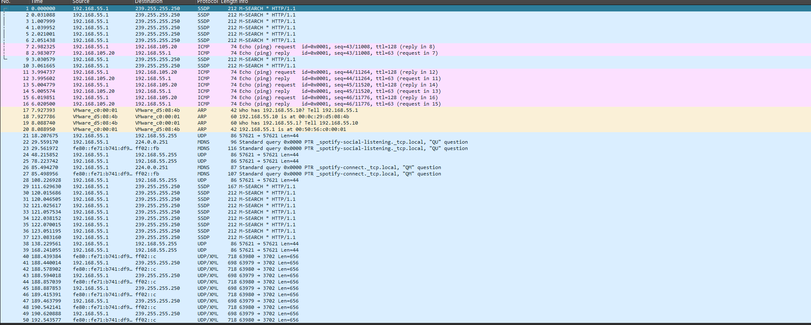

# UNIVERSIDAD DE SAN CARLOS DE GUATEMALA
## FACULTAD DE INGENIERÍA
### ESCUELA DE CIENCIAS Y SISTEMAS
### REDES DE COMPUTADORAS 1

---

## PROYECTO 2
# IMPLEMENTACIÓN DE ENRUTAMIENTO ENTRE REDES UTILIZANDO KALI LINUX COMO ROUTER

---

### TUTOR ACADÉMICO
**Ing. César Fernando Sazo Quisquinay**

---

### ESTUDIANTE
**Diego Alexander Pablo Subuyuj**  
**Carné:** 202300485  
**Sección:** N

---

### FECHA
**Guatemala, mayo de 2026**

---

# INTRODUCCIÓN

En la presente práctica se implementó una topología de red virtualizada utilizando VMware Workstation, donde una máquina virtual Kali Linux funcionó como router principal entre diferentes segmentos de red. El objetivo principal fue comprender el funcionamiento del enrutamiento entre redes, el direccionamiento IP, las rutas estáticas y el análisis de tráfico mediante herramientas de captura de paquetes.

La práctica consistió en conectar una computadora física con una máquina virtual Linux cliente a través de un router Kali Linux utilizando múltiples adaptadores de red virtuales. Para ello, se configuraron redes Host-Only y Segment LAN, permitiendo el intercambio de tráfico entre redes distintas mediante el uso de forwarding IP en Linux.

Adicionalmente, se utilizó Wireshark para capturar y analizar paquetes ICMP y ARP generados durante las pruebas de conectividad, permitiendo observar el comportamiento real de protocolos fundamentales en redes de computadoras.

---

# JUSTIFICACIÓN

El uso de un router Linux permite comprender de forma práctica el funcionamiento del enrutamiento entre redes y el comportamiento de los protocolos básicos de comunicación. Esta práctica facilita el análisis del tráfico real entre dispositivos, así como la implementación de rutas estáticas y segmentación lógica de redes.

Además, el uso de herramientas como Wireshark permite visualizar el proceso de encapsulación, resolución ARP y decremento del TTL cuando un paquete atraviesa un router, fortaleciendo los conocimientos fundamentales sobre redes de computadoras.

---

# OBJETIVOS

## OBJETIVO GENERAL

Implementar y documentar una topología de red virtualizada utilizando Kali Linux como router, permitiendo la comunicación entre una computadora física y una máquina virtual Linux cliente mediante el uso de direccionamiento IP, rutas estáticas y análisis de tráfico de red.

---

## OBJETIVOS ESPECÍFICOS

- Configurar múltiples adaptadores de red virtuales en VMware Workstation.
- Implementar Kali Linux como router entre dos redes distintas.
- Configurar direccionamiento IP estático en Windows, Kali Linux y Linux cliente.
- Habilitar el reenvío de paquetes (IP Forwarding) en Kali Linux.
- Implementar rutas estáticas en Windows para alcanzar redes remotas.
- Verificar conectividad mediante comandos ping y tracert.
- Analizar tráfico ICMP y ARP utilizando Wireshark.
- Identificar el comportamiento del TTL al atravesar un router.

---

# ALCANCE DE LA PRÁCTICA

La práctica incluye:

- Configuración de redes virtuales en VMware Workstation.
- Uso de redes Host-Only y Segment LAN.
- Configuración manual de direcciones IP.
- Implementación de routing básico en Linux.
- Uso de rutas estáticas en Windows.
- Validación de conectividad entre redes.
- Captura y análisis de tráfico con Wireshark.
- Identificación de protocolos ICMP y ARP.

---

# LIMITACIONES

- La práctica se realiza en un entorno virtualizado y no en infraestructura física real.
- No se implementaron protocolos avanzados de routing dinámico.
- No se utilizaron mecanismos avanzados de seguridad o firewall.
- El análisis se enfocó únicamente en protocolos básicos de conectividad y resolución de direcciones.

---

# HERRAMIENTAS Y RECURSOS UTILIZADOS

| Herramienta | Descripción |
|---|---|
| VMware Workstation | Plataforma de virtualización utilizada para crear las máquinas virtuales |
| Kali Linux | Sistema operativo utilizado como router Linux |
| Linux Mint / Ubuntu | Máquina virtual cliente |
| Windows 10/11 | Computadora física utilizada como host |
| Wireshark | Herramienta de captura y análisis de paquetes |
| CMD / Terminal Linux | Utilizados para configuración y pruebas de conectividad |

---

# TOPOLOGÍA IMPLEMENTADA

La topología implementada consistió en:

- Una computadora física Windows conectada mediante una red Host-Only.
- Una máquina virtual Kali Linux funcionando como router con dos interfaces de red.
- Una máquina virtual Linux cliente conectada mediante una red Segment LAN.

Kali Linux actuó como intermediario entre ambas redes, permitiendo la comunicación entre segmentos distintos.

---

# TABLA DE DIRECCIONAMIENTO IP

| Dispositivo | Interfaz | Dirección IP | Máscara |
|---|---|---|---|
| Windows Host | VMnet1 Host-Only | 192.168.55.1 | 255.255.255.0 |
| Kali Linux | eth1 | 192.168.55.10 | 255.255.255.0 |
| Kali Linux | eth2 | 192.168.105.1 | 255.255.255.0 |
| Linux Cliente | ens33 | 192.168.105.20 | 255.255.255.0 |

---

# CONFIGURACIÓN REALIZADA

## CONFIGURACIÓN EN KALI LINUX

### Activación de interfaces

```bash
sudo ip link set eth1 up
sudo ip link set eth2 up
```
### Asignación de direcciones IP

```bash
sudo ip addr add 192.168.55.10/24 dev eth1
sudo ip addr add 192.168.105.1/24 dev eth2
```

### Activación del forwarding IP
```bash
sudo sh -c "echo 1 > /proc/sys/net/ipv4/ip_forward"
```

## CONFIGURACIÓN EN LINUX CLIENTE

### Configuración IP

```bash
sudo ip link set ens33 up
sudo ip addr add 192.168.105.20/24 dev ens33
sudo ip route add default via 192.168.105.1
```

## CONFIGURACIÓN EN WINDOWS

### Configuración de ruta estática
```bash
route -p add 192.168.105.0 mask 255.255.255.0 192.168.55.10
```

### Permitir ICMP en Firewall
```bash
netsh advfirewall firewall add rule name="ICMP" protocol=icmpv4:8,any dir=in action=allow
```

# VALIDACIÓN DE CONECTIVIDAD

## PRUEBAS REALIZADAS

### Ping hacia Kali Linux
```bash
ping 192.168.55.10
```


### Ping hacia Linux Cliente

```bash
ping 192.168.105.20
```


### Traceroute
```bash
tracert 192.168.105.20
```


## ANÁLISIS CON WIRESHARK

### PROTOCOLO UTILIZADO POR PING

El comando ping utiliza el protocolo ICMP (Internet Control Message Protocol), específicamente mensajes Echo Request y Echo Reply, para verificar conectividad entre dispositivos.

En Wireshark se observaron paquetes ICMP entre Windows y Linux cliente.

### UTILIDAD DEL PROTOCOLO ARP

ARP (Address Resolution Protocol) se utiliza para resolver direcciones IP a direcciones MAC dentro de una red local.

Antes de enviar tráfico hacia otra red, Windows realizó solicitudes ARP para obtener la dirección MAC del gateway (Kali Linux).

Ejemplo observado:

Who has 192.168.55.10? Tell 192.168.55.1

### DIRECCIÓN MAC UTILIZADA HACIA OTRA RED

Cuando el tráfico se dirige hacia otra red, el host no utiliza la dirección MAC del destino final, sino la dirección MAC del router o gateway.

En esta práctica, Windows utilizó la dirección MAC de Kali Linux para enviar paquetes destinados hacia la red 192.168.105.0/24.

### COMPORTAMIENTO DEL TTL

El campo TTL (Time To Live) disminuye en 1 cada vez que un paquete atraviesa un router.

Durante las pruebas se observó:

TTL inicial: 128
TTL recibido: 63

Esto confirma que el tráfico atravesó el router Kali Linux antes de llegar al destino.



## CONCLUSIONES

- Kali Linux puede utilizarse exitosamente como router entre diferentes redes.
- El protocolo ICMP permite verificar conectividad entre dispositivos.
- ARP es fundamental para la resolución de direcciones MAC dentro de una LAN.
- El uso de rutas estáticas permite comunicación entre redes distintas.
- Wireshark facilita el análisis y comprensión del tráfico de red en tiempo real.
- El decremento del TTL confirma el paso de paquetes a través de routers.