# UNIVERSIDAD DE SAN CARLOS DE GUATEMALA
## FACULTAD DE INGENIERÍA
### REDES DE COMPUTADORAS 1

**TUTOR ACADÉMICO:** César Fernando Sazo Quisquinay

---

**Diego Alexander Pablo Subuyuj**  
**CARNÉ:** 202300485  
**SECCIÓN:** N

**Guatemala, 26 de febrero del 2026**


## TAREA 3

### Diseño e implementación de redes VLAN


### Configuracion de Switch servidor

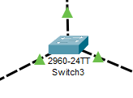

### **Comandos**

```bash
## Configurar VTP

enable
configure terminal

vtp version 2
vtp mode server
vtp domain tarea3
vtp password 123

## Crear VLANs
vlan 10
name ADMIN
exit

vlan 20
name MERCA
exit

vlan 30
name VENTAS
exit

# Puerto TRUNK
interface fa0/2
 switchport mode trunk
 switchport trunk allowed vlan 10,20,30
 no shutdown


# Verificar 

show vtp status
show vlan brief
```
### Captura switch

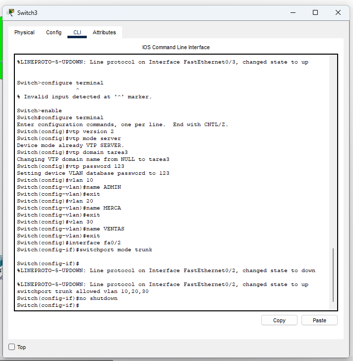

### Configuracion de Switch cliente - ADMIN

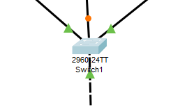

```bash
## Configuracion VTP
enable
configure terminal
vtp version 2
vtp domain tarea3
vtp mode client
vtp password 123

## Configuracion Trunk

switchport mode trunk
exit

## Asignacion puerto a VLAN 10
interface fa0/2
switchport mode access
switchport access vlan 20
exit

## Test
show vlan brief
show vtp status

```

CAPTURA CONFIGURACION

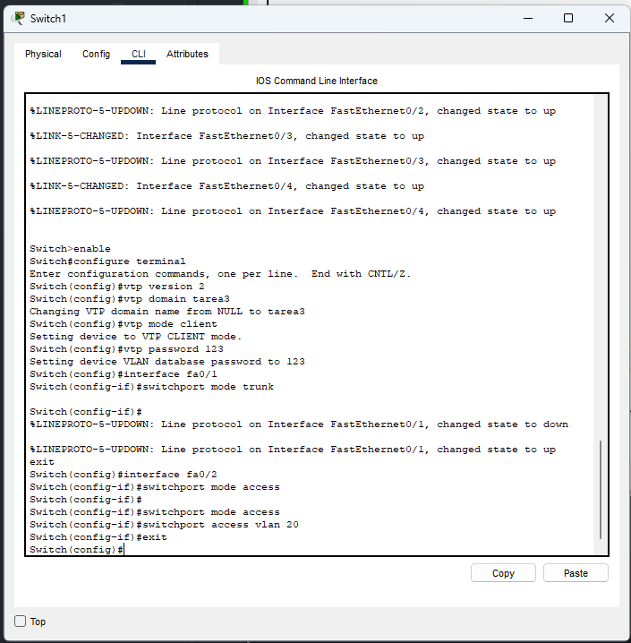

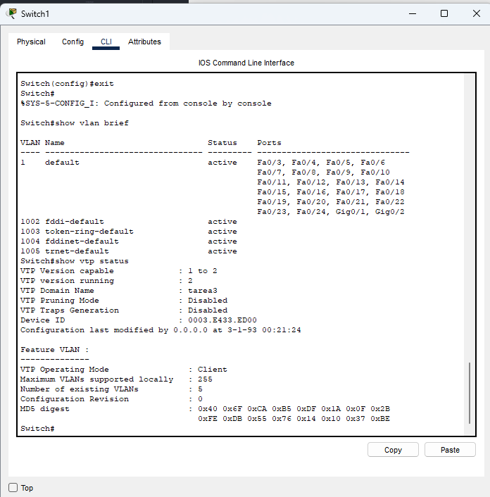


### Configuracion de Switch transparente - MERCA

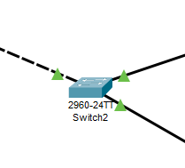

```BASH
## Configuracion VTP
enable
configure terminal
vtp version 2
vtp domain tarea3
vtp mode transparent
vtp password 123

## Configuración Trunk

interface fa0/1
switchport mode trunk

## Creacion VLAN 20

vlan 20
name MERCA
exit

## Asignacion puerto a VLAN 20

interface range fa0/2 - 3
switchport mode access
switchport access vlan 30
exit

## Verificación

show vlan brief
show vtp status


```

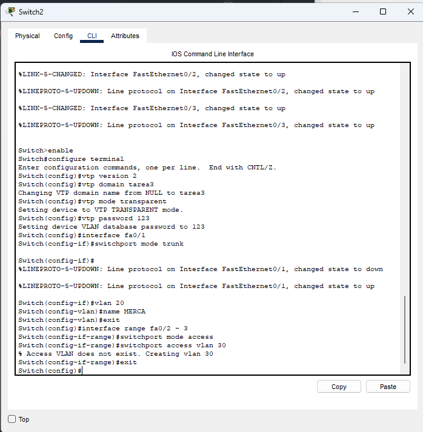

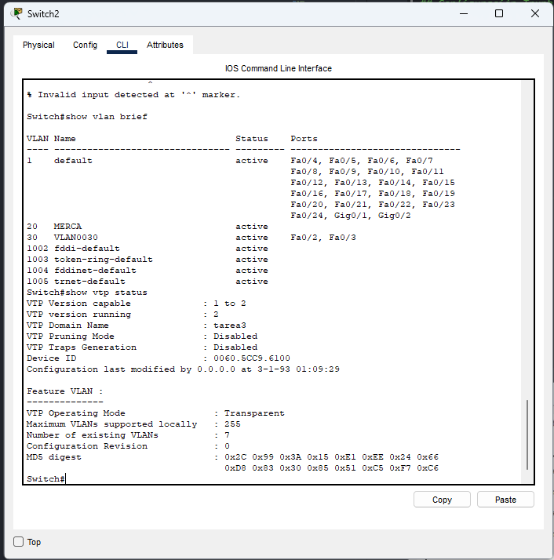

### Configuracion de Switch cliente - VENTAS

```bash
enable
configure terminal
vtp version 2
vtp domain tarea3
vtp mode client
vtp password 123
## Configuración Trunk
interface fa0/1
switchport mode trunk
exit

## Asignación puertos a VLAN 30

interface range fa0/2 - 4
switchport mode access
switchport access vlan 10
exit

## Verificación


show vlan brief
show vtp status
```

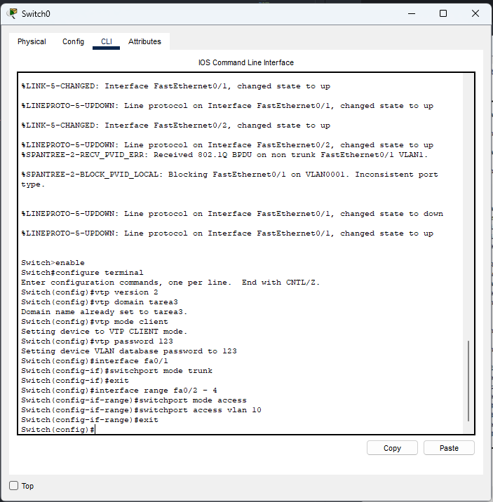

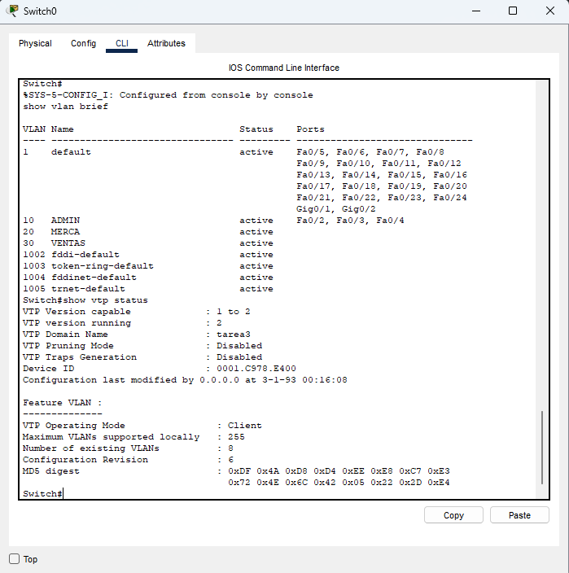


### SIMULACION

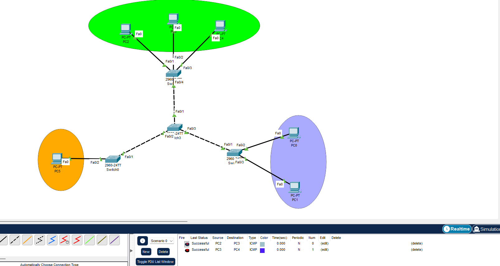

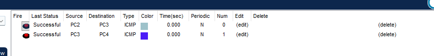

### CONFIGURACION PC

## PC 1 - VENTAS

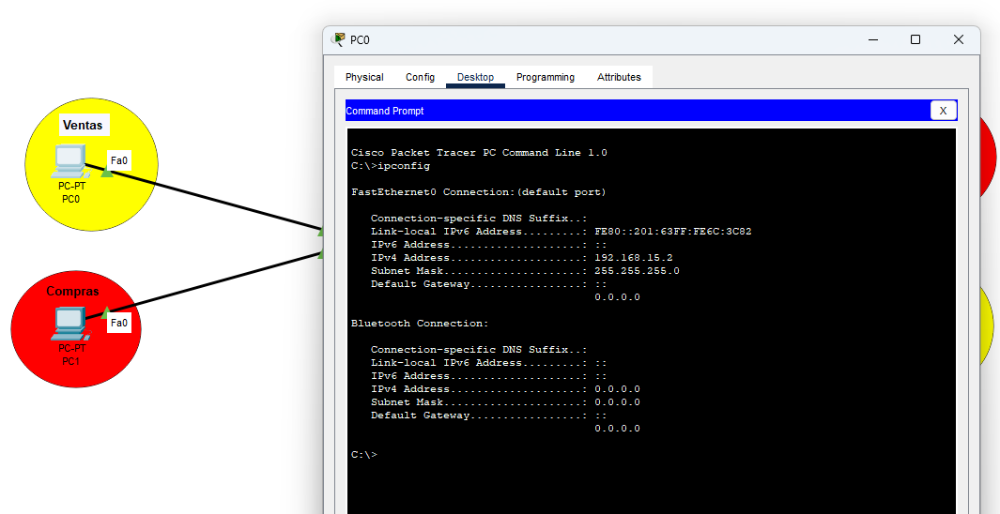

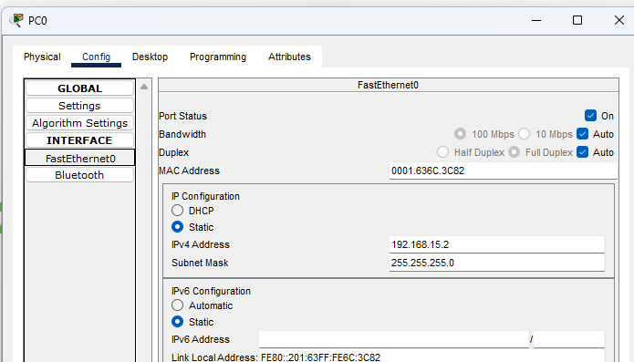

## PC 2 - VENTAS

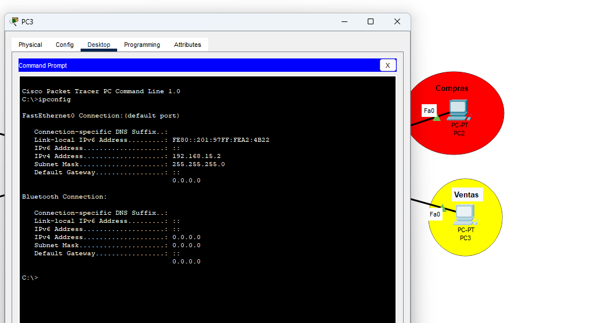

## PC 1 - COMPRAS

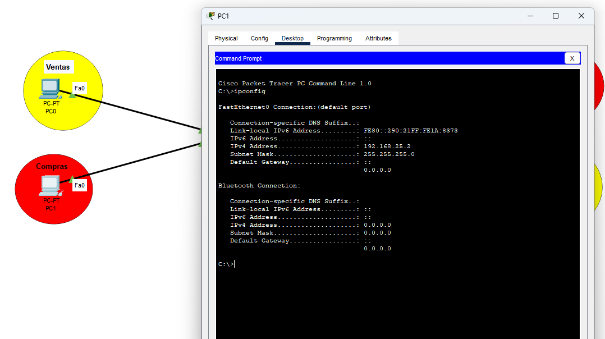

## PC 2 - COMPRAS

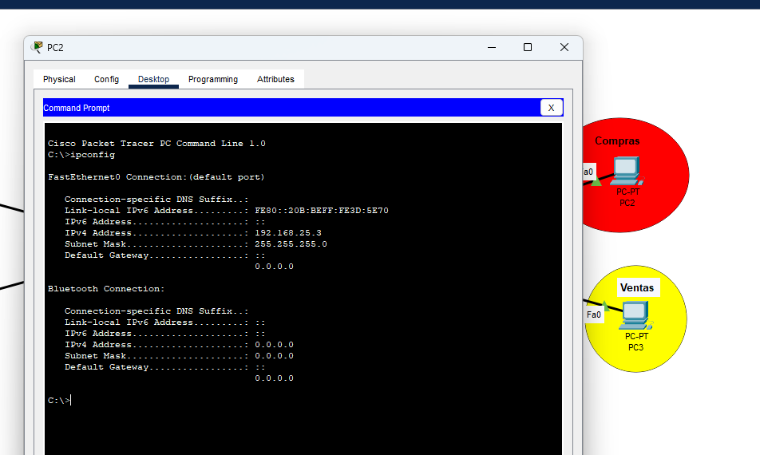
